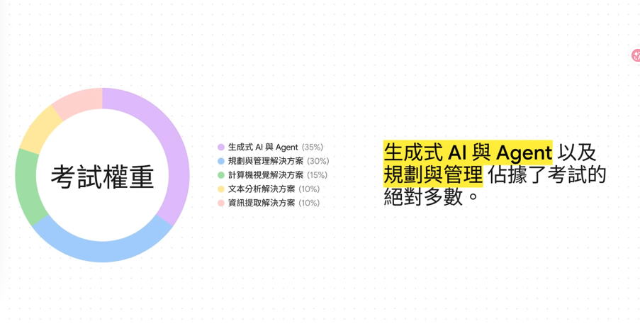

# AI-103｜Developing AI Apps and Agents on Azure

## 建議閱讀順序

| 順序 | 模組 | 用途 |
|---:|---|---|
| 00 | README（本頁） | 全部知識模組的快速入口 |
| 01 | [Exam Guide](01_Exam_Guide.md) | 考試流程、題型、出題方向與考後心得 |
| 02 | [Plan and Manage](02_Plan_and_Manage.md) | 服務／模型選型、部署、成本、監控、網路與驗證 |
| 03 | [Responsible AI and Content Safety](03_Responsible_AI_and_Content_Safety.md) | Guardrails、Prompt Shields、評估器、稽核與人工審核 |
| 04 | [Generative AI and Agents](04_Generative_AI_and_Agents.md) | RAG、Agent 工具、結構化輸出、反思迴圈、可觀測性 |
| 05 | [Computer Vision](05_Computer_Vision.md) | 影像／影片生成、遮罩編輯、多模態理解、無障礙 alt text |
| 06 | [Text and Speech](06_Text_and_Speech.md) | Azure Language、CLU、Translator、Speech 與自訂語音 |
| 07 | [Information Extraction](07_Information_Extraction.md) | Azure AI Search、Document Intelligence、Content Understanding |

## 考綱權重（自 2026-04-16 起生效）

| Domain | Weight | 對應模組 |
|---|---:|---|
| Plan and manage an Azure AI solution | 25–30% | [02](02_Plan_and_Manage.md)、[03](03_Responsible_AI_and_Content_Safety.md) |
| Implement generative AI and agentic solutions | 30–35% | [04](04_Generative_AI_and_Agents.md) |
| Implement computer vision solutions | 10–15% | [05](05_Computer_Vision.md) |
| Implement text analysis solutions | 10–15% | [06](06_Text_and_Speech.md) |
| Implement information extraction solutions | 10–15% | [07](07_Information_Extraction.md) |

> 上圖是我整理時用的比重示意。官方原文把 responsible AI 放在 domain 1 的 1.4，多模態安全放在 domain 3.3；我把兩邊合併成 **03 Responsible AI and Content Safety**，因為實際考起來它是最密集的單一主題。

## 怎麼讀這份筆記

AI-103 是 **Associate 等級**，預設你已經有 [AI-901](../../ai-901/knowledge/00_README.md) 的概念基礎。兩份筆記的分工：

| 你想確認的事 | 去哪裡 |
|---|---|
| 這個服務是幹嘛的、input/output 是什麼 | AI-901 筆記 |
| 這個服務**要怎麼設定、怎麼呼叫、出事怎麼查** | 這份筆記 |

沒碰過 Azure 的話，建議先看 AI-901 的 [Azure Fundamentals](../../ai-901/knowledge/09_Azure_Fundamentals.md) 第 1–4 節再回來。

## 狀態閱讀方式

| 標記 | 意義 |
|---|---|
| **Current** | 目前可用且仍適合用現行文件學習 |
| **Preview** | 預覽功能；API 與可用性可能變動 |
| **Deprecated / Retiring** | 已不建議新採用，或已公布退場計畫 |
| **Retired** | 已退休；只保留舊題庫脈絡 |
| **Legacy exam-bank context** | 為理解舊題保留；不代表同名產品一定已退休 |
| **NEEDS VERIFICATION** | 官方文件不足、互相衝突，或原始材料已缺損，未自行猜測 |

Microsoft 產品名稱、SDK 與 Preview 狀態會持續變動，後續更新應以 [current English AI-103 Study Guide](https://learn.microsoft.com/en-us/credentials/certifications/resources/study-guides/ai-103) 和英文 Microsoft Learn 為優先依據。

## 原始材料

`ai-103/raw_files/` 是不可修改的原始匯出（Notion 筆記、Gemini 對話 PDF 與所有題目截圖）。這裡的知識模組都是從那份材料重新整理、去重並核對官方文件後的版本。
