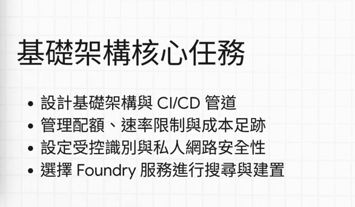
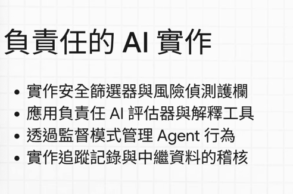

# AI-103 考前須知｜題型、配速與出題方向

這一篇是我考完 AI-103 後整理的心得。**AI-103 比 AI-901 難很多**，不是難在觀念，是難在題幹長、時間緊、而且有不能回頭的區塊。考前把這篇看一次，至少不會被題型嚇到。

## 1. 考試範圍

英文考綱自 **2026-04-16** 起生效，分成五大部分：

| Domain | Weight | 準備重點 |
|---|---:|---|
| **Plan and manage an Azure AI solution** | 25–30% | 模型／服務選型、部署與 CI/CD、配額與成本、監控、網路安全、responsible AI |
| **Implement generative AI and agentic solutions** | 30–35% | RAG、Agent 工具與編排、結構化輸出、反思迴圈、可觀測性 |
| **Implement computer vision solutions** | 10–15% | 影像／影片生成與編輯、多模態理解、無障礙、多模態安全 |
| **Implement text analysis solutions** | 10–15% | 生成式文字擷取、情緒與敏感內容、翻譯、Speech |
| **Implement information extraction solutions** | 10–15% | Azure AI Search 檢索管線、文件擷取、Content Understanding |

官方 audience profile 寫得很直白：**你要有 Python 開發經驗**，而且熟悉 Azure 服務能力。這不是嘴上說說，程式題真的會出現。




> **啾啾筆記：** AI-901 問「這是什麼服務」，AI-103 問「這個情境你要**怎麼設定**」。同樣是 Content Safety，901 問它能擋什麼，103 問你要選 custom categories 還是 built-in moderation、要放在 pipeline 哪一段喔～

## 2. 我這場的實測數據

| Item | 實測情況 |
|---|---|
| **作答時間** | **100 分鐘**（不是網路上流傳的 120 分鐘） |
| **總題數** | **56 題**（含 case study 與 yes/no） |
| **平均配速** | 每題約 **1.5 分鐘以內**，要自己盯時間 |
| **監考嚴格度** | 比 901 嚴格很多，反覆要求檢查桌面與環境 |

> 這是我單次考試的經驗，不代表每場都一樣。但「比官方／網路說的時間短」這件事，寧可先當真來配速。

## 3. 三個區塊與「不能回頭」規則

這是 AI-103 跟 AI-901 最大的差別，考前一定要知道：

```text
1. Case Study（約 7 題）      ──送出後不可返回──▶
2. 單選／多選／下拉填空（約 46 題）  ──▶
3. 連續 Yes/No（3 題）        ──每題送出即鎖定，不可返回
```

| 區塊 | 結構 | 介面限制 | 我的實戰做法 |
|---|---|---|---|
| **Case Study**（約 7 題） | 先給公司背景、資料環境、technical 需求、安全性需求，再逐題問你該選什麼服務／決策 | 離開這個區塊後**完全無法回來看** | 答題前先極速通讀一次抓關鍵詞。之後每題旁邊都會再附同一份資料，只要精準定位對應段落（例如只看安全性需求）就好，不用重讀全文 |
| **選擇與填空**（約 46 題） | 單選、多選（選 3–4 個）、拖曳、下拉填空 | 可標記 Review later，送出本大題前能回頭 | 見下方「讀題三段法」 |
| **連續 Yes/No**（3 題） | 同一個業務情境，依序給 A、B、C 三種不同選型問是否正確 | 送出第一題後就**無法改上一題** | 每題獨立判斷：該服務能完全滿足情境就 Yes，不符就 No。不要抱著「等一下再改」的心態 |

> **啾啾筆記：** Yes/No 那三題其實不難，難在心理。例如「我要做一個有 RAG 的 agent，用 Foundry 對不對？」→ Yes；「用 Search 對不對？」→ Yes；「用 voice 對不對？」→ No。看起來簡單，但按下去就回不來了，所以每題都要當成最終答案喔～

## 4. 讀題三段法

單選題的題幹變得**很長**，但語法其實有規則：

```text
第 1 段：環境描述（「你有一個 Microsoft Foundry agent…」）→ 快速掃過，通常不重要
第 2 段：問題與需求（「使用者回報…你需要確保…」）      → 重點，畫關鍵詞
第 3 段：限制條件（「同時要最小化…」「不能購買…」）     → 決勝點，常常就是排除選項的依據
```

- 第 3 段的限制條件最容易被忽略，但它往往一句話就砍掉兩個看起來都對的選項。例如「**without buying more reserved capacity**」直接排除「增購 PTU」。
- 英文詞彙量比 901 大很多。如果閱讀速度吃力，**可以考慮用繁體中文應試**；但術語還是建議記英文。

## 5. 我覺得重要的出題方向

| Priority | 考點 | 我的準備建議 |
|---:|---|---|
| ⭐⭐⭐⭐⭐ | **安全過濾與防護** | 我估計有 **10 題左右**。Prompt Shields、guardrails（content filters）、四大危害類別、custom categories 要能秒答 |
| ⭐⭐⭐⭐⭐ | **Azure AI Search** | 絕對的核心。Indexer 五階段順序、`queryType`、skillset 選型都考 |
| ⭐⭐⭐⭐⭐ | **Content Understanding** | 新題型且考很多。`extract` / `classify` / `generate` 三種 field method 要熟 |
| ⭐⭐⭐⭐ | **服務選型** | Vision / Language / Speech / Translator / Document Intelligence / Content Understanding 的邊界 |
| ⭐⭐⭐⭐ | **網路與身分安全** | Private Endpoint vs Service Endpoint、Managed Identity、keyless |
| ⭐⭐⭐ | **程式與 API 呼叫** | 有 Python 基礎就夠。多是直覺型方法名（建立 agent 選 `.create()` 而不是 `.get()`），不會刁難冷門語法 |
| ⭐⭐ | **傳統 Responsible AI 理論** | 反而**考得很少**。901 的六大原則在這裡幾乎不直接問，全面轉向具體的安全防護實作 |

> **啾啾筆記：** 901 的主題是 responsible AI，103 的主題是 **content filter 跟 prompt shield 這類安全性實作**。這是兩張證照的體感差異最大的地方，別把 901 的複習比重直接搬過來喔～

### 服務選型快速表

| 題目需求 | 優先想到 |
|---|---|
| 建索引、enrichment、wildcard/fuzzy 查詢 | [Azure AI Search](07_Information_Extraction.md) |
| 從 document / image / audio / video 產生結構化欄位 | [Content Understanding](07_Information_Extraction.md#3-azure-content-understanding) |
| 發票、收據等標準表單擷取 | [Document Intelligence prebuilt model](07_Information_Extraction.md#4-azure-document-intelligence) |
| 專有名詞、口音導致轉錄不準 | [Custom Speech](06_Text_and_Speech.md#5-speech-solutions) |
| 混合褒貶需要細粒度情緒 | [Opinion Mining](06_Text_and_Speech.md#2-azure-language-in-foundry-tools) |
| 擋越獄／截圖裡的隱藏指令 | [Prompt Shields](03_Responsible_AI_and_Content_Safety.md#3-prompt-shields防注入與越獄) |
| 偵測企業專屬 logo／浮水印 | [Content Safety custom categories](03_Responsible_AI_and_Content_Safety.md#4-custom-categories自訂類別) |
| 追蹤 LLM 呼叫與 tool invocation | [Application Insights distributed tracing](04_Generative_AI_and_Agents.md#6-可觀測性observability) |
| 只允許訂用帳戶內部存取 | [Private Endpoint](02_Plan_and_Manage.md#5-網路安全) |

## 6. 我的準備流程

整體比重：**刷 Practice Assessment ≫ 看 Microsoft Learn 全文**。Learn 的文件量太大，時間有限的話不划算。

我建議可以先看完這個播放清單：https://www.youtube.com/watch?v=2x5YiDDMMyQ&list=PLFf5f8-G-HGs

裡面雖然是 AI 生成的但是我覺得整理地頗好，可以先抓到整體方向

```text
階段一：AI 輔助精讀（前 2–3 輪）
  做一題 → 點 Show Solution → 不確定或答錯的題目餵給 AI
  → 要它解析正確答案理由 + 逐一剖析其他錯誤選項
  → 產出的比較表整理成自己的筆記

階段二：盲測衝刺（第 4 輪起）
  不開提示、計時盲測 → 只挑再次出錯的回查筆記
  → 考前集中複習自製筆記 → 進場
```

1. 先看 [YouTube 重點清單](https://www.youtube.com/watch?v=2x5YiDDMMyQ)快速抓架構。**注意影片裡的考試資訊可能不準**（例如時間長度），架構參考就好。
2. 精刷 [Practice Assessment](https://learn.microsoft.com/en-us/credentials/certifications/practice-assessments-for-microsoft-certifications)，重點是搞懂**每個錯誤選項為什麼不適合**。
3. 用這份筆記的[常見錯誤與詳解](#7-各模組的錯題在哪)區塊做考前最後複習。

> **啾啾筆記：** Practice Assessment 的題目長度、單詞難度跟正式考試很接近，很適合拿來測自己的讀題速度。做到後面會開始重複，這時不要只憑記憶選答案，試著重新講一次「為什麼選它、其他為什麼不行」喔～

## 7. 各模組的錯題在哪

每個模組底部都有 **常見錯誤與詳解**，全部來自我實際做過的 Practice Assessment 題目：

| 模組 | 收錄題號 |
|---|---|
| [02 Plan and Manage](02_Plan_and_Manage.md#8-常見錯誤與詳解) | Q15 Portal vs SDK、Q16 Service Endpoint、Q17 PTU 與 spillover、Q21 驗證方式、Q22 診斷記錄、Q24 Private Endpoint |
| [03 Responsible AI and Content Safety](03_Responsible_AI_and_Content_Safety.md#7-常見錯誤與詳解) | Q07 Custom categories、Q18 Prompt Shields、Q23 安全輸出三動作 |
| [04 Generative AI and Agents](04_Generative_AI_and_Agents.md#8-常見錯誤與詳解) | Q03 可觀測性、Q04 反思迴圈、Q05 Strictness、Q06 結構化輸入／輸出 |
| [05 Computer Vision](05_Computer_Vision.md#6-常見錯誤與詳解) | Q08 無障礙 metadata、Q09 視訊人員偵測 |
| [06 Text and Speech](06_Text_and_Speech.md#6-常見錯誤與詳解) | Q01 Custom Speech、Q02 Opinion Mining、Q10 CLU 訓練、Q19 Translator 功能 |
| [07 Information Extraction](07_Information_Extraction.md#6-常見錯誤與詳解) | Q11 EntityLinkingSkill、Q12 queryType、Q13 Indexer 第一階段、Q14 文件模型選型、Q20 Field method |

## 8. Official Sources

核對日期：**2026-09-30**。

- [AI-103 Study Guide](https://learn.microsoft.com/en-us/credentials/certifications/resources/study-guides/ai-103)
- [Exam AI-103 details](https://learn.microsoft.com/en-us/credentials/certifications/exams/ai-103)
- [Exam duration and exam experience](https://learn.microsoft.com/en-us/credentials/support/exam-duration-exam-experience)
- [About online exams with Pearson VUE](https://learn.microsoft.com/en-us/credentials/certifications/online-exams)
- [Exam scoring and score reports](https://learn.microsoft.com/en-us/credentials/certifications/exam-scoring-reports)（700 分通過）
- [Practice Assessments for Microsoft Certifications](https://learn.microsoft.com/en-us/credentials/certifications/practice-assessments-for-microsoft-certifications)
