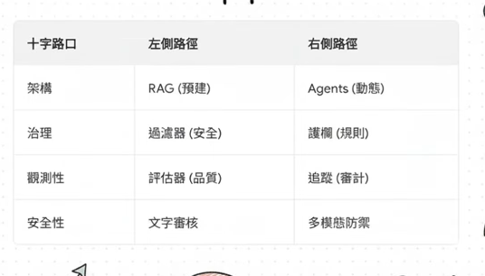
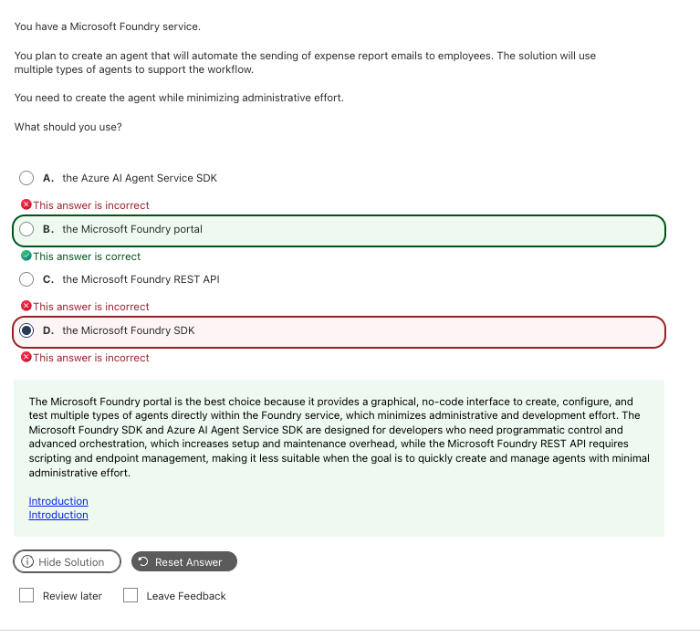
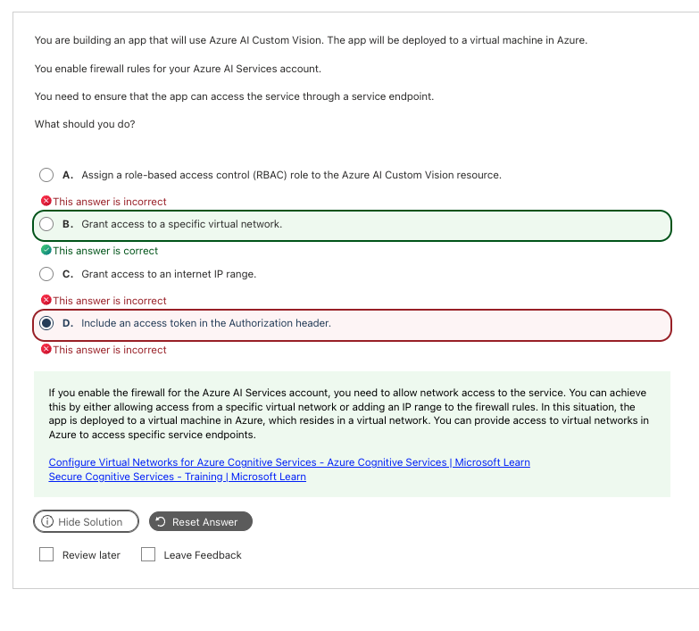
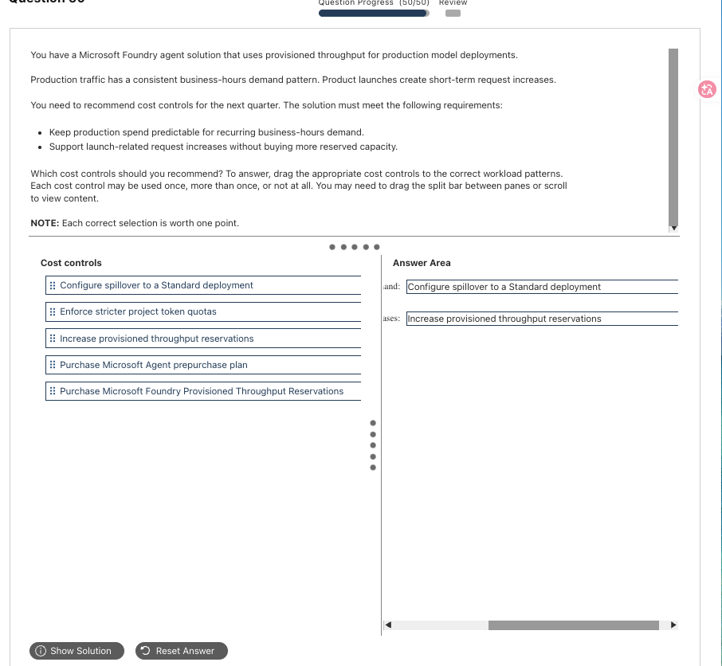
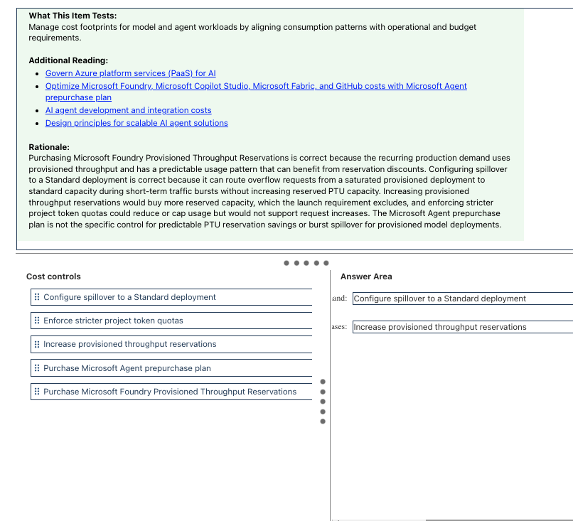
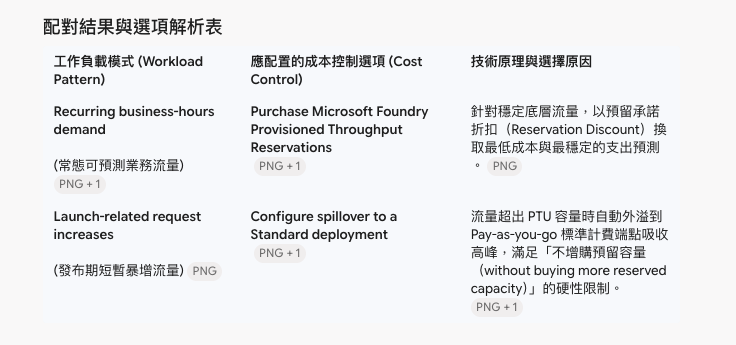

# Plan and Manage｜選型、部署、成本、監控與安全

**考綱對應：** Plan and manage an Azure AI solution（25–30%）

這個模組的題目幾乎都是同一個句型：「**有這些需求和限制，你該選哪一個？**」所以重點不是把每個服務背熟，而是知道**每個限制條件會把你逼到哪個選項**。

## 1. 模型選型

| 模型類型 | 什麼時候選 | 考點關鍵字 |
|---|---|---|
| **LLM（大型語言模型）** | 複雜推理、長上下文、開放式生成 | complex reasoning、nuanced、high quality |
| **SLM（Small Language Model）** | 極低延遲、成本敏感、邊緣／地端部署 | low latency、on-premises、edge、cost-sensitive |
| **Multimodal model** | 輸入同時包含文字＋影像／音訊 | image + text、visual question answering、audio input |
| **Code model** | 產生或解釋程式碼 | code generation、refactor |
| **Embedding model** | 把內容轉向量以供檢索 | vector search、similarity、index |
| **Foundry Tools（Language / Speech / Vision / Translator…）** | 任務明確、有現成 API、不需要生成式推理 | transcribe、translate、OCR、prebuilt |

> **啾啾筆記：** 看到「**極低延遲**」或「**地端**」就往 small model 想；看到「**複雜／多步推理**」就往大模型想。這兩個詞幾乎是 103 的送分關鍵字喔～

## 2. 服務選型：RAG 還是 Agent？



| 比較 | **RAG** | **Agent** |
|---|---|---|
| 流程 | **預先寫死的固定流程**：檢索 → 組 prompt → 生成 | **動態決定**下一步要做什麼、要呼叫哪個工具 |
| 適合 | 問答要有依據、流程單純可預期 | 需要多步驟、呼叫多個工具、依結果調整策略 |
| 治理重點 | 檢索品質、groundedness | 工具存取控制、審批關卡 |
| 考點關鍵字 | ground responses in、company documents | multi-step、tool、orchestrate、autonomous |

上圖那張「十字路口」表整理得很好用，直接當記憶錨點：

| 面向 | 左側路徑 | 右側路徑 |
|---|---|---|
| 架構 | RAG（預建流程） | Agents（動態流程） |
| 治理 | 過濾器（安全底線） | 護欄（業務規則） |
| 觀測性 | 評估器（品質） | 追蹤（稽核） |
| 安全性 | 文字審核 | 多模態防禦 |

檢索與索引方式的選擇另見 [Information Extraction](07_Information_Extraction.md#2-azure-ai-search)。

## 3. 部署與 CI/CD

| 需求關鍵字 | 該選什麼 | 為什麼 |
|---|---|---|
| **Minimizing administrative / development effort** | **Foundry portal**（或 Logic Apps 等 no-code 工具） | 圖形化、免寫程式、不用維護執行環境 |
| **Automated deployment / CI/CD pipeline / programmatic control** | **SDK**、**Azure CLI** 或 **Bicep/ARM template** | 可版本控管、可自動化 |
| **Heterogeneous system without SDK support** | **REST API** | 任何語言都能發 HTTP 請求 |

這組對應是 Microsoft 認證的通用破題法則，不只 AI-103 適用。實務上通常是**先在 Portal 做原型驗證，穩定後再改用 SDK 整合進產品**。

## 4. 配額、速率限制與成本

| 概念 | 說明 | 考點關鍵字 |
|---|---|---|
| **Standard（Pay-as-you-go）** | 多租戶共享，按 token 計費，流量高時可能被限流（429） | 彈性、不可預測流量 |
| **PTU（Provisioned Throughput Units）** | 保留專屬運算容量，延遲穩定、在承諾容量內不限流；按時數計費 | dedicated capacity、predictable latency |
| **PTU Reservations** | 簽 1 或 3 年合約鎖定費率，換取大幅折扣 | **predictable spend**、recurring demand、reservation discount |
| **Spillover to Standard** | 流量超出 PTU 上限時，**自動外溢**到隨用隨付端點吸收高峰 | **short-term bursts**、without buying more reserved capacity |
| **Token quota** | 限制專案／部署可用的 token 量 | 會導致請求失敗或 429，**不是用來「支援」流量增加的** |

> **啾啾筆記：記法是「穩定底層買 Reservation，突發高峰開 Spillover」。** 題目只要同時出現「規律的日常流量」和「短期發布高峰」，這兩個就是一組答案。看到「不增購預留容量」更是直接鎖定 spillover 喔～

## 5. 網路安全

這是 103 的高頻考點，核心是分清楚**網路層**和**身分層**是兩回事。

| 設定 | 公用網路狀態 | 連線機制 | 防護強度 | 什麼時候選 |
|---|---|---|---|---|
| **All networks** | 完全開放 | 網際網路公用端點 | 最低（只靠 key/token） | 開發測試 |
| **Selected networks** | 部分開放（白名單） | 公用 IP 防火牆 ／ **VNet Service Endpoint** | 高，但公用端點仍存在 | VM 在 Azure VNet 內、要透過 **service endpoint** 存取 |
| **Disabled + Private Endpoint** | 完全關閉 | Azure Private Link，配私有 IP | **最高** | 要求「**僅限訂用帳戶／內部網路存取**」 |

### Service Endpoint vs Private Endpoint（必考對比）

| | **Service Endpoint** | **Private Endpoint** |
|---|---|---|
| 位址解析 | 仍使用服務原本的**公用 FQDN** | VNet 內的**私有 IP**（例如 `10.0.1.5`） |
| 機制 | 在目標服務防火牆**白名單認可該 VNet** | 在你的 VNet 內建立一張虛擬網卡（NIC） |
| 公用存取 | 端點本身仍是開啟的 | 可設為 **Disabled**，完全關閉 |
| 搭配設定 | 子網路啟用 `Microsoft.CognitiveServices`，服務端選「Selected networks」並加入該 VNet | 搭配 Private DNS Zone（如 `privatelink.openai.azure.com`） |

> **啾啾筆記：** 看到「Firewall rules + Azure VM + **service endpoint**」→ 答案是**授權特定虛擬網路**；看到「only available to applications hosted in my subscription」→ 答案是 **Disabled + Private Endpoint**。兩題長得很像，差別就在題目有沒有點名 service endpoint 喔～

## 6. 身分驗證與授權

Azure AI Services **只支援兩種**原生驗證方式：

| 方式 | 機制 | 適用 | 備註 |
|---|---|---|---|
| **Subscription key（API key）** | 放在 `Ocp-Apim-Subscription-Key` 標頭 | 開發測試、快速 PoC、不支援 Entra ID 的第三方系統 | 建立資源時產生 Key 1／Key 2，支援輪替 |
| **Microsoft Entra ID** | OAuth 2.0 Bearer token，搭配 **Managed Identity** 或 Service Principal ＋ **Azure RBAC** | 正式生產環境、零信任、**keyless** | 微軟強烈推薦 |

**SAML token** 與 **Kerberos** 是傳統企業 SSO／內部網域協定，Azure AI Services 的 REST 端點**不接受**。

```python
# Keyless（建議做法）：不在程式碼寫死任何金鑰
from azure.identity import DefaultAzureCredential
from azure.ai.textanalytics import TextAnalyticsClient

client = TextAnalyticsClient(
    endpoint="https://<resource>.cognitiveservices.azure.com/",
    credential=DefaultAzureCredential(),   # 自動使用 Managed Identity / az login / 環境變數
)
```

| Key 類型 | 說明 |
|---|---|
| **Single-service key** | 專屬於單一服務（例如只開了一個 Translator 資源） |
| **Multi-service key** | 頂層 Azure AI Services 多服務資源，一把 key 可打 Vision、Speech、Language 等多個端點，合併出帳 |

常見 RBAC 角色：`Cognitive Services User`（呼叫推論）、`Cognitive Services Contributor`（管理資源）。

> **啾啾筆記：** 題目出現 **eliminate credential leakage / Zero Trust / keyless access** → 一定是 **Entra ID ＋ Managed Identity ＋ RBAC**。這是微軟最愛的標準答案喔～

## 7. 監控

### 三大監控維度

| 監控項目 | 追蹤什麼 | 典型指標 | 症狀 | 怎麼修 |
|---|---|---|---|---|
| **效能漂移（Data / Concept Drift）** | 實際輸入資料與基準資料的分佈偏差 | Data drift magnitude、準確率／延遲劣化 | 使用者改用不同方言或詞彙，模型開始答非所問 | 用新生產資料更新資料集、重新校準 prompt |
| **Safety Events** | 內容過濾器觸發與攻擊事件 | Content filter trigger rate、各危害類別命中數、Prompt Shield 阻擋數 | 遭 prompt injection 攻擊、產出被攔截 | 收緊嚴重度門檻、強化 Prompt Shield、調整系統提示詞邊界 |
| **Grounding 品質** | 生成內容是否忠實基於檢索資料 | Groundedness score、citation precision／recall、無來源斷言比例 | 回答流暢但混入檢索資料裡沒有的資訊 | 改善檢索品質（語意排序／混合檢索）、優化 chunk 大小、強化「僅根據上下文回答」約束 |

也要監控**資料擷取品質、search index 健康度與相關性表現**——RAG 答不好，很多時候問題在檢索端不在模型端。

### 底層工具

- **Application Insights**：收集日誌與遙測，Agent 場景一定搭配 **distributed tracing**。
- **Foundry Monitoring 儀表板**：設定 **scheduled / continuous evaluation**，定時對線上流量抽樣計算 groundedness 與 drift。

### 診斷設定（Diagnostic Settings）的四大目的地

啟用診斷記錄前，**必須先有一個目的地**來接收 log。官方只支援這四種：

| 目的地 | 用途 |
|---|---|
| **Log Analytics workspace** | 用 KQL 查詢、設定 Azure Monitor 告警，適合即時排查 |
| **Storage account** | 以 Blob 封存為 JSON，成本最低，適合長期合規稽核 |
| **Event Hub** | 即時串流給第三方（Splunk、Datadog、自建 SIEM） |
| **Partner solution** | 整合 Azure Native ISV 服務（如 Elastic） |

**Cosmos DB、Azure SQL、Key Vault 都不是合法目的地**，考試看到一律排除。

## 8. 常見錯誤與詳解

### Q15 — 最小化管理負擔要用哪個介面



| 快速判斷 | 內容 |
|---|---|
| **答案** | **B. the Microsoft Foundry portal** |
| **線索** | `minimizing administrative effort` |
| **考點** | Portal vs SDK vs REST API 的取捨 |
| **錯誤原因** | 選了 SDK，把「可程式化」當成比「低負擔」更優先 |

**為什麼選 B：** Foundry Portal 是圖形化、no-code 介面，可以直接在網頁建立 agent、設定提示詞、綁定工具並即時測試，完全不用寫程式或維護執行環境。

| Option | 為什麼是／不是 |
|---|---|
| A. Azure AI Agent Service SDK | Code-first。要自己寫 thread／run 邏輯與 poll 迴圈，開發成本高。 |
| **B. the Microsoft Foundry portal** | **是。**視覺化建立與測試，管理負擔最低。 |
| C. the Microsoft Foundry REST API | 要手動處理 HTTP 標頭、權杖、端點路徑與 JSON payload，成本最高。 |
| D. the Microsoft Foundry SDK | 比純 REST 方便，但仍需搭建專案環境與維護程式碼。 |

> **記法：minimizing effort → Portal；CI/CD → SDK/CLI；沒有 SDK 的語言 → REST。**

**官方來源：** [Microsoft Foundry portal](https://learn.microsoft.com/en-us/azure/foundry/what-is-azure-ai-foundry)

---

### Q16 — 透過 Service Endpoint 存取被防火牆保護的資源



| 快速判斷 | 內容 |
|---|---|
| **答案** | **B. Grant access to a specific virtual network** |
| **線索** | `firewall rules`、`Azure VM`、`through a service endpoint` |
| **考點** | 網路層 vs 身分層存取控制 |
| **錯誤原因** | 選了 access token，把身分驗證當成能突破網路防火牆 |

**為什麼選 B：** VNet Service Endpoint 把虛擬網路的位址空間延伸到 Azure PaaS 服務。App 部署在 Azure VM（必然位於某個 VNet／Subnet），要讓流量透過 service endpoint 進來，就得在防火牆設定中授權那個特定虛擬網路。

| Option | 為什麼是／不是 |
|---|---|
| A. Assign an RBAC role | 身分授權層，解決不了網路層阻擋。 |
| **B. Grant access to a specific virtual network** | **是。**直接對應 service endpoint 的網路連線需求。 |
| C. Grant access to an internet IP range | App 已在 Azure VM 內，應走內部骨幹而非公用網際網路 IP。 |
| D. Include an access token in the Authorization header | 層級混淆。Token 是 Layer 7 身分驗證；網路層被擋的話，TCP 連線根本建立不起來（直接 403），到不了驗證 token 那一步。 |

**補充：** 設定步驟是 ①在 VM 所在 Subnet 啟用 `Microsoft.CognitiveServices` 服務端點 → ②AI 資源的 Networking 頁改成 **Selected Networks** → ③加入該 VNet/Subnet。

> **記法：防火牆問題要用防火牆設定解，不能用 token 繞過。**

**官方來源：** [Configure Virtual Networks for Azure AI services](https://learn.microsoft.com/en-us/azure/ai-services/cognitive-services-virtual-networks)

---

### Q17 — PTU 成本控制與流量外溢




| 快速判斷 | 內容 |
|---|---|
| **答案** | **Recurring business-hours demand → Purchase Microsoft Foundry Provisioned Throughput Reservations**；**Launch-related request increases → Configure spillover to a Standard deployment** |
| **線索** | `consistent demand pattern`、`short-term request increases`、`without buying more reserved capacity` |
| **考點** | PTU 計費模式與突發流量策略 |
| **錯誤原因** | 沒抓到「不能增購預留容量」這個硬性限制 |

**為什麼是這組配對：**

| 工作負載模式 | 成本控制選項 | 原理 |
|---|---|---|
| **常態可預測業務流量** | Purchase PTU Reservations | 穩定底層流量用 1／3 年預留承諾換折扣，支出固定可預測 |
| **發布期短暫暴增流量** | Configure spillover to a Standard deployment | 超出 PTU 上限的請求自動外溢到隨用隨付端點，完全不需增購預留 |

| 干擾選項 | 為什麼不是 |
|---|---|
| Increase provisioned throughput reservations | 題目明寫 `without buying more reserved capacity`，而且高峰過後會產生昂貴閒置。 |
| Enforce stricter project token quotas | 緊縮配額會導致請求失敗或 429，是**限制**流量而不是**支援**流量增加。 |
| Purchase Microsoft Agent prepurchase plan | 通用點數預付折扣，不是針對模型部署的吞吐量保留／外溢控制項。 |

**補充與延伸：** 沒有 spillover 時，超出 PTU 承載能力的請求會回傳 `429 Too Many Requests`。啟用後 Azure 自動把超額呼叫路由到多租戶 Standard 端點。



> **記法：穩定流量 → Reservation；突發高峰 → Spillover。**

**官方來源：** [Provisioned throughput](https://learn.microsoft.com/en-us/azure/ai-foundry/openai/concepts/provisioned-throughput)、[Spillover for provisioned deployments](https://learn.microsoft.com/en-us/azure/ai-foundry/openai/how-to/spillover-traffic-management)

---

### Q21 — Azure AI Services 支援的驗證方式

| 快速判斷 | 內容 |
|---|---|
| **答案** | **B. a subscription key、C. Microsoft Entra ID** |
| **線索** | `authentication methods` |
| **考點** | Azure AI Services 原生驗證路徑 |
| **錯誤原因** | 把企業 SSO 協定當成雲端 PaaS API 的驗證方式 |

| Option | 為什麼是／不是 |
|---|---|
| A. a SAML token | 以 XML 為基礎的舊式 SSO 標準。Azure AI Services REST 端點只接收 OAuth 2.0 Bearer 權杖，不支援 SAML。 |
| **B. a subscription key** | **是。**放在 `Ocp-Apim-Subscription-Key` 標頭，最基礎的呼叫方式。 |
| **C. Microsoft Entra ID** | **是。**OAuth 2.0 ＋ Managed Identity／Service Principal ＋ RBAC，生產環境建議做法。 |
| D. Kerberos | Windows AD 內部網域的 ticket 驗證協定，公有雲 PaaS API 不支援。 |

> **記法：雲端 API 只認 key 和 token；SAML／Kerberos 是地端的事。**

**官方來源：** [Authenticate requests to Azure AI services](https://learn.microsoft.com/en-us/azure/ai-services/authentication)

---

### Q22 — 建立診斷設定的前提

| 快速判斷 | 內容 |
|---|---|
| **答案** | **A. a Log Analytics workspace、E. an Azure Storage account** |
| **線索** | `diagnostic logging`、`prerequisite` |
| **考點** | 診斷設定的合法目的地 |
| **錯誤原因** | 把一般資料庫當成 log 可以直接寫入的目標 |

**為什麼是 A、E：** 診斷記錄本身是「純資料流」，啟用診斷設定時必須先有一個**目的地**來接收並存放 log。

| Option | 是否為合法目的地 |
|---|---|
| **A. a Log Analytics workspace** | **是。**支援 KQL 查詢與告警，適合即時監控。 |
| B. an Azure Cosmos DB for NoSQL account | 否。診斷設定不支援直接串流至 Cosmos DB。 |
| C. an Azure Key Vault | 否。Key Vault 是被監控的對象，不是 log 儲存目的地。 |
| D. an Azure SQL database | 否。不支援把原始 log 直接寫入 Azure SQL。 |
| **E. an Azure Storage account** | **是。**以 Blob 封存，成本最低，適合長期合規保存。 |

**補充：** 完整四大目的地是 Log Analytics workspace、Storage account、Event Hub、Partner solution。

> **記法：診斷記錄只有四個去處——查詢（Log Analytics）、封存（Storage）、串流（Event Hub）、夥伴（Partner）。**

**官方來源：** [Diagnostic settings in Azure Monitor](https://learn.microsoft.com/en-us/azure/azure-monitor/essentials/diagnostic-settings)

---

### Q24 — 只允許訂用帳戶內的應用程式存取

| 快速判斷 | 內容 |
|---|---|
| **答案** | **C. Disabled, and allow a private endpoint connection to establish access** |
| **線索** | `only available to applications that are hosted in your Azure subscription` |
| **考點** | PaaS 網路隔離的最高標準 |
| **錯誤原因** | 選了 Selected networks，以為白名單就等於完全隔離 |

**為什麼選 C：** 公用網路存取設為 **Disabled** 會徹底關閉所有網際網路連線管道；搭配 **Private Endpoint** 把服務映射到 VNet 內的私有 IP，只有同一 VNet 內的應用程式能存取。

| Option | 為什麼不是 |
|---|---|
| A. All networks | 任何持有 key 或 token 的網際網路流量都能存取。 |
| B. All networks + NSG | 公用存取依然全開，而且 NSG 套在子網路／網卡上，無法取代 PaaS 服務本身的端點防護。 |
| **C. Disabled + private endpoint** | **是。**唯一能保證「僅限內部」的組合。 |
| D. Selected networks | 依公用 IP 範圍或 service endpoint 白名單篩選，**公用端點本質上仍是開啟的**，不如 C 嚴格。 |

> **記法：看到「Disable public access / private IP only / 僅限 Azure 內部」→ Public Access = Disabled ＋ Private Endpoint。**

**官方來源：** [Configure virtual networks for Azure AI services](https://learn.microsoft.com/en-us/azure/ai-services/cognitive-services-virtual-networks)、[Azure Private Link](https://learn.microsoft.com/en-us/azure/private-link/private-link-overview)

## 9. Official Sources

核對日期：**2026-09-30**。

- [AI-103 Study Guide](https://learn.microsoft.com/en-us/credentials/certifications/resources/study-guides/ai-103)
- [What is Microsoft Foundry?](https://learn.microsoft.com/en-us/azure/foundry/what-is-azure-ai-foundry)
- [Deployment types in Microsoft Foundry](https://learn.microsoft.com/en-us/azure/foundry/foundry-models/concepts/deployment-types)
- [Provisioned throughput](https://learn.microsoft.com/en-us/azure/ai-foundry/openai/concepts/provisioned-throughput)
- [Authenticate requests to Azure AI services](https://learn.microsoft.com/en-us/azure/ai-services/authentication)
- [Configure virtual networks for Azure AI services](https://learn.microsoft.com/en-us/azure/ai-services/cognitive-services-virtual-networks)
- [Diagnostic settings in Azure Monitor](https://learn.microsoft.com/en-us/azure/azure-monitor/essentials/diagnostic-settings)
- [Managed identity for Azure AI services](https://learn.microsoft.com/en-us/azure/ai-services/managed-identity)
