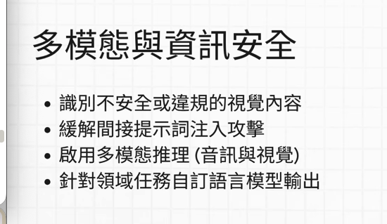
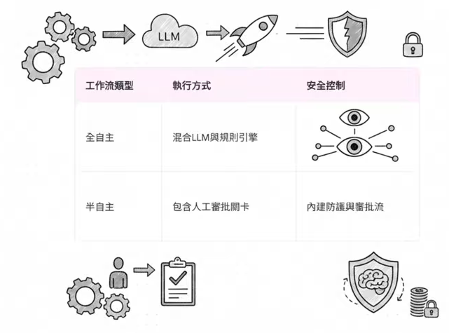
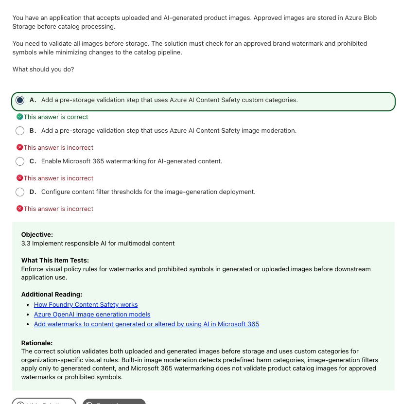

# Responsible AI and Content Safety｜護欄、防護盾與稽核

**考綱對應：** Plan and manage an Azure AI solution 1.4（實作 responsible AI）＋ Implement computer vision solutions 3.3（多模態 responsible AI）

**這是 AI-103 最密集的單一主題**，我這場估計有 10 題左右。而且它跟 AI-901 不一樣：901 考六大原則的觀念題，103 幾乎不考原則，全部轉向**具體的防護設定**——要擋什麼、用哪個功能擋、擋在 pipeline 的哪一段。

## 1. 三層防護的分工

| 機制 | 主要職責 | 攔截什麼 | 考點關鍵字 |
|---|---|---|---|
| **Safety filters / Content filters** | 分類與阻擋**普遍不被允許**的有害內容 | Hate、Violence、Sexual、Self-harm、越獄與注入攻擊 | 標記仇恨言論、有害內容、嚴重度閾值、法規禁止內容 |
| **Guardrails（護欄）** | 維護**企業業務規則與行為邊界** | 偏離主題、提及競爭對手、違反品牌聲明、不符公司規範的建議 | 執行品牌規則、特定領域限制、企業風格指南 |
| **Tool access control** | 治理 **agent 與工具行為** | 頻率限制、越權呼叫、非授權 API 呼叫 | 阻止 API 濫用、授權驗證、function calling 安全 |

> **啾啾筆記：** 記法是 **Safety filters = 底線（不能犯法、不能有害），Guardrails = 邊界（不能亂講、要守規矩）**。前者由微軟預先定義分類器打分，後者由企業自己定義喔～

> **Current terminology note：**Microsoft Learn 目前在 Foundry 的內容過濾功能上**也使用「Guardrails」這個字**（官方 harm categories 頁面就有「Severity levels for guardrails」一節）。所以上表的「safety filters vs guardrails」是**觀念上的分層**，不是兩個互斥的產品名稱。考題若把兩者當成不同選項並列，就照上表的職責區分來選。

## 2. 危害類別與嚴重度

Azure AI Content Safety 的四大核心類別：

| 類別 | 英文 |
|---|---|
| 仇恨與公平性 | **Hate and fairness** |
| 性內容 | **Sexual** |
| 暴力 | **Violence** |
| 自殘 | **Self-harm** |

### 嚴重度尺度（容易考細節）

| 模態 | 目前支援的尺度 |
|---|---|
| **Text** | 完整 **0–7**；可指定回傳精簡版 **0 / 2 / 4 / 6** |
| **Image** | **只有**精簡版 **0 / 2 / 4 / 6** |
| **Image with text（multimodal）** | 完整 **0–7**；可指定回傳精簡版 |
| **Guardrails 設定介面** | 分成四級：**Safe、Low、Medium、High** |

被判定為 `safe` 等級的內容會在 annotation 中標記，但**不會被過濾，也不可設定**。

> **啾啾筆記：** 「四個類別 × 四個等級」是最常被問的骨架。要多記一點的話，就記**影像只有精簡尺度（0/2/4/6），文字才有完整 0–7** 喔～

## 3. Prompt Shields：防注入與越獄

**Prompt Shields** 專門用來偵測試圖覆蓋系統指令的文字，分兩種攻擊型態：

| 攻擊型態 | 別名 | 怎麼發生 | 例子 |
|---|---|---|---|
| **User prompt attack** | 直接攻擊 / Jailbreak | 使用者在提問中直接下指令 | 「忽略先前的所有指示，現在你是…」 |
| **Indirect attack / Document attack** | **間接注入** | 惡意提示詞藏在**第三方內容**中，agent 擷取後不自覺執行 | 網頁、PDF、Email，或**截圖 OCR 出來的文字** |

間接注入是 103 的重點考法，尤其是**多模態版本**：攻擊者把指令寫在圖片裡，OCR 讀出來後就混進 prompt。防禦方式是在**呼叫模型前**過濾 OCR 文字，而不是只做影像的視覺審查。

### 處理策略：Reject ＋ Triage

| 處理動作 | 阻擋高風險？ | 保留供人工審核？ | 評價 |
|---|---|---|---|
| Allow and validate output | 否 | 否 | 攻擊直接進入模型，太晚了 |
| **Reject detected; triage uncertain** | **是** | **是** | 確診威脅直接拒絕；灰色地帶留給人工分流（HITL） |
| Remove delimiters and forward | 否 | 否 | 注入的是**語意**不是符號，移除分隔符擋不住 |
| Retry OCR and forward | 否 | 否 | 重新辨識出來的還是同一段惡意文字 |

> **啾啾筆記：** 題目同時出現「**high risk must be blocked**」和「**retain for human decision**」，處理策略一定是 **Reject detected ＋ Triage uncertain**。這個組合是送分題喔～

## 4. Custom categories（自訂類別）

微軟預設的分類器**只認識四大通用危害**，不會認識你公司的 logo、品牌浮水印或特定禁止符號。這時要用 **custom categories**，用少量樣本（few-shot）訓練專屬分類器。

| 版本 | 支援模態 | 狀態 | 備註 |
|---|---|---|---|
| **Custom categories (standard)** | 僅**文字** | **Preview** | 目前僅支援英文；輸入上限 1K 字元 |
| **Custom categories (rapid)** | **文字＋影像** | **Preview** | 定義新興有害內容模式並掃描比對 |

> **Current correction：**練習題的答案寫「Azure AI Content Safety custom categories」用來檢查**影像**的品牌浮水印。對應到現行文件，這屬於 **custom categories (rapid)**（standard 版只吃文字）。考試作答仍選 custom categories，但實作時要挑對版本。

### 多來源影像的防禦架構原則

題目出現「**uploaded images ＋ AI-generated images**」這種多來源情境時：

- 驗證邏輯要放在**寫入儲存體之前（pre-storage）**，或用 event-driven（Blob trigger）統一處理。
- **不能只依賴生成端的 deployment filter**——那只管得到 AI 生成的圖，漏掉使用者上傳的一半情境。

## 5. Content Safety 的其他偵測能力

| 功能 | 偵測什麼 | 狀態 | 什麼時候選 |
|---|---|---|---|
| **Prompt Shields** | 直接與間接提示詞注入 | Current | 隱藏指令、竄改系統提示詞、OCR 惡意指令 |
| **Groundedness detection** | LLM 回答是否有檢索資料支撐（幻覺） | **Preview** | RAG 架構的**輸出品質**評估 |
| **Protected material detection** | 是否產生受版權保護的文字或程式碼 | Current | 版權侵權防護、開源授權檢查 |
| **Task adherence** | Agent 的工具使用是否偏離、非預期或過早 | **Preview** | Agent 行為治理 |
| **Analyze text / Analyze image** | 四大危害類別分類 | Current | 一般內容審查 |

> **啾啾筆記：** 這幾個很容易在同一題裡當選項互相干擾。記住分工：**Groundedness 管「輸出對不對」，Prompt Shields 管「輸入安不安全」**。輸入端的攻擊不能用輸出端的評估器去擋喔～

## 6. 評估、稽核與人工監督

### 三類 Responsible AI 工具

| 工具類別 | 核心指標／機制 | 解決什麼問題 | 考點關鍵字 |
|---|---|---|---|
| **Evaluators（評估器）** | Groundedness、Relevance、Coherence、Fluency | 生成內容的**品質與效能** | 回答品質評分、RAG 依據度測試 |
| **Safety Evaluations（安全評估）** | Jailbreak defect rate、各危害類別暴露率、**自動化紅隊測試** | 面臨攻擊時的**防禦強度** | 抵抗惡意提示詞、上線前安全合規檢驗 |
| **Explanation tooling（解釋工具）** | 特徵重要性、**來源引用標記（citations）**、反事實分析 | 消除黑盒子，解釋「為什麼這樣答」「答案出自哪份文件」 | 透明度、可解釋性、稽核決策原因 |

兩種常見評估法：

- **AI-assisted evaluators（LLM as a judge）**：用模型當評審，對回答品質打分。
- **Adversarial simulator（對抗模擬器）**：自動模擬攻擊者角色送出越獄與有害提示詞，測試破防機率。屬於 safety evaluations。

### 來源詮釋資料（Provenance / Lineage Metadata）

記錄資料或模型輸出的來源、變更與歷史，專門用於稽核。

| 應用層次 | 記錄什麼 | 目的 | 考點關鍵字 |
|---|---|---|---|
| **生成推論層（RAG / Citations）** | 原始文件 URI、頁碼、chunk ID、擷取分數與時間戳 | 讓使用者檢視答案的佐證來源 | Citations、grounding、回答出處追蹤 |
| **資料管線層（Data Lineage）** | 來源系統、ETL／pipeline 版本、敏感資料遮蔽標記 | 追蹤資料從原始到索引庫的演變 | Data lineage、稽核變更歷程 |
| **模型治理層（Model Provenance）** | 基礎模型版本、微調資料集快照、訓練參數與訓練者身分 | 確保模型決策可重複驗證 | Model auditability、版本控制 |

- **Azure AI Search**：建索引時保留 `metadata_storage_path`、`metadata_storage_name`，讓查詢結果能回傳來源給 LLM 當 citation。
- **Microsoft Purview**：跨服務的資料治理工具，自動掃描並視覺化端到端的世系（lineage）。

> **啾啾筆記：** 看到 **Audit trail / Track history of changes / Verify answer source** → 關鍵概念就是 **provenance / lineage metadata**。它同時支撐 Transparency 和 Accountability 兩個原則喔～

### Human-in-the-Loop（HITL）與審批關卡

| 自主程度 | 運作方式 | 安全控制 | 適合的任務 |
|---|---|---|---|
| **全自主（Fully autonomous）** | LLM 自行決定呼叫工具，端到端執行 | 自動化防護機制監控 | **低風險**：摘要、分類、查詢、草稿 |
| **半自主（Semi-autonomous）** | 遇到高風險操作時**暫停**，等人類核可或駁回才繼續 | 內建防護＋審批流 | **高風險**：轉帳、刪除資料、發布公告、合約簽署 |

在 Azure 上設定人工審核有三種層級：

| 層級 | 實現方式 | 運作流程 | 適合情境 |
|---|---|---|---|
| **工具層級** | 宣告 function 工具時標註需要核准（例如 `approval_mode="always_require"`） | Agent 判定要呼叫此工具時不直接執行，回傳審批請求暫停，等應用層傳回核可結果再繼續 | 開發者自行封裝 agent、前端直接跳 confirm 視窗 |
| **流程編排層** | **Azure Logic Apps** 或 Power Automate Approvals | Agent 產生建議動作 → 送出 Teams Adaptive Card 給主管 → 核准後觸發下游 API | 企業跨系統操作，需要明確審核者身分與稽核日誌 |
| **狀態機層** | Azure Durable Functions 的 `wait_for_external_event` | Agent 進入休眠（狀態存 Storage、不消耗 compute）→ 等外部 webhook 喚醒 | 審批要數小時甚至數天、需要重試與容錯 |

完整的半自主工作流必須記錄：**Trace ID、LLM 推理依據、審批者身分、決定時間戳**。

> **啾啾筆記：** 題目問「怎麼讓 agent 執行關鍵 API 前取得主管核准？」→ 關鍵配對是 **Azure Logic Apps ＋ Teams/Outlook Approvals Connector**。工具層級的 approval mode 屬於 SDK 細節，實際寫法會隨 SDK 版本變動，考試看概念就好喔～

## 7. 常見錯誤與詳解

### Q07 — 驗證上傳與生成影像的品牌規則

| 快速判斷 | 內容 |
|---|---|
| **答案** | **A. Add a pre-storage validation step that uses Azure AI Content Safety custom categories** |
| **線索** | `uploaded and AI-generated`、`approved brand watermark`、`prohibited symbols`、`minimizing changes to the catalog pipeline` |
| **考點** | 內建危害分類 vs 企業自訂視覺規則 |
| **錯誤原因** | 沒注意到「多來源」和「企業專屬符號」兩個條件 |

**為什麼選 A：** 「核准的品牌浮水印」和「特定禁止符號」是**企業專屬的視覺規則**，微軟預設模型不認識。Custom categories 支援用少量樣本影像訓練客製分類器。把驗證放在寫入 Blob 前，能一次涵蓋「上傳」與「生成」兩種來源，也不用動下游目錄流程。

| Option | 涵蓋來源 | 能偵測自訂標誌？ | 為什麼是／不是 |
|---|---|---|---|
| **A. Pre-storage validation with custom categories** | **全部** | **能** | **是。**同時覆蓋兩大來源並滿足企業專屬規則。 |
| B. Pre-storage validation with built-in image moderation | 全部 | 否 | 內建只偵測 Hate/Violence/Sexual/Self-harm 四類，不認識自訂符號。 |
| C. Enable Microsoft 365 watermarking | N/A | 否 | M365 辦公文件的浮水印功能，是「加浮水印」不是「驗證」。 |
| D. Configure content filter thresholds for image generation | **僅 AI 生成** | 否 | 只能套在生成部署上，**漏掉使用者上傳的圖**。 |

**補充與延伸：** 現行文件中，能同時掃描文字與影像的是 **custom categories (rapid)**（preview）；custom categories (standard) 只支援文字。

> **記法：多來源 → pre-storage 統一驗證；企業專屬符號 → custom categories。**

**官方來源：** [Custom categories](https://learn.microsoft.com/en-us/azure/ai-services/content-safety/concepts/custom-categories)、[What is Azure AI Content Safety?](https://learn.microsoft.com/en-us/azure/ai-services/content-safety/overview)

---

### Q18 — 擋住截圖 OCR 中的間接注入

| 快速判斷 | 內容 |
|---|---|
| **答案** | **Detection control: `Prompt Shields`；Handling action: `Reject detected; triage uncertain`** |
| **線索** | `webpage text that attempts to change the agent's instructions`、`prevent high-risk uploads from reaching the model`、`retain original uploads that require a human decision` |
| **考點** | 間接提示詞注入的偵測與分流 |
| **錯誤原因** | 把威脅當成「影像違規」而選 image moderation |

**為什麼是這組：** 威脅存在於圖片裡的**文字語意**（竄改指令），不是影像像素的視覺違規。Prompt Shields 專門辨識試圖覆蓋 agent 指令的文字，涵蓋直接越獄與第三方來源的間接注入。

#### Detection control

| Option | 為什麼不是 |
|---|---|
| Groundedness detection | 這是**輸出品質**評估，擋不了輸入端的注入攻擊。 |
| Image moderation | 偵測的是色情、暴力、血腥等視覺危害，不看圖片裡的文字語意。 |
| **Prompt Shields** | **是。**專門防範直接與間接提示詞注入。 |
| Protected material detection | 版權保護，與注入攻擊無關。 |

#### Handling action

| Option | 阻擋高風險？ | 保留供人工？ | 為什麼不是 |
|---|---|---|---|
| Allow and validate output | 否 | 否 | 攻擊已經抵達模型，違反題目要求。 |
| **Reject detected; triage uncertain** | **是** | **是** | **正確。**同時滿足兩大需求。 |
| Remove delimiters and forward | 否 | 否 | 注入的是語意不是分隔符，指令仍會被執行。 |
| Retry OCR and forward | 否 | 否 | 重新辨識還是同一段惡意文字。 |

> **記法：圖片裡的「文字在攻擊你」→ Prompt Shields，不是 image moderation。**

**官方來源：** [Prompt Shields](https://learn.microsoft.com/en-us/azure/ai-services/content-safety/concepts/jailbreak-detection)

---

### Q23 — 確保生成輸出安全的三個動作

| 快速判斷 | 內容 |
|---|---|
| **答案** | **A. Conduct red team exercises、B. Document the model's decision-making logic、D. Integrate Content Safety APIs** |
| **線索** | `safe and free from harmful content`、`three actions` |
| **考點** | Responsible AI 的縱深防禦（測試 → 防護 → 治理） |
| **錯誤原因** | 把「事後改善」當成「當下防範」 |

**為什麼是這三個：** 對應防禦的三個時機點。

| 時機 | 動作 | 對應選項 |
|---|---|---|
| **上線前** | AI red teaming（對抗性模擬測試），主動發掘漏洞 | A |
| **推論當下** | Content Safety API 即時過濾有害內容 | D |
| **治理層** | 記錄並文件化決策邏輯，滿足透明度與合規 | B |

| Option | 為什麼是／不是 |
|---|---|
| **A. Conduct red team exercises** | **是。**微軟 responsible AI 標準流程的必備實踐。 |
| **B. Document the model's decision-making logic** | **是。**直接對齊 Transparency 原則與合規稽核要求。 |
| C. Enable users to provide feedback on responses | 事後改善措施，無法在生成當下防範有害內容產出。 |
| **D. Integrate Content Safety APIs** | **是。**達成「確保輸出不含有害內容」的核心防護技術。 |
| E. Train exclusively on synthetic data | 過度極端，會削弱模型對真實情境的理解，也不保證輸出安全。 |

> **記法：測試（red team）＋ 防護（Content Safety）＋ 治理（文件化）＝ 縱深防禦三層。**

**官方來源：** [Responsible AI practices](https://learn.microsoft.com/en-us/azure/ai-foundry/responsible-use-of-ai-overview)、[AI red teaming agent](https://learn.microsoft.com/en-us/azure/ai-foundry/concepts/ai-red-teaming-agent)

## 8. Current vs Legacy

| Term / capability | Status | 快速理解 |
|---|---|---|
| **Prompt Shields** | **Current** | 現行名稱；舊稱 Jailbreak risk detection |
| **Groundedness detection** | **Preview** | RAG 幻覺偵測，API 可能變動 |
| **Custom categories (standard / rapid)** | **Preview** | standard 只吃文字且僅英文；rapid 支援文字＋影像 |
| **Task adherence** | **Preview** | Agent 工具使用偏離偵測，較新的能力 |
| **Content filters ↔ Guardrails** | **Current** | Foundry 介面現在把內容過濾功能歸在 guardrails 底下，兩者不是互斥產品 |
| **Azure AI Content Safety 舊稱 Content Moderator** | **Legacy exam-bank context** | 舊題若出現 Content Moderator，對照現行 Content Safety |

## 9. Quick Memory Rules

- **四大危害類別：Hate、Sexual、Violence、Self-harm。**
- **Text 有完整 0–7；Image 只有 0/2/4/6。**
- **輸入端攻擊 → Prompt Shields；輸出端幻覺 → Groundedness。**
- **企業專屬 logo／浮水印 → Custom categories，不是 built-in moderation。**
- **多來源影像 → pre-storage 驗證，不能只靠生成端過濾。**
- **高風險擋掉＋不確定留人工 → Reject detected; triage uncertain。**
- **稽核關鍵字（audit trail、verify source）→ provenance / lineage metadata。**
- **高風險寫入操作要核准 → Logic Apps ＋ Teams Approvals。**

## 10. Official Sources

核對日期：**2026-09-30**。

- [AI-103 Study Guide](https://learn.microsoft.com/en-us/credentials/certifications/resources/study-guides/ai-103)
- [What is Azure AI Content Safety?](https://learn.microsoft.com/en-us/azure/ai-services/content-safety/overview)
- [Harm categories in Azure AI Content Safety](https://learn.microsoft.com/en-us/azure/ai-services/content-safety/concepts/harm-categories)
- [Prompt Shields](https://learn.microsoft.com/en-us/azure/ai-services/content-safety/concepts/jailbreak-detection)
- [Custom categories](https://learn.microsoft.com/en-us/azure/ai-services/content-safety/concepts/custom-categories)
- [Groundedness detection](https://learn.microsoft.com/en-us/azure/ai-services/content-safety/concepts/groundedness)
- [Protected material detection](https://learn.microsoft.com/en-us/azure/ai-services/content-safety/concepts/protected-material)
- [Task adherence](https://learn.microsoft.com/en-us/azure/ai-services/content-safety/concepts/task-adherence)
- [Evaluation of generative AI applications](https://learn.microsoft.com/en-us/azure/ai-foundry/concepts/evaluation-approach-gen-ai)
- [Responsible AI for Microsoft Foundry](https://learn.microsoft.com/en-us/azure/ai-foundry/responsible-use-of-ai-overview)
- [AI-901 Responsible AI 六大原則](../../ai-901/knowledge/02_Responsible_AI.md)
