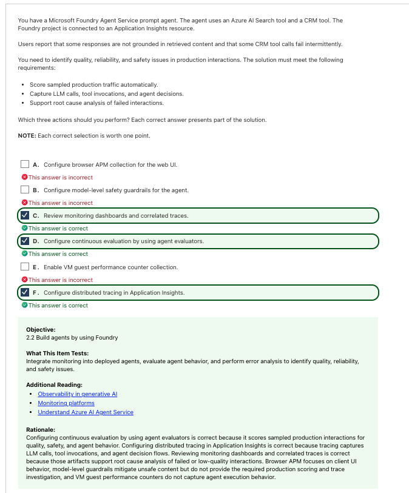
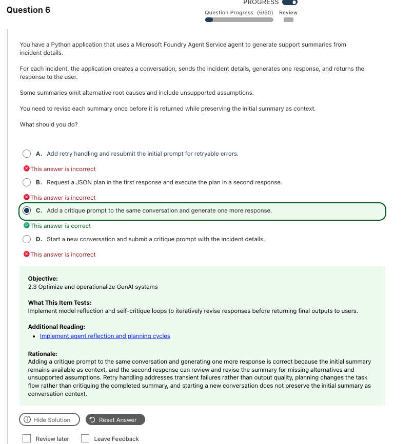
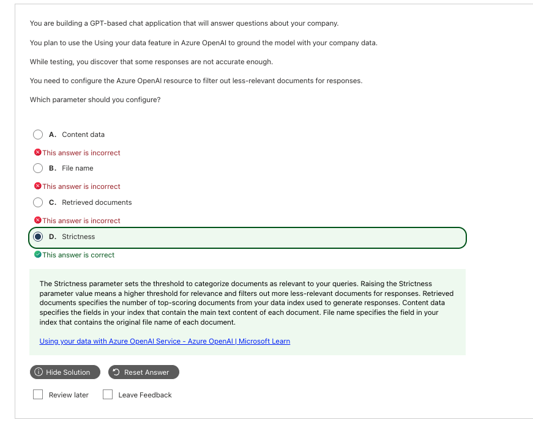
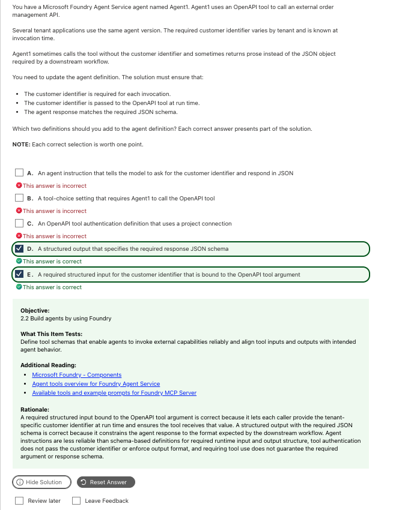

# Generative AI and Agents｜RAG、Agent 工具與最佳化

**考綱對應：** Implement generative AI and agentic solutions（30–35%）— 整份考試比重最高的部分

## 1. RAG（Retrieval-Augmented Generation）

RAG 的本質是**用檢索到的內容當作模型回答的依據**，流程是固定的：

```text
使用者問題 → 檢索（search / vector / hybrid）→ 取回 top N 片段
→ 組進 prompt 當上下文 → 模型生成 → 附上 citations
```

檢索與索引的建置細節在 [Information Extraction](07_Information_Extraction.md)；這一節專注在**生成端的調參**。

### On Your Data 關鍵參數（必背二分法）

| 參數 | 類別 | 作用 | 看到什麼關鍵字選它 |
|---|---|---|---|
| **Strictness** | **相關性門檻**（1–5，預設 3） | 設定檢索內容被採納為上下文的嚴格度，**低於門檻的片段直接被過濾掉** | `filter out less-relevant`、`higher threshold for relevance` |
| **Retrieved documents** | **檢索數量上限**（Top N，通常 3–20） | 控制最多取回幾筆最高分結果餵給 LLM | `limit the number of documents passed to the prompt` |
| **Content data** | 欄位對應（Field mapping） | 指定索引中哪個欄位存放主要文字內容 | 索引架構對齊 |
| **File name** | 欄位對應（Field mapping） | 指定存放原始檔名的欄位 | citation 標題顯示 |

Strictness 的調整取捨：

| 設定 | 效果 | 風險 |
|---|---|---|
| 調高（4–5） | 回答更嚴謹、過濾更多文件 | 設太高會讓模型常常說「找不到相關資訊」 |
| 調低（1–2） | 盡量回答、容忍邊緣相關文件 | 容易混入雜訊、引發幻覺 |

> **啾啾筆記：** Strictness 管「**門檻**」，Retrieved documents 管「**數量**」。看到 filter / threshold 選 strictness，看到 number / limit 選 retrieved documents，這兩個一定會互相當干擾選項喔～

## 2. Agent 的組成

| 元件 | 定義什麼 | 考點 |
|---|---|---|
| **Role / Instructions** | Agent 的角色、語氣、行為邊界 | 軟性約束，**不保證**輸出格式 |
| **Goal** | 要完成的任務目標 | |
| **Model** | 背後使用的模型部署 | 複雜推理選大模型、低延遲選小模型 |
| **Tools** | 能呼叫的外部能力 | 見下表 |
| **Conversation / Thread** | 對話狀態，自動持久化歷史訊息 | **要基於前次回應做修改，必須在同一個 conversation 內** |
| **Memory** | 跨對話的長期記憶 | 與單次 conversation 的短期上下文不同 |

### 常見 Agent 工具

| 工具 | 用途 |
|---|---|
| **Azure AI Search** | 檢索企業索引內容 |
| **File Search** | 檢索上傳的檔案 |
| **Function tool / Custom function** | 呼叫自己寫的程式邏輯 |
| **OpenAPI tool** | 依 OpenAPI 規格呼叫外部 REST API |
| **Code Interpreter** | 執行程式碼做計算或資料處理 |
| **MCP（Model Context Protocol）** | 接上 MCP server 提供的工具集 |
| **Bing Grounding / Web Search** | 以網路資訊佐證回答 |
| **Content Understanding** | 從檔案擷取結構化表示 |
| **Agent-to-Agent (A2A)** | 呼叫其他 agent |

## 3. 結構化輸入與輸出

這是 103 很愛考的一組，核心觀念是：**prompt 是建議，schema 才是保證。**

| 機制 | 作用 | 怎麼設定 | 解決什麼問題 |
|---|---|---|---|
| **Structured input** | 定義**必填**的輸入欄位，並繫結到工具參數 | 工具 schema 中 `"required": ["customer_id"]` | Agent 呼叫工具時**漏傳參數** |
| **Structured output** | 以 JSON Schema 約束模型回應 | `response_format` 設為 `json_schema` 且 `strict: true` | Agent 回傳**散文（prose）**而非 JSON |

Structured output 採用**文法約束採樣（constrained decoding）**，保證回傳字串必然符合傳入的 schema，杜絕 Markdown 標記、客套話或非預期 prose。

```python
# 工具參數必填（structured input）
order_tool = {
    "type": "function",
    "function": {
        "name": "query_customer_order",
        "parameters": {
            "type": "object",
            "properties": {
                "customer_id": {"type": "string", "description": "租戶客戶唯一識別碼"},
                "order_id": {"type": "string"},
            },
            "required": ["customer_id"],      # 硬性約束：執行期必填
            "additionalProperties": False,
        },
    },
}

# 回應格式約束（structured output）
response_format = {
    "type": "json_schema",
    "json_schema": {
        "name": "order_response_schema",
        "strict": True,                       # 強制 100% 遵從 schema
        "schema": AgentFinalResponse.model_json_schema(),   # 可用 Pydantic 產生
    },
}
```

> **啾啾筆記：** 題目強調 **Must ensure / Reliably / Matches schema** 時，答案一律選 schema（structured input／output），**不要選純 system prompt 或 instructions**。Instruction 只是拜託模型，schema 才是強制喔～

`tool_choice` 也常來當干擾選項：它只強制「**必須呼叫某個工具**」，**不保證參數帶齊**，也管不到最終輸出格式。

## 4. Agent 四大設計模式

| 模式 | 運作方式 | 什麼時候用 |
|---|---|---|
| **Reflection（反思／自我批判）** | 模型生成內容 → 用 critique prompt 讓它（或另一個模型）自我審查並修正 | 摘要要修正遺漏、檢查無依據的假設 |
| **Planning（規劃）** | 先把大目標拆成子步驟或工具呼叫順序，再逐步執行 | 複雜多步驟任務編排 |
| **Tool Use（工具使用）** | 呼叫外部 API 擴充能力 | 需要即時資料或外部系統操作 |
| **Multi-Agent Collaboration（多代理協同）** | 多個角色各司其職（一人撰寫、一人審稿） | 需要分工與交叉檢核 |

### Reflection 的實作重點

官方考綱寫的是「model reflection、chain-of-thought evaluations、**self-critique loops**」。實作上最關鍵的一點是：

> **要保留初次回應當作上下文，就必須在「同一個 conversation / thread」中追加 critique prompt。**開新對話會丟失上下文。

## 5. 最佳化生成行為

| 手段 | 說明 |
|---|---|
| **Prompt engineering** | 調整指令、範例（few-shot）、輸出格式描述 |
| **模型參數** | temperature（創意度）、top_p、max tokens、frequency/presence penalty |
| **Reflection / self-critique** | 見上節 |
| **多模型編排** | 便宜小模型做初篩、大模型做最終推理；或 LLM 搭配規則引擎的混合架構 |

## 6. 可觀測性（Observability）

Agent 可觀測性的**黃金三要素**，這組在考試裡是整組出現的：

| 要素 | 工具 | 回答什麼問題 |
|---|---|---|
| **Traces（追蹤）** | **Application Insights ＋ OpenTelemetry distributed tracing** | 每個 agent step、tool invocation、LLM call 的輸入輸出是什麼？ |
| **Metrics（指標）** | Azure Monitor | 延遲、token 使用量、工具呼叫成功／失敗率 |
| **Evaluations（評估）** | **Continuous evaluation ＋ agent evaluators** | 線上真實請求的 groundedness、relevance 分數如何？ |

| 看到這個需求 | 必選這個 |
|---|---|
| 記錄 **LLM calls ＋ tool invocations ＋ agent decisions** | Distributed tracing in Application Insights |
| **自動對生產流量抽樣打分** | Continuous evaluation by using agent evaluators |
| **調查失敗互動的根本原因** | Review monitoring dashboards and correlated traces |

> **啾啾筆記：** APM 是 Application Performance Monitoring。**Browser APM 只看得到前端瀏覽器行為**，看不到 agent 內部呼叫了哪支 API 或 prompt 內容，所以在 agent 題裡永遠是干擾選項喔～

## 7. Foundry SDK 呼叫模式

> **Current correction（重要）：**現行 `azure-ai-projects`（v2.3+）**只支援 Entra ID 驗證**，用 `AIProjectClient(endpoint=..., credential=...)` 建立。舊教材常見的 `AIProjectClient.from_connection_string(...)` 與 `project_client.agents.create_agent(model=..., response_format=...)` 寫法屬於**舊版 SDK**，僅保留為 **Legacy exam-bank context**。考試若出現舊寫法，判斷它想測的觀念即可；實作請用下面的現行模式。

```python
import os
from azure.ai.projects import AIProjectClient
from azure.identity import DefaultAzureCredential

with (
    DefaultAzureCredential() as credential,
    AIProjectClient(
        endpoint=os.environ["FOUNDRY_PROJECT_ENDPOINT"],   # https://<account>.services.ai.azure.com/api/projects/<project>
        credential=credential,
    ) as project_client,
):
    # 取得 OpenAI client 來跑 Responses / Conversations / Evaluations
    with project_client.get_openai_client() as openai_client:
        response = openai_client.responses.create(
            model=os.environ["FOUNDRY_MODEL_NAME"],
            input="Summarize the incident.",
        )
        print(response.output_text)

        # 在同一段對話中接續（reflection 就靠這個）
        critique = openai_client.responses.create(
            model=os.environ["FOUNDRY_MODEL_NAME"],
            input="Review the summary above for missing root causes.",
            previous_response_id=response.id,        # 保留前一次回應當上下文
        )
```

| 操作 | 現行入口 |
|---|---|
| Agent 建立與執行 | `project_client.agents` |
| Responses / Conversations / Evaluations / Fine-tuning | `project_client.get_openai_client()` |
| 列出模型部署 | `project_client.deployments` |
| 列出已連線的 Azure 資源 | `project_client.connections` |
| 建立／列出搜尋索引 | `project_client.indexes` |
| 上傳資料集 | `project_client.datasets` |

> **啾啾筆記：** 程式題通常不刁難語法，考的是**直覺型方法名**——建立 agent 選 `.create()` 而不是 `.get()`。看到極端冷門的底層細節就果斷跳過，不要浪費時間喔～

## 8. 常見錯誤與詳解

### Q03 — Agent 的品質、可靠性與安全性監控



| 快速判斷 | 內容 |
|---|---|
| **答案** | **C. Review monitoring dashboards and correlated traces、D. Configure continuous evaluation by using agent evaluators、F. Configure distributed tracing in Application Insights** |
| **線索** | `score sampled production traffic`、`capture LLM calls, tool invocations`、`root cause analysis` |
| **考點** | Agent 可觀測性三要素 |
| **錯誤原因** | 選了 browser APM 或 VM counter，監控範圍完全錯層 |

**三個需求逐一對應：**

| 需求 | 解法 |
|---|---|
| Score sampled production traffic automatically | **D.** Continuous evaluation ＋ agent evaluators |
| Capture LLM calls, tool invocations, and agent decisions | **F.** Distributed tracing in Application Insights |
| Support root cause analysis of failed interactions | **C.** Review monitoring dashboards and correlated traces |

| Option | 為什麼是／不是 |
|---|---|
| A. Configure browser APM collection for the web UI | 只看得到前端 JS 錯誤與頁面渲染，擷取不到 agent 內部的 LLM 與 CRM 工具調用。 |
| B. Configure model-level safety guardrails | 這是**主動防禦**機制，不提供流量打分與根因追蹤。 |
| **C. Review monitoring dashboards and correlated traces** | **是。**直接滿足根因分析需求。 |
| **D. Configure continuous evaluation by using agent evaluators** | **是。**直接滿足生產流量抽樣打分。 |
| E. Enable VM guest performance counter collection | Agent Service 是託管 PaaS，虛擬機硬體計數器捕捉不到 agent 執行邏輯。 |
| **F. Configure distributed tracing in Application Insights** | **是。**完整記錄跨服務呼叫鏈。 |

> **記法：打分用 evaluation，記錄用 tracing，查因用 dashboard。三個需求三個答案，不會重複。**

**官方來源：** [Observability in generative AI](https://learn.microsoft.com/en-us/azure/ai-foundry/concepts/observability)、[Trace agents](https://learn.microsoft.com/en-us/azure/foundry/observability/how-to/trace-agent-client-side)

---

### Q04 — 修正摘要但保留初次結果當上下文



| 快速判斷 | 內容 |
|---|---|
| **答案** | **C. Add a critique prompt to the same conversation and generate one more response** |
| **線索** | `revise each summary once`、`preserving the initial summary as context` |
| **考點** | Reflection / self-critique pattern 與對話狀態 |
| **錯誤原因** | 沒注意到「保留初次摘要作為上下文」這個限制 |

**為什麼選 C：** 這是典型的反思／自我批判模式。題目特別要求保留初次摘要當上下文，所以必須在**同一個 conversation** 中追加 critique prompt——模型才看得到自己剛寫的初稿，進而檢查遺漏與無依據的推論，輸出修訂版。

| Option | 設計模式 | 為什麼不是 |
|---|---|---|
| A. Add retry handling and resubmit | 容錯與重試（Error handling） | 重試是為了解決暫態網路或 5xx 錯誤，**不能改善內容品質**。 |
| B. Request a JSON plan and execute in a second response | 規劃與執行（Planning） | 改變的是整個任務工作流結構，不是對已生成的摘要做檢驗修訂。 |
| **C. Add a critique prompt to the same conversation** | **Reflection / Self-critique** | **是。**保留上下文，單次反思修訂。 |
| D. Start a new conversation and submit a critique prompt | 獨立對話（Stateless） | 開新對話會**遺失初次摘要的 context**，違反題目明確要求。 |

**補充與延伸：** Agent Service 的 thread／conversation 會自動持久化歷史訊息。要做「基於前次回應的迭代修訂」，必須在同一個 thread 內新增訊息並觸發新的 run（Responses API 則用 `previous_response_id`）。

> **記法：preserve context → same conversation；new conversation 一定是錯的。**

**官方來源：** [Agent reflection and planning cycles](https://learn.microsoft.com/en-us/azure/foundry/agents/overview)

---

### Q05 — 過濾相關性較低的文件



| 快速判斷 | 內容 |
|---|---|
| **答案** | **D. Strictness** |
| **線索** | `filter out less-relevant documents` |
| **考點** | On Your Data 的相關性門檻 vs 數量上限 |
| **錯誤原因** | 把 Retrieved documents（數量）當成相關性過濾 |

**為什麼選 D：** Strictness 是設定相關性閾值的參數（整數 1–5）。調高數值會用更嚴格的標準篩選檢索結果，低於門檻的片段直接被排除，不再餵給模型當上下文。

| Option | 參數類別 | 為什麼不是 |
|---|---|---|
| A. Content data | Field mapping | 指定索引中哪個欄位放主要內容，是資料對齊設定。 |
| B. File name | Field mapping | 指定原始檔名欄位，用於 citation 顯示。 |
| C. Retrieved documents | Top N 數量限制 | 只控制「取幾份」，**不評估相關性門檻**。 |
| **D. Strictness** | 相關性門檻 | **是。**調高就拉高門檻，排除低相關文件。 |

> **記法：Strictness 管門檻，Retrieved documents 管數量。**

**官方來源：** [Using your data with Azure OpenAI](https://learn.microsoft.com/en-us/azure/ai-foundry/openai/concepts/use-your-data)

---

### Q06 — 保證工具參數必填且回應符合 JSON schema



| 快速判斷 | 內容 |
|---|---|
| **答案** | **D. A structured output that specifies the required response JSON schema、E. A required structured input for the customer identifier that is bound to the OpenAPI tool argument** |
| **線索** | `required for each invocation`、`passed to the OpenAPI tool at run time`、`matches the required JSON schema` |
| **考點** | Prompt 的軟約束 vs Schema 的硬約束 |
| **錯誤原因** | 選了 agent instruction，把自然語言指令當成保證 |

**兩個痛點各對應一個解法：**

| 痛點 | 解法 |
|---|---|
| Agent 呼叫工具時漏傳客戶識別碼 | **E.** Structured input，把欄位設為 required 並繫結到 OpenAPI tool 參數 |
| Agent 回傳 prose 而非 JSON 物件 | **D.** Structured output，以 JSON schema 強制輸出格式 |

| Option | 設定層級 | 為什麼是／不是 |
|---|---|---|
| A. An agent instruction… | 提示詞層 | 軟性約束，模型仍有機率漏問或輸出雜亂文字。題目要求「保證」。 |
| B. A tool-choice setting… | 呼叫策略層 | 只強制「必須呼叫該工具」，不保證參數帶齊，也管不到輸出格式。 |
| C. An OpenAPI tool authentication definition… | 安全連線層 | 只處理 API 鑑權，與執行期參數傳遞和輸出格式無關。 |
| **D. A structured output…** | 輸出驗證層 | **是。**徹底解決下游工作流無法解析 prose 的問題。 |
| **E. A required structured input…** | 輸入參數繫結層 | **是。**確保每次呼叫都帶入 customer identifier。 |

**補充與延伸：** 多租戶情境下，客戶識別碼在**呼叫時（invocation time）**才可知，所以不能寫死在 agent 定義裡，必須透過 structured input 由呼叫端傳入並繫結到工具參數。

> **記法：Must ensure / Reliably → 選 Schema，不要選 Instruction。**

**官方來源：** [Agent tools overview](https://learn.microsoft.com/en-us/azure/foundry/agents/concepts/tool-catalog)、[Structured outputs](https://learn.microsoft.com/en-us/azure/ai-foundry/openai/how-to/structured-outputs)

## 9. Current vs Legacy

| Term / capability | Status | 快速理解 |
|---|---|---|
| **Microsoft Foundry Agent Service** | **Current** | 現行 agent 託管服務 |
| **`AIProjectClient(endpoint=, credential=)`** | **Current** | 只支援 Entra ID 驗證 |
| **`AIProjectClient.from_connection_string(...)`** | **Legacy exam-bank context** | 舊版 SDK 寫法，現行版本已改用 endpoint |
| **Responses API ＋ `previous_response_id`** | **Current** | 現行接續對話的方式 |
| **Assistants API threads / runs** | **Legacy exam-bank context** | 舊題常見；概念（同一 thread 保留上下文）仍然正確 |
| **Azure OpenAI On Your Data** | **Current** | Strictness／Retrieved documents 參數仍是考點 |
| **Azure AI Studio / Azure AI Foundry 舊稱** | **Legacy exam-bank context** | 現行名稱為 Microsoft Foundry |

## 10. Quick Memory Rules

- **Strictness = 門檻；Retrieved documents = 數量。**
- **Instruction 是建議，Schema 是保證。**
- **保留上下文做修訂 → 同一個 conversation，絕不開新對話。**
- **Tracing 記錄、Evaluation 打分、Dashboard 查因。**
- **Browser APM 在 agent 題永遠是干擾選項。**
- **RAG 是寫死的流程，Agent 是動態決定的流程。**
- **建立資源的方法名選 `.create()`，不是 `.get()`。**

## 11. Official Sources

核對日期：**2026-09-30**。

- [AI-103 Study Guide](https://learn.microsoft.com/en-us/credentials/certifications/resources/study-guides/ai-103)
- [Microsoft Foundry Agents overview](https://learn.microsoft.com/en-us/azure/foundry/agents/overview)
- [Agent tool catalog](https://learn.microsoft.com/en-us/azure/foundry/agents/concepts/tool-catalog)
- [Azure AI Projects client library for Python](https://learn.microsoft.com/en-us/python/api/overview/azure/ai-projects-readme?view=azure-python)
- [Using your data with Azure OpenAI](https://learn.microsoft.com/en-us/azure/ai-foundry/openai/concepts/use-your-data)
- [Structured outputs](https://learn.microsoft.com/en-us/azure/ai-foundry/openai/how-to/structured-outputs)
- [Retrieval augmented generation in Microsoft Foundry](https://learn.microsoft.com/en-us/azure/ai-foundry/concepts/retrieval-augmented-generation)
- [Trace agents with Application Insights](https://learn.microsoft.com/en-us/azure/foundry/observability/how-to/trace-agent-client-side)
- [Evaluate agents](https://learn.microsoft.com/en-us/azure/foundry/observability/how-to/evaluate-agent)
