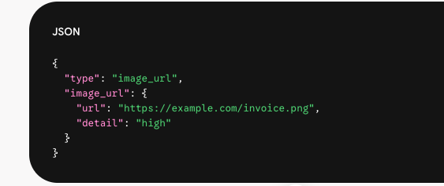
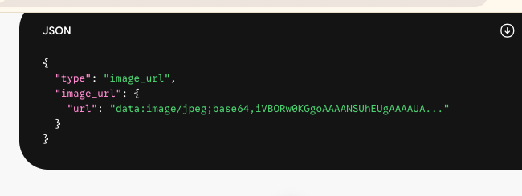
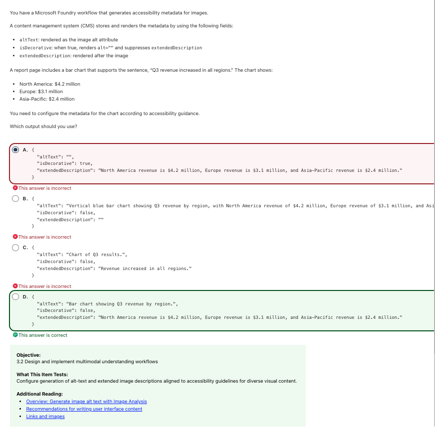
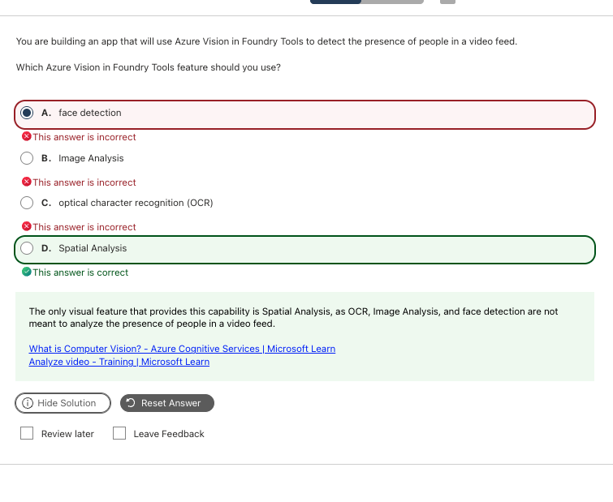

# Computer Vision｜影像生成、多模態理解與視覺安全

**考綱對應：** Implement computer vision solutions（10–15%）

AI-103 的視覺題和 AI-901 差很多：901 問「這是 classification 還是 object detection」，103 問「**這個生成／編輯流程要怎麼設定**」「**alt text 該怎麼寫**」。傳統的 Vision API 題反而變少了。

## 1. 影像與影片生成工作流

完整的視覺生成不是「文字生圖」就結束，而是四階管線：

| 步驟 | 名稱 | 實際在做什麼 | 考點關鍵字 |
|---:|---|---|---|
| 1 | **提供文字提示詞與參考媒體** | 呼叫 Generations/Edits API 時傳入 text prompt、style 參數，或參考圖檔（image conditioning） | Prompt engineering、multi-modal input、reference image |
| 2 | **生成基礎視覺內容** | 模型產出第一版原始影像或影格（base image / frame） | Base generation、初始構圖 |
| 3 | **基於遮罩的編輯（Mask-based edits）** | 用 mask 定義哪些區域保留、哪些允許重繪 | Masking、alpha channel、region specification |
| 4 | **局部重繪（Inpainting）進行無縫修改** | 只替換遮罩內的像素，並參考邊界紋理與光影自然接合 | Inpainting、seamless blend |

### Inpainting vs Outpainting

| | **Inpainting（局部重繪）** | **Outpainting（外擴延伸）** |
|---|---|---|
| 遮罩位置 | 原圖**框內**的特定區塊 | 原圖**邊界外側** |
| 效果 | 替換或擦除畫面內的東西 | 往外擴展更大的背景或視角 |
| 例子 | 圈出「沙發上的貓」，prompt 寫 `a sleeping dog` → 沙發不變，貓變成狗 | 原圖置中縮小、四周留空白遮罩，prompt 寫 `a modern living room` → 主角不變，四周自動補全 |

### 遮罩影像（Mask Image）

遮罩就像一張「防護貼紙」，精確告訴模型**哪些區域要改、哪些要保留**。不給遮罩，模型就不知道你要換掉哪一部分。

| 比較維度 | **Alpha 透明通道**（API 標準做法） | **黑白二值遮罩** |
|---|---|---|
| 運作機制 | 用透明度（Alpha）區分 | 用純黑／純白色塊區分 |
| 保留區域 | **不透明**（Alpha = 100%） | **黑色**像素 |
| 重繪區域 | **全透明**（Alpha = 0%） | **白色**像素 |
| 檔案格式 | **PNG**（必須有 RGBA 通道） | PNG 或 JPEG |
| 應用場景 | Azure OpenAI / OpenAI Image Edit API | 傳統電腦視覺、部分開源擴散模型 |

**規格完全一致原則：**遮罩的解析度尺寸必須與原始影像**完全一致**（原圖 1024×1024，遮罩也必須是 1024×1024），且要用支援透明度的格式。

> **啾啾筆記：** Inpainting 是「往內修」，Outpainting 是「往外長」。記遮罩的話，記 **透明＝可以改、不透明＝不准動** 就好喔～

### 內容安全的介入點

| 階段 | 過濾器 |
|---|---|
| 步驟 1 接收提示詞 | **Input content filter**（阻擋違規提示） |
| 步驟 2 與步驟 4 生成後 | **Output content filter**（確保沒生成出有害影像） |

## 2. 多模態理解：傳圖給模型

多模態模型的 payload 中，`image_url` 物件有三種變化：

| 變化 | 語法 | 什麼時候用 |
|---|---|---|
| **公開 URL** | `"url": "https://example.com/sample.png"` | 圖片已在公開 CDN 或開放的 Blob Storage |
| **Base64 Data URI** | `"url": "data:image/jpeg;base64,/9j/4AAQ..."` | 本地圖檔、私有資料不願公開託管、臨時產生的影像 |
| **`detail` 參數** | `"detail": "low" \| "high" \| "auto"` | 控制 token 消耗與辨識精細度 |

### `detail` 三種值

| 值 | 機制 | 適用情境 | 特點 |
|---|---|---|---|
| **`low`** | 固定 85 tokens | 只需總體理解（「這張圖是室內還是室外？」） | 速度最快、token 最少 |
| **`high`** | 切成 512×512 小塊計算：85 tokens 基礎費 ＋ 每塊 170 tokens | 需要細緻分析（辨識發票細小文字、讀複雜圖表、定位小物件） | 精準但貴 |
| **`auto`**（預設） | 模型依輸入解析度自動決定走 low 或 high | 一般情況 | |

> **私有 Blob 存取：**圖片若放在未公開的 Azure Blob Storage，URL 必須附加 **SAS Token**，否則模型推論時會因 403 報錯。

> **啾啾筆記：** 看到「**辨識發票上的細小文字**」「**讀懂圖表數值**」→ `detail: "high"`；看到「只要知道大概是什麼場景」→ `low`。token 數字（85／170）偶爾會考，但更常考的是**什麼情境該用哪一個**喔～

## 3. 無障礙：alt text 與延伸描述

這是 103 新增的考點，考的是 **WCAG 無障礙規範在多模態 metadata 上的實作**。

| 欄位 | 用途 | 寫法原則 |
|---|---|---|
| **`altText`** | 渲染成圖片的 alt 屬性，給螢幕閱讀器快速朗讀 | **簡短精確**：說明圖表類型與主題即可 |
| **`isDecorative`** | 為 `true` 時代表純裝飾，螢幕閱讀器直接略過，且會**壓制 `extendedDescription`** | 只有背景花紋、分隔線等才設 true |
| **`extendedDescription`** | 渲染在圖片之後，給需要詳細資訊的使用者 | **放具體數據**與完整內容 |

### 三大黃金法則

| 圖片類型 | 做法 |
|---|---|
| **純裝飾圖**（背景、分隔線、氛圍插圖） | `alt=""` 或 `isDecorative: true`，讓螢幕閱讀器略過 |
| **複雜資訊圖表**（長條圖、折線圖、架構圖） | **二階結構**：短 alt 指明圖表類別與目的；長描述提供完整逐點數據 |
| **避免過度描述視覺風格** | 除非顏色有語意（紅色代表警告），否則不要在 altText 描述顏色、陰影或字型大小 |

> **啾啾筆記：** 最常見的陷阱是把全部數據塞進 altText。正確做法是 **短標籤在 altText，長數據在 extendedDescription**。而且只要圖片有實質資訊，`isDecorative` 就**必須是 false** 喔～

## 4. 多模態視覺理解的服務選擇

| 需求 | 選什麼 |
|---|---|
| 分析視覺語境、回答有視覺依據的問題（VQA） | **多模態模型**（GPT 系列等） |
| 為單張或多張圖片產生簡短／詳細 caption | 多模態模型；或 Content Understanding 的 `prebuilt-imageSearch` |
| 從影像擷取**結構化欄位**（型別固定、要 confidence 與 bounding box） | **Azure Content Understanding** |
| 分析影片片段、自動分段、產生逐段描述 | **Content Understanding video analyzer** |
| 純 OCR 文字擷取 | **Document Intelligence Read model** |
| 人臉偵測與辨識 | **Azure Face** |

Content Understanding 的 **standard vs pro mode** 是高頻考點：

| 模式 | 運作方式 | 適用 | 限制 |
|---|---|---|---|
| **Standard / Single-task** | 針對單一輸入直接執行 OCR 或既定模板擷取 | 單張證件辨識、常規發票金額、純影像 OCR | 延遲低、成本低，不支援跨文件邏輯推論 |
| **Pro mode / Multi-file** | 串聯多模態 LLM，具備上下文理解與**多步驟推理** | 比對合約條款差異、跨多張圖表整合歸納、圖文關聯驗證 | 延遲較高，支援多檔案與參考資料，區域與 API 版本有限制 |

| 看到這些字 | 選 |
|---|---|
| Direct extraction、Standard OCR、Prebuilt model | **Standard / Single-task** |
| Multi-step reasoning、Cross-document analysis、Complex visual reasoning | **Pro mode** |

> **NEEDS VERIFICATION：**原始筆記記載 pro mode 是透過 `config.workflow = "agentic"`（早期預覽為 `"pro"`）設定。我在現行 Content Understanding 文件中**沒有找到這個屬性名稱**的對應說明，所以只保留**概念層面的 standard vs pro 區分**（這部分考試會考），實際 API 屬性請以當下的 [Content Understanding REST 文件](https://learn.microsoft.com/en-us/rest/api/contentunderstanding/)為準。

Content Understanding 的完整能力與 field schema 寫法見 [Information Extraction](07_Information_Extraction.md#3-azure-content-understanding)。

## 5. 多模態的 responsible AI

| 需求 | 做法 | 對應模組 |
|---|---|---|
| 分類並阻擋不安全的視覺內容 | Content Safety 的 **Analyze image**（四大危害類別，嚴重度 0/2/4/6） | [03](03_Responsible_AI_and_Content_Safety.md#2-危害類別與嚴重度) |
| 偵測並緩解**圖片內嵌文字**引發的間接注入 | 在呼叫模型前對 OCR 文字跑 **Prompt Shields** | [03](03_Responsible_AI_and_Content_Safety.md#3-prompt-shields防注入與越獄) |
| 執行視覺政策規則（浮水印、禁止符號、品牌規範） | Content Safety **custom categories** | [03](03_Responsible_AI_and_Content_Safety.md#4-custom-categories自訂類別) |

## 6. 常見錯誤與詳解

### Q08 — 圖表的無障礙 metadata

| 快速判斷 | 內容 |
|---|---|
| **答案** | **D.**（`altText` 簡短概括、`isDecorative: false`、`extendedDescription` 放三區域具體數據） |
| **線索** | `isDecorative: when true... suppresses extendedDescription`、`accessibility guidance` |
| **考點** | WCAG 二階描述結構 |
| **錯誤原因** | 選了 A，把 `isDecorative` 設成 `true` |

**為什麼選 D：** 這張圖表包含明確的商業數據（北美 $4.2M、歐洲 $3.1M、亞太 $2.4M），**絕對不是裝飾圖**，所以 `isDecorative` 必須是 `false`。依無障礙指南，altText 要簡短精確（說明圖表類型與主題），extendedDescription 放完整數據。

| Option | `isDecorative` | 問題 |
|---|---|---|
| A. | **`true`（致命錯誤）** | 題目明寫 `isDecorative: true` 會**壓制 extendedDescription**，視障者完全讀不到那串營收數字。 |
| B. | `false` | altText 過長，而且描述了「Vertical blue bar」這種無語意的視覺雜訊；數據應該拆到延伸描述。 |
| C. | `false` | extendedDescription 只重複標題，完全遺漏各區域金額，沒有實質價值。 |
| **D.** | `false` | **是。**短標籤在 altText，長數據在 extendedDescription，完全符合最佳實踐。 |

> **記法：有資訊的圖 → isDecorative 一定是 false；短 alt ＋ 長描述兩階分工。**

**官方來源：** [Generate image alt text](https://learn.microsoft.com/en-us/azure/ai-services/computer-vision/concept-describe-images)、[W3C WCAG Images Tutorial](https://www.w3.org/WAI/tutorials/images/)

---

### Q09 — 在視訊串流中偵測人員存在

| 快速判斷 | 內容 |
|---|---|
| **題庫答案** | **D. Spatial Analysis** |
| **線索** | `video feed`、`detect the presence of people` |
| **考點** | 靜態影像分析 vs 即時視訊串流分析 |
| **錯誤原因** | 選了 face detection，把「偵測人員存在」等同於「人臉偵測」 |

**為什麼題庫選 D：** Spatial Analysis 是 Azure Computer Vision 專門針對**即時攝影機視訊串流**設計的功能，核心工作包含偵測物理空間中人員的存在、人流計數、行進路徑追蹤與人員間距監測。

| Option | 核心輸入 | 為什麼不是 |
|---|---|---|
| A. face detection | 靜態圖檔、人臉特寫 | **偵測人員存在 ≠ 人臉偵測**。背影、側面、戴帽子或距離遠都偵測不到；輸入來源也不是即時串流。 |
| B. Image Analysis | 靜態圖片 | 處理單張靜態圖片，不是即時視訊串流分析引擎。 |
| C. OCR | 文件、圖片中的文字 | 與偵測人員存在完全無關。 |
| **D. Spatial Analysis** | **即時視訊串流** | **題庫正確答案。**微軟為即時攝影機串流、人體空間動態追蹤設計的功能。 |

> **Current correction（重要）：**現行 [Azure Vision in Foundry Tools 總覽](https://learn.microsoft.com/en-us/azure/ai-services/computer-vision/overview)只列出 **Face**、**Image Analysis (legacy)**、**OCR (legacy)** 三項，**已不再列出 Spatial Analysis**。同時 Image Analysis 4.0 已標記 deprecated，將於 **2028-09-25 退役**，官方建議改用 Document Intelligence（OCR）、Face API（人臉）、Content Understanding 或多模態模型（其他情境）。
>
> 所以這題的 Spatial Analysis 應視為 **Legacy exam-bank context**：舊題仍會這樣問，但要知道它已不在現行產品線中。**Spatial Analysis 的確切退場日期我無法在官方文件中確認，標記為 NEEDS VERIFICATION。**現行要做即時視訊人流分析，走 Content Understanding video analyzer 或自建多模態管線。

**補充（舊題脈絡）：**Spatial Analysis 的四大運算元為 `personcrossingline`（穿越界線）、`personcrossingpolygon`（進出區域）、`persondistance`（人員間距）、`personcount`（區域人數與停留時間），通常以 Azure IoT Edge 容器部署在邊緣設備上。

> **記法（舊題）：Video feed ＋ presence of people → Spatial Analysis。記法（現行）：即時視訊理解 → Content Understanding video。**

**官方來源：** [What is Azure Vision in Foundry Tools?](https://learn.microsoft.com/en-us/azure/ai-services/computer-vision/overview)、[Image Analysis migration guide](https://learn.microsoft.com/en-us/azure/ai-services/computer-vision/migration-options)、[Content Understanding video overview](https://learn.microsoft.com/en-us/azure/ai-services/content-understanding/video/overview)

## 7. Current vs Legacy

| Term / capability | Status | 快速理解 |
|---|---|---|
| **多模態模型視覺理解** | **Current** | 103 的視覺題主力 |
| **Azure Content Understanding（image / video）** | **Current／部分 Preview** | 結構化視覺擷取的現行首選 |
| **Azure Face** | **Current** | 人臉偵測與辨識仍由 Face 提供 |
| **Image Analysis 4.0** | **Deprecated（2028-09-25 退役）** | 官方已提供遷移指南 |
| **Computer Vision OCR (Read)** | **Legacy** | 總覽頁已標記 legacy；OCR 建議改用 Document Intelligence Read |
| **Spatial Analysis** | **Retired／已移出產品線（退場日期 NEEDS VERIFICATION）** | 現行 Vision 總覽已不列出；保留為舊題脈絡 |
| **Custom Vision** | **Legacy exam-bank context** | 舊題常見的自訂影像分類／物件偵測服務 |

## 8. Quick Memory Rules

- **Inpainting 往內修，Outpainting 往外長。**
- **遮罩：透明＝可改，不透明＝不准動；尺寸必須和原圖一模一樣。**
- **`detail: high` 給細小文字與圖表；`low` 給整體場景判斷。**
- **私有 Blob 圖片 URL 要帶 SAS Token。**
- **有資訊的圖 → `isDecorative: false`；短 alt ＋ 長 extendedDescription。**
- **Standard 做單點擷取，Pro mode 做多步推理。**
- **圖片裡的文字在攻擊你 → Prompt Shields，不是 image moderation。**

## 9. Official Sources

核對日期：**2026-09-30**。

- [AI-103 Study Guide](https://learn.microsoft.com/en-us/credentials/certifications/resources/study-guides/ai-103)
- [What is Azure Vision in Foundry Tools?](https://learn.microsoft.com/en-us/azure/ai-services/computer-vision/overview)
- [Migrate from Image Analysis](https://learn.microsoft.com/en-us/azure/ai-services/computer-vision/migration-options)
- [Azure OpenAI image generation models](https://learn.microsoft.com/en-us/azure/ai-foundry/openai/how-to/dall-e)
- [Content Understanding image solutions](https://learn.microsoft.com/en-us/azure/ai-services/content-understanding/image/overview)
- [Content Understanding video overview](https://learn.microsoft.com/en-us/azure/ai-services/content-understanding/video/overview)
- [Azure Face overview](https://learn.microsoft.com/en-us/azure/ai-services/face/overview-identity)
- [W3C WAI Images Tutorial](https://www.w3.org/WAI/tutorials/images/)
- [AI-901 Computer Vision 基礎](../../ai-901/knowledge/07_Computer_Vision.md)
