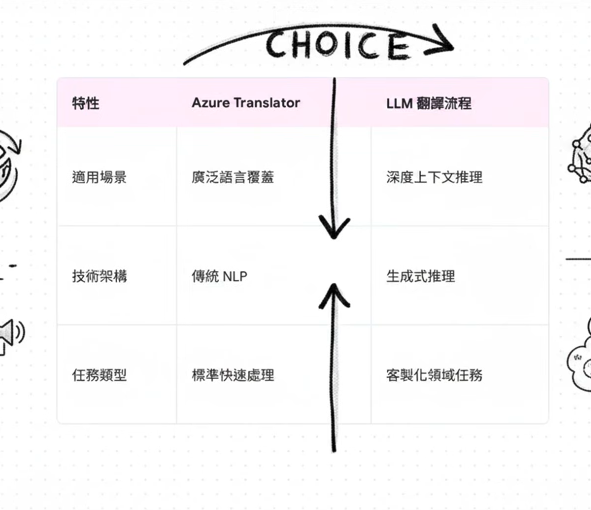
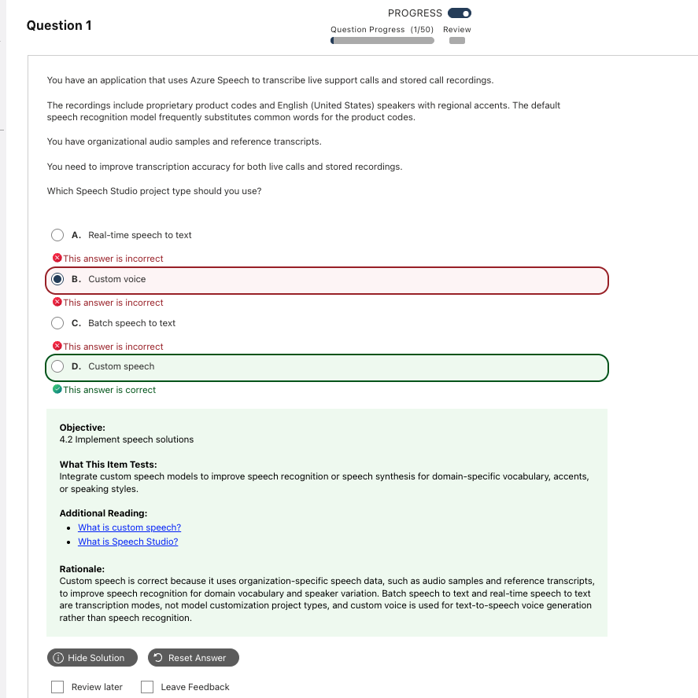
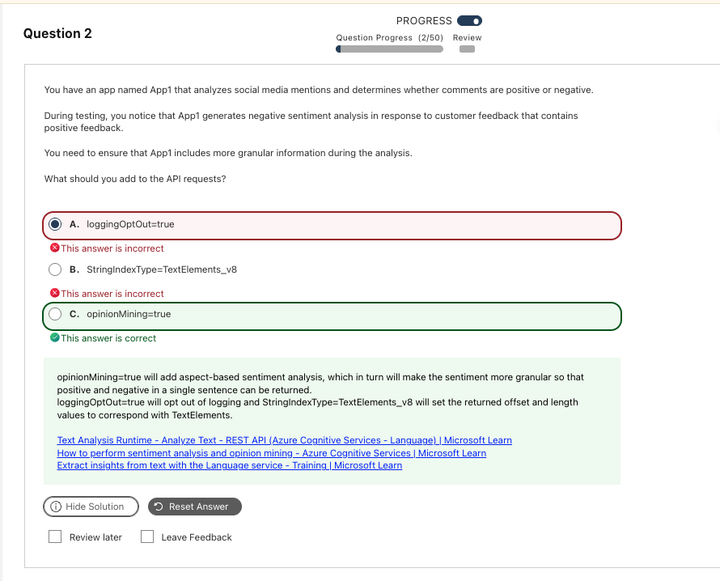
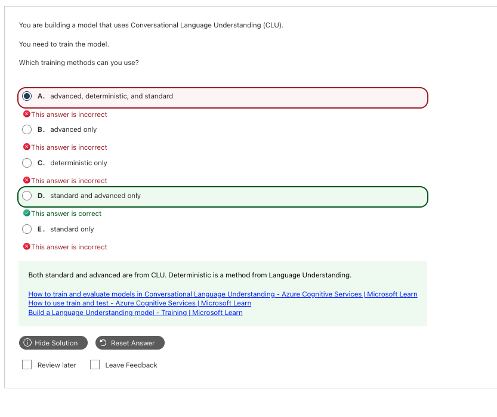

# Text and Speech｜語言分析、翻譯與語音

**考綱對應：** Implement text analysis solutions（10–15%）

AI-103 的文字題分成兩條路：**用生成式模型做擷取**，和**用 Foundry Tools 的專用服務做分析**。考試很愛問「這個情境該走哪一條」。

## 1. 生成式擷取 vs 專用服務

| 面向 | **Foundry Tools（Azure Language / Translator）** | **生成式模型（LLM prompting）** |
|---|---|---|
| 技術架構 | 傳統 NLP，預訓練固定任務 | 生成式推理 |
| 適用場景 | 廣泛語言覆蓋、標準快速處理 | 深度上下文推理、客製化領域任務 |
| 輸出 | 固定 schema 的結構化結果 | 可用 prompt 定義任意 JSON 結構 |
| 什麼時候選 | 任務明確（NER、sentiment、translate）、要低延遲低成本 | 需要領域知識、合規摘要、非標準欄位擷取 |

用生成式做結構化擷取的三步驟：**擷取實體 → 生成摘要 → 強制輸出 JSON**。第三步要用 [structured output](04_Generative_AI_and_Agents.md#3-結構化輸入與輸出) 保證格式，不要只靠 prompt 拜託。

> **啾啾筆記：** 考綱寫的是「extract entities, topics, summaries, and **structured JSON outputs** by using generative prompting **and** Foundry Tools」——兩條路都要會。題目給「compliance summarization」「domain extraction」這種客製需求就走生成式喔～

## 2. Azure Language in Foundry Tools

核心任務的定義與輸出範例見 [AI-901 Text and Language](../../ai-901/knowledge/05_Text_and_Language.md)；這裡只整理 103 會多考的**設定層面**。

### 情緒分析的三個層級

| 層級 | 輸出 | 怎麼啟用 |
|---|---|---|
| **Document-level** | 整篇總體分數 | 預設 |
| **Sentence-level** | 個別句子分數 | 預設 |
| **Target / Aspect-level** | 精確到「**對什麼東西**有什麼評價」 | 加上 **`opinionMining=true`** |

**Opinion Mining（觀點挖掘）**屬於 aspect-based sentiment analysis，把句子中的 **Target（目標／面向）** 和 **Assessment（評估／看法）** 拆開分別標註：

| 例句 | Target | Assessment | Sentiment |
|---|---|---|---|
| 「餐點很好吃，但服務態度很差」 | 餐點 | 好吃 | Positive |
| | 服務態度 | 很差 | Negative |

> **啾啾筆記：** 題目出現「**more granular information**」「**mixed sentiments**」「對某個特定功能／零件的評價」→ 直接選 `opinionMining=true`。一般 sentiment 只給整體傾向，混合褒貶時很容易偏向一端喔～

### 常被當干擾選項的參數

| 參數 | 真正的作用 | 為什麼常被誤選 |
|---|---|---|
| `loggingOptOut=true` | **隱私與合規**：告訴 Azure 不要記錄你的輸入文字用於模型改善 | 完全不影響分析輸出的內容或粒度 |
| `StringIndexType=TextElements_v8` | **文字編碼**：指定回傳 offset／length 的計算方式（處理 Emoji、特定語言字元） | 只影響字串索引單位，不改變分析細緻度 |
| `opinionMining=true` | **啟用 aspect-based 分析** | 這才是控制「粒度」的參數 |

## 3. Conversational Language Understanding（CLU）

CLU 的目的只有一個：**教模型聽懂人話背後的動機與細節**。

| 概念 | 意義 | 例子（「我下禮拜想帶全家人飛去東京玩，幫我看早上的班機」） |
|---|---|---|
| **Utterance** | 使用者實際說的整句話 | 上面那整句 |
| **Intent** | 使用者想做什麼 | `BookFlight` |
| **Entity** | 完成任務需要的參數 | Destination=東京、Date=下禮拜、TimePreference=早上 |

### 訓練方式：CLU 只有兩種

| 訓練方式 | 所屬服務 | 底層 | 速度 | 泛化能力 | 多語言 | 什麼時候用 |
|---|---|---|---|---|---|---|
| **Standard** | **CLU** | 輕量級 ML | 快（數分鐘內） | 中等 | 僅以主要語言推論 | **開發測試期**，快速驗證標註品質 |
| **Advanced** | **CLU** | 大型預訓練多語言 Transformer | 慢（數十分鐘至數小時） | 高（抗錯字、倒裝、俚語） | **支援跨語言遷移** | **正式生產環境**，追求最高精度 |
| ~~Deterministic~~ | **舊版 LUIS** | 規則特徵比對 | 極快 | 極差（換個說法就失敗） | 無 | **CLU 沒有這個選項** |

| 看到這個 | 選 |
|---|---|
| Rapid feedback during development | **Standard training** |
| Highest accuracy / multilingual support for production | **Advanced training** |
| `deterministic` | **舊版 LUIS 概念，CLU 題目中直接排除** |

**跨語言遷移（Multilingual transfer）必考點：**只有英文訓練資料但要支援多國語系時，在 CLU 開啟多語言專案設定並選 **Advanced training**，底層 Transformer 會自動把學到的意圖映射到其他支援語系。

> **啾啾筆記：** 開發流程是「標註 → Standard 快速驗證 → 修正 → 定案後跑 Advanced 上線」。看到 `deterministic` 這個字就知道是 LUIS 時代的干擾項喔～

## 4. Azure Translator in Foundry Tools

### 五個原生 API 端點（記這五個就夠）

| 端點 | 功能 |
|---|---|
| `/translate` | 核心翻譯 |
| `/transliterate` | 字元音譯轉寫 |
| `/detect` | 語言偵測 |
| `/dictionary/lookup` | 查單字的替代翻譯與詞性 |
| `/dictionary/examples` | 查單字的雙語例句 |

### Translate vs Transliterate（必考差異）

| | **Translate（翻譯）** | **Transliterate（音譯）** |
|---|---|---|
| 改變什麼 | **語言與語意** | **書寫系統（Script / Alphabet）** |
| 發音 | 改變 | **不變** |
| 例子 | `你好`(zh) → `Hello`(en) | `你好`(zh-Hans) → `nǐ hǎo`(Latn) |

### 服務邊界（考試最愛混）

| 看到這個 | 選 |
|---|---|
| NER、Sentiment Analysis、Key Phrase Extraction、PII | **Azure Language** |
| Intent、對話中的 entity tagging | **CLU** |
| Detect、Transliterate、Dictionary | **Azure Translator** |
| 深度上下文推理、客製領域翻譯風格 | **LLM 翻譯流程** |

## 5. Speech solutions

### 二分法：聽 vs 說

| | **STT（Speech-to-Text，聽／轉錄）** | **TTS（Text-to-Speech，說／發音）** |
|---|---|---|
| 自訂功能 | **Custom Speech** | **Custom Voice** |
| 做什麼 | 用文字或「音訊＋逐字稿」微調辨識模型 | 訓練客製化神經網路聲音 |
| 用途 | 專有名詞、產品代號、特殊口音、背景噪音 | 品牌語音助理、有聲書、NPC 配音 |
| 注意 | — | 需取得錄音人同意授權 |

### 轉錄模式 vs 模型自訂（容易混）

| 概念 | 類型 | 說明 |
|---|---|---|
| **Real-time speech to text** | 轉錄**模式** | 即時串流辨識。用預設或自訂模型都可以 |
| **Batch speech to text** | 轉錄**模式** | 針對大量儲存於 Blob 的音訊非同步批次辨識 |
| **Custom Speech** | 模型**自訂** | 訓練專屬模型並部署 endpoint，**即時與批次都能呼叫同一個自訂模型** |

> **啾啾筆記：** 「模式」和「自訂」是兩個維度。題目說「辨識不準」是模型問題，要選 Custom Speech；說「大量歷史錄音夜間排程」才是選 Batch。這兩組常常放在同一題互相干擾喔～

### Custom Speech 的訓練資料類型

| 資料類型 | 解決什麼 | 成本 |
|---|---|---|
| **純文字 / Pronunciation** | 專有名詞、縮寫、拼字 | 最快、最低 |
| **音訊 ＋ 人工標註逐字稿** | **特殊口音、強烈背景噪音、聲學環境異常** | 較高 |

**Phrase Lists（片語清單）**：只是要輕量補充特定單字（聯絡人名、簡單選單代碼）時，可在 SDK 呼叫時傳入片語清單，不一定要從頭訓練 Custom Speech。但題目一旦提到**口音**與**音訊對照樣本**，就必選 Custom Speech。

### Speech 作為 Agent 的模態

考綱明確列出三項：

| 能力 | 說明 |
|---|---|
| **STT / TTS 用於 agentic interactions** | 讓 agent 能聽能說，形成語音對話迴圈 |
| **多模態音訊推理** | 模型**直接對音訊做推理**（不只是先轉文字再處理），能感知語氣、情緒、背景 |
| **語音翻譯** | 用語言模型或 Foundry Tools 把語音翻成其他語言 |

> **啾啾筆記：** 「Speech modality」是 103 的新字眼。重點是現在模型可以**直接吃音訊**做多模態推理，不一定要走「STT → 文字 → LLM」的老路喔～

## 6. 常見錯誤與詳解

### Q01 — 改善專有名詞與口音的轉錄準確度

| 快速判斷 | 內容 |
|---|---|
| **答案** | **D. Custom speech** |
| **線索** | `proprietary product codes`、`regional accents`、`audio samples and reference transcripts`、`both live calls and stored recordings` |
| **考點** | STT 模型自訂 vs TTS 模型自訂 vs 轉錄模式 |
| **錯誤原因** | 選了 Custom voice，方向剛好相反 |

**為什麼選 D：** 預設 STT 模型對特定領域字彙或特殊口音辨識度差時，要建立 Custom Speech 做微調訓練。訓練後部署 endpoint，**即時與批次都能呼叫同一個自訂模型**，正好對應題目的兩種需求。

| Option | 分類 | 為什麼不是 |
|---|---|---|
| A. Real-time speech to text | 轉錄模式 (STT) | 這是呼叫模式而非模型自訂類型，解決不了產品代碼被誤判。 |
| B. Custom voice | 模型自訂 (**TTS**) | **方向相反。**用於「生成聲音」，不是「聽懂聲音」。 |
| C. Batch speech to text | 轉錄模式 (STT) | 是作業模式，本身不具備訓練／改善模型的功能。 |
| **D. Custom speech** | 模型自訂 (**STT**) | **是。**用音訊樣本與逐字稿改善精準度，即時與批次共用。 |

**補充：** 題目給了「audio samples ＋ reference transcripts」，這正是用來克服**口音與噪音**的訓練資料類型；如果只是補幾個單字，phrase list 就夠了。

> **記法：Custom Speech = 聽得更準；Custom Voice = 說得像你。**

**官方來源：** [What is custom speech?](https://learn.microsoft.com/en-us/azure/ai-services/speech-service/custom-speech-overview)、[Custom neural voice](https://learn.microsoft.com/en-us/azure/ai-services/speech-service/custom-neural-voice)

---

### Q02 — 讓情緒分析更細緻

| 快速判斷 | 內容 |
|---|---|
| **答案** | **C. `opinionMining=true`** |
| **線索** | `more granular information`、正面回饋被判成負面 |
| **考點** | Aspect-based sentiment analysis |
| **錯誤原因** | 選了 `loggingOptOut=true`，那是隱私設定 |

**為什麼選 C：** 一般 sentiment analysis 只給整段或整句的整體情感。當一句話混合褒貶時容易偏向某一端。Opinion mining 把句子中的 target 和 assessment 拆開分別標註正負向，提供更細粒度的洞察。

| Option | 參數類別 | 為什麼不是 |
|---|---|---|
| A. `loggingOptOut=true` | 隱私與合規 | 只控制日誌保留，對分析結果的細緻度**沒有任何影響**。 |
| B. `StringIndexType=TextElements_v8` | 文字編碼 | 只影響 offset／length 的計算單位。 |
| **C. `opinionMining=true`** | 分析功能啟用 | **是。**啟用 aspect-based 分析，精準捕捉單句內的不同面向。 |

> **記法：granular / mixed sentiment → opinionMining。**

**官方來源：** [Sentiment analysis and opinion mining](https://learn.microsoft.com/en-us/azure/ai-services/language-service/sentiment-opinion-mining/overview)

---

### Q10 — CLU 支援哪些訓練方法

| 快速判斷 | 內容 |
|---|---|
| **答案** | **D. standard and advanced only** |
| **線索** | `Conversational Language Understanding`、`training methods` |
| **考點** | CLU 與舊版 LUIS 的訓練管道差異 |
| **錯誤原因** | 選了含 `deterministic` 的選項 |

**為什麼選 D：** CLU 專案只提供 Standard 與 Advanced 兩種訓練模式。`deterministic` 是舊版 LUIS 的訓練概念，微軟把 LUIS 升級為 CLU 時沒有保留。

| Option | 為什麼不是 |
|---|---|
| A. advanced, deterministic, and standard | 混入了已淘汰的 LUIS 模式。 |
| B. advanced only | 遺漏了開發期常用的 standard。 |
| C. deterministic only | CLU 完全沒有這個模式。 |
| **D. standard and advanced only** | **是。**CLU 官方 UI 與 API 唯一支援的兩種。 |
| E. standard only | 遺漏了高精度的 advanced。 |

**補充與延伸：** 新舊服務名詞汰換——**LUIS → CLU**、**QnA Maker → Custom Question Answering**。考題若出現 LUIS 專有名詞（`deterministic` 訓練、`Patterns` 等），通常就是干擾項。

> **記法：CLU 只有 Standard 和 Advanced；看到 deterministic 直接刪。**

**官方來源：** [Train a CLU model](https://learn.microsoft.com/en-us/azure/ai-services/language-service/conversational-language-understanding/how-to/train-model)

---

### Q19 — Translator 原生支援哪三個功能

| 快速判斷 | 內容 |
|---|---|
| **答案** | **A. Detect language、B. Dictionary lookup、E. Transliterate** |
| **線索** | `features available in the Translator service` |
| **考點** | Translator vs Azure Language vs CLU 的服務邊界 |
| **錯誤原因** | 把 Azure Language 的功能算進 Translator |

**為什麼是 A、B、E：** Translator 除了核心的 `/translate`，原生端點還包含 `/detect`（語言偵測）、`/dictionary/lookup`（查替代翻譯與詞性）、`/transliterate`（書寫系統轉換），以及 `/dictionary/examples`（雙語例句）。

| Option | 所屬服務 | 為什麼是／不是 |
|---|---|---|
| **A. Detect language** | Azure Translator `/detect` | **是。**內建原生功能。 |
| **B. Dictionary lookup** | Azure Translator `/dictionary/lookup` | **是。**內建原生功能。 |
| C. Entity extraction | **Azure Language**（NER） | 屬於文字分析服務，非 Translator 職責。 |
| D. Intent recognition | **CLU** | 屬於對話語言理解，非 Translator。 |
| **E. Transliterate** | Azure Translator `/transliterate` | **是。**內建原生功能。 |

> **記法：Translator 管「換語言、換字母、查字典」；Language 管「看懂文字內容」。**

**官方來源：** [Azure Translator overview](https://learn.microsoft.com/en-us/azure/ai-services/translator/overview)、[Translator v3 reference](https://learn.microsoft.com/en-us/azure/ai-services/translator/text-translation/reference/v3/reference)

## 7. Current vs Legacy

| Term / capability | Status | 快速理解 |
|---|---|---|
| **Azure Language in Foundry Tools** | **Current** | 現行服務名稱；SDK 仍保留 Text Analytics 命名 |
| **NER、Language Detection** | **Current** | Core capabilities，適合新開發 |
| **Sentiment / Opinion Mining、Key Phrase、Summarization、CLU** | **Retiring（2029-03-31）** | 概念仍在現行考綱中；詳見 [AI-901 對照表](../../ai-901/knowledge/05_Text_and_Language.md#4-current-vs-legacy) |
| **Entity Linking** | **Retiring（2028-09-01）** | 保留 Wikipedia link 題型 |
| **Azure Translator** | **Current** | 五個原生端點仍是考點 |
| **Azure Speech（Custom Speech / Custom Voice）** | **Current** | 自訂語音模型是考綱明列項目 |
| **LUIS** | **Retired** | 已由 CLU 取代；`deterministic` 訓練是其遺留概念 |
| **QnA Maker** | **Retired** | 已由 Custom Question Answering 取代 |
| **Cognitive Services、Text Analytics 舊稱** | **Legacy exam-bank context** | 看到舊題時對照現行 Azure Language 術語 |

## 8. Quick Memory Rules

- **granular / mixed sentiment → `opinionMining=true`。**
- **`loggingOptOut` 管隱私，`StringIndexType` 管編碼，都不管粒度。**
- **CLU 只有 Standard（快）和 Advanced（準＋多語言）。**
- **Translate 換語言，Transliterate 換字母。**
- **Custom Speech 聽得準，Custom Voice 說得像。**
- **「模式」（real-time/batch）和「自訂」（custom）是兩個維度。**
- **口音＋音訊逐字稿 → Custom Speech；只補幾個單字 → Phrase List。**

## 9. Official Sources

核對日期：**2026-09-30**。

- [AI-103 Study Guide](https://learn.microsoft.com/en-us/credentials/certifications/resources/study-guides/ai-103)
- [Azure Language in Foundry Tools overview](https://learn.microsoft.com/en-us/azure/ai-services/language-service/overview)
- [Sentiment analysis and opinion mining](https://learn.microsoft.com/en-us/azure/ai-services/language-service/sentiment-opinion-mining/overview)
- [Conversational Language Understanding](https://learn.microsoft.com/en-us/azure/ai-services/language-service/conversational-language-understanding/overview)
- [Azure Translator overview](https://learn.microsoft.com/en-us/azure/ai-services/translator/overview)
- [Azure Speech in Foundry Tools overview](https://learn.microsoft.com/en-us/azure/ai-services/speech-service/overview)
- [What is custom speech?](https://learn.microsoft.com/en-us/azure/ai-services/speech-service/custom-speech-overview)
- [Batch transcription](https://learn.microsoft.com/en-us/azure/ai-services/speech-service/batch-transcription)
- [AI-901 Text and Language](../../ai-901/knowledge/05_Text_and_Language.md)、[AI-901 Speech](../../ai-901/knowledge/06_Speech.md)
