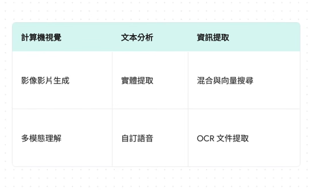
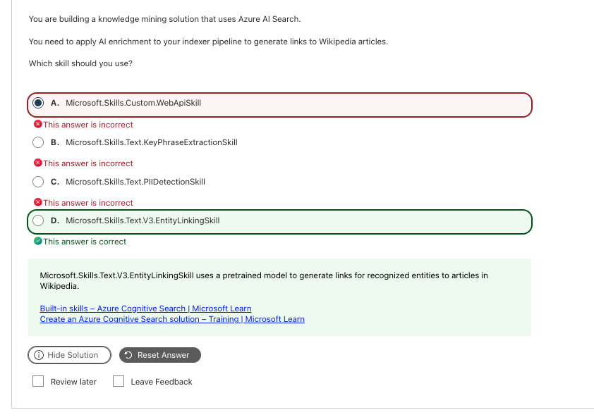
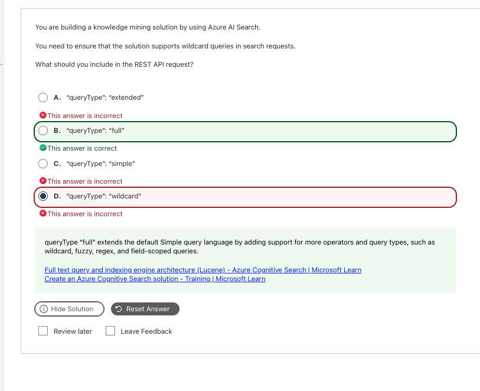
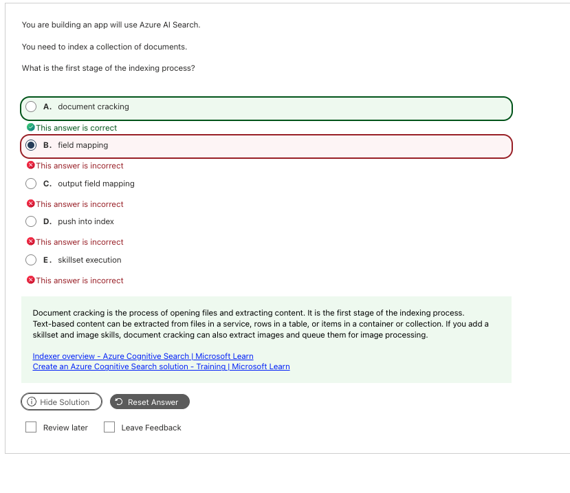
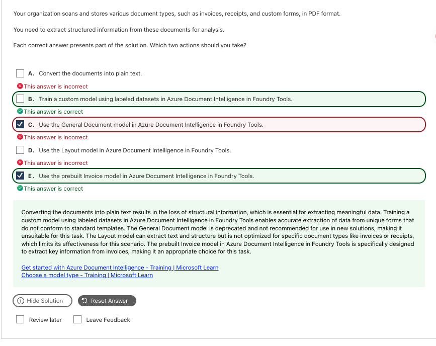

# Information Extraction｜檢索管線、文件擷取與內容理解

**考綱對應：** Implement information extraction solutions（10–15%）

權重看起來只有 10–15%，但 **Azure AI Search 是我這場的核心重點**，實際出現的題數感覺超過權重。Content Understanding 也是考很多的新題型。



## 1. 內容擷取的四個步驟

不管用哪個服務，把非結構化內容變成可檢索資料的骨架都是同一套：

```text
原始文件 → OCR（抓出文字）→ Layout analysis（理解段落與從屬關係）
→ 內容擷取（產生結構化欄位）→ 建立索引
```

> **啾啾筆記：** 記住「**OCR 只認字，layout 才認結構**」。發票金額在哪一欄、表格哪一列對哪一欄，都是 layout analysis 的工作，不是 OCR 喔～

## 2. Azure AI Search

### Indexer 管線的五個階段（順序必考）

| 順序 | 階段 | 做什麼 | 考點關鍵字 |
|---:|---|---|---|
| **1** | **Document cracking** | **打開檔案並擷取內容**。解構 PDF/Office/圖片，分離純文字與影像 | **First stage**、opening files and extracting content |
| 2 | **Field mapping** | 把資料來源的**既有欄位**（未經 AI 加工）直接對應到索引欄位 | Source field to target field |
| 3 | **Skillset execution** | 執行 AI 擴充技能（OCR、Entity Linking、Translation…），產生衍生資訊 | AI enrichment、enriched document |
| 4 | **Output field mapping** | 把 skillset 產生的**新 AI 欄位**寫入索引指定欄位 | Mapping enrichment tree to index fields |
| 5 | **Push into index** | 最終資料寫入索引並建立反向索引 | Writing documents to search index |

**兩種 field mapping 的二分法：**

| | 從哪來 | 到哪去 |
|---|---|---|
| `fieldMappings` | 資料來源的原始欄位（**不經過 AI**） | 索引 |
| `outputFieldMappings` | **Skillset 產出**的豐富化內容（如 `/document/pages/*/keyphrases`） | 索引 |

**Document cracking 的抽取層級**（`configuration.dataToExtract`）：

| 值 | 抽取什麼 |
|---|---|
| `contentAndMetadata`（預設） | 文件內文 ＋ 詮釋資料 |
| `allMetadata` | 只抽詮釋資料（例如只要檔名、修改日期，節省資源） |
| `storageMetadataOnly` | 只抓儲存體屬性 |

> **啾啾筆記：** 只要問到「**first stage of indexing**」，答案永遠是 **document cracking**。很多人會選 field mapping，但沒先打開檔案，根本沒有欄位可以對應喔～

### 查詢類型

| 檢索方式 | 比對什麼 | 什麼時候用 |
|---|---|---|
| **Keyword / full-text search** | 分詞後的反向索引 | 精確詞彙比對、傳統搜尋 |
| **Vector search** | 向量欄位的 embedding 相似度 | 語意相近但用字不同 |
| **Hybrid search** | 同一次查詢中結合文字＋向量 | **RAG grounding 的預設建議做法** |
| **Semantic ranker** | 用深度學習模型對結果重新排序，回傳 answer/caption | 想提升相關性排序品質 |
| **Agentic retrieval** | 用 LLM 做查詢規劃，回應設計給 agent 消費 | **Preview**，agent 場景 |

### `queryType`：只有三個合法值

| 值 | 語法引擎 | 支援什麼 |
|---|---|---|
| `simple`（預設） | Simple parser | 基本布林（`+` `\|` `-`）、片語引號 `" "` |
| **`full`** | **完整 Lucene parser** | **Wildcard（`*` `?`）、Fuzzy（`~`）、Regex（`/…/`）、Proximity（`"a b"~5`）、Term boosting（`^`）、Field-scoped** |
| `semantic` | 語意重排 | Semantic ranker，回傳 answer/caption |

> **啾啾筆記：看到 wildcard、fuzzy、regex、proximity、term boosting 這五個任何一個，`queryType` 就必定是 `"full"`。** 題目很愛放 `"wildcard"` 這種**根本不存在的值**來誘答，看到就知道是陷阱喔～

### Skillset：內建技能四大類

| 類別 | 技能 |
|---|---|
| **自然語言** | `EntityLinking`、`EntityRecognition`、`KeyPhraseExtraction`、`LanguageDetection`、`PIIDetection`、`Sentiment`、`Translation` |
| **影像分析** | `ImageAnalysis`、`Ocr` |
| **資料處理／塑型** | `Split`（切分段落）、`Shaper`（塑形 JSON 結構） |
| **客製整合** | `Custom.WebApiSkill`（串接外部系統的唯一首選） |

**EntityRecognition vs EntityLinking（必考區分）：**

| | `EntityRecognitionSkill`（NER） | `EntityLinkingSkill` |
|---|---|---|
| 做什麼 | 只標記分類（「微軟」是 Organization） | 識別 ＋ **消除歧義** ＋ 綁定知識庫 |
| 輸出 | Entity ＋ category | Entity ＋ **Wikipedia URL** |
| 例子 | 抓出「Apple」是 Organization | 分辨上下文中的「Apple」是水果還是公司，並給對應連結 |

> **考試原則：優先用內建技能，沒有內建時才選 `WebApiSkill`。**

## 3. Azure Content Understanding

微軟整合了 Document Intelligence、Computer Vision 與多模態推理的統一服務，**用同一套 API 處理 documents、images、audio、video**。

### Field extraction methods（高頻考點）

定義 `fieldSchema` 時，每個欄位都要指定 `method`：

| `method` | 運作機制 | 輸出 | 看到這個選它 |
|---|---|---|---|
| **`extract`** | 用 OCR／版面定位，在內容中**精確框出原始文字** | 原文字元，支援 bounding box 與 confidence | **`text as shown`**、發票號碼、日期、金額、商標原文 |
| **`classify`** | 評估語意或影像特徵，從**限定集合**中選一個 | 列舉值（`enum`） | **`one of A, B, or C`**、產品成色、文件類型 |
| **`generate`** | 多模態 LLM 根據整體內容**推理、摘要或生成** | 開放式文字 | **`short description`**、會議摘要、圖表趨勢解讀 |

```json
"fieldSchema": {
  "fields": {
    "ProductName": {
      "type": "string",
      "method": "extract",
      "description": "影像中標籤上所顯示的產品名稱原文"
    },
    "Condition": {
      "type": "string",
      "method": "classify",
      "description": "包裝的保存狀況",
      "enum": ["new", "used", "damaged"]
    },
    "Description": {
      "type": "string",
      "method": "generate",
      "description": "針對產品外觀與包裝瑕疵撰寫一段簡短視覺描述"
    }
  }
}
```

> **啾啾筆記：** 三個 method 的判斷超級直覺——**原文照抄用 extract，三選一用 classify，要模型自己寫用 generate**。題目通常直接在欄位描述裡把關鍵字給你喔～

### Analyzer 類型

| 類型 | 用途 | 代表 |
|---|---|---|
| **Content extraction analyzers** | OCR 與版面分析 | `prebuilt-layout`、`prebuilt-read`、`prebuilt-digitalParse` |
| **Base analyzers** | 建立自訂 analyzer 時的父層（`baseAnalyzerId`） | `prebuilt-document`、`prebuilt-image`、`prebuilt-audio`、`prebuilt-video` |
| **RAG analyzers** | 針對 RAG 最佳化，輸出 markdown 與語意切塊 | `prebuilt-documentSearch`、`prebuilt-imageSearch`、`prebuilt-audioSearch`、`prebuilt-videoSearch` |
| **Domain-specific analyzers** | 常見產業文件的預建 schema | `prebuilt-invoice`、`prebuilt-receipt`、`prebuilt-idDocument`、`prebuilt-contract`、`prebuilt-tax.us.w2` |
| **Utility analyzers** | schema 產生與鍵值擷取 | `prebuilt-documentFieldSchema`、`prebuilt-documentFields` |

> 目前自訂 analyzer 只能從那四個 base analyzer 衍生。

### 四大核心能力

| 能力 | 說明 |
|---|---|
| **跨模態統一處理** | 同一套 API 處理 PDF 表單、錄音、影片與圖檔 |
| **RAG-ready Markdown** | 不只做 OCR，還會為文件中的**圖表、流程圖產生文字說明（figure description）**，輸出乾淨的 Markdown 與切塊結果 |
| **Confidence & Grounding** | 每個擷取欄位附帶 **bounding box** 與 **confidence score**，可在原文高亮定位 |
| **Pro mode 多步驟推理** | 面對超長合約或跨頁圖表做深度推論（見 [Computer Vision](05_Computer_Vision.md#4-多模態視覺理解的服務選擇)） |

呼叫流程是**非同步**的：`PUT /analyzers/{id}` 建立 analyzer → `POST /analyzers/{id}:analyze` 提交（回傳 `202` 與 `Operation-Location`）→ 對該 URL 輪詢 `GET` 直到 `status` 為 `succeeded`。

## 4. Azure Document Intelligence

### 模型選型法則

| 文件情況 | 選什麼 |
|---|---|
| **標準產業格式**（發票、收據、身分證、W-2 稅表） | **Prebuilt model**（免標註、免訓練，直接呼叫 API） |
| **公司內部專屬格式**（設備檢查表、特製合約、業務報表） | **Custom model**（用已標註資料集訓練） |
| 只要文字與表格框線 | **Layout model** |
| 純影像轉文字 | **Read model（OCR）** |

### Custom model 兩種 buildMode

| | **Custom Template**（`buildMode: template`） | **Custom Neural**（`buildMode: neural`） |
|---|---|---|
| 適合 | 版面位置**固定**的表格或申請單 | 版面排版**各異**（多家廠商的合約） |
| 機制 | 依視覺模板定位 | 理解上下文語意擷取欄位 |
| 訓練樣本 | 最少 **5 份** | 結構化／半結構化／非結構化皆可 |

## 5. 把檢索接上 Agent

| 需求 | 做法 |
|---|---|
| 擷取並索引 documents / images / audio / video | Content Understanding 產生 RAG-ready 輸出 → 寫入 Azure AI Search |
| 設定 grounding 用的檢索 | Semantic ＋ hybrid ＋ vector search |
| 用自訂或內建技能做 enrichment | Skillset（內建優先，不夠才用 `WebApiSkill`） |
| RAG ingestion flow 含 OCR | Content Understanding 或 Document Intelligence Read |
| 把檢索管線直接接上 agent | Agent 的 **Azure AI Search tool** 或 **Content Understanding tool** |

詳見 [Generative AI and Agents](04_Generative_AI_and_Agents.md#2-agent-的組成)。

## 6. 常見錯誤與詳解

### Q11 — 產生指向 Wikipedia 的連結要用哪個 skill



| 快速判斷 | 內容 |
|---|---|
| **答案** | **D. `Microsoft.Skills.Text.V3.EntityLinkingSkill`** |
| **線索** | `links to Wikipedia articles` |
| **考點** | 內建技能 vs 自訂技能；NER vs Entity Linking |
| **錯誤原因** | 選了 `WebApiSkill`，繞遠路自建 API |

**為什麼選 D：** Entity Linking 的核心功能就是識別文字中的實體，並對齊到外部公開知識庫的標準條目，微軟的預設知識庫就是 Wikipedia。回傳結果直接包含實體名稱與對應的 Wikipedia 頁面 URL。

| Option | 技能性質 | 為什麼不是 |
|---|---|---|
| A. `Custom.WebApiSkill` | 自訂擴充 | Wikipedia 連結**已有現成內建技能**，不需自建 Web API。考試原則：內建優先。 |
| B. `KeyPhraseExtractionSkill` | 內建文字 | 只挑出代表性字詞，不具備超連結能力。 |
| C. `PIIDetectionSkill` | 內建文字 | 個資遮蔽，與百科連結無關。 |
| **D. `V3.EntityLinkingSkill`** | 內建文字 | **是。**識別實體 ＋ 消除歧義 ＋ 附 Wikipedia URL。 |

> **記法：NER 只分類，Entity Linking 才給連結。**

**官方來源：** [Entity Linking cognitive skill](https://learn.microsoft.com/en-us/azure/search/cognitive-search-skill-entity-linking-v3)、[Built-in skills](https://learn.microsoft.com/en-us/azure/search/cognitive-search-predefined-skills)

---

### Q12 — 支援萬用字元查詢



| 快速判斷 | 內容 |
|---|---|
| **答案** | **B. `"queryType": "full"`** |
| **線索** | `wildcard queries` |
| **考點** | Simple parser vs Full Lucene parser |
| **錯誤原因** | 選了 `"wildcard"`，那是題目自創的假參數值 |

**為什麼選 B：** `full` 啟用完整 Lucene 查詢語法，全面支援萬用字元、模糊搜尋、正規表達式、鄰近搜尋與欄位指定搜尋。`simple` 只支援基本布林運算子與片語引號。

| Option | 是否為合法值 | 為什麼不是 |
|---|---|---|
| A. `"extended"` | **無效參數值** | API 根本沒有這個值。 |
| **B. `"full"`** | 有效 | **是。**完整 Lucene parser。 |
| C. `"simple"` | 有效（預設） | 不支援完整萬用字元、正規表達式與模糊查詢。 |
| D. `"wildcard"` | **無效參數值** | **常見陷阱：直接把功能名稱當成參數值來誘答。** |

**補充：** `queryType` 官方合法值只有三個——`simple`、`full`、`semantic`。

> **記法：wildcard / fuzzy / regex / proximity / boosting → `"full"`。看到 `"wildcard"` 就知道是假的。**

**官方來源：** [Lucene query syntax](https://learn.microsoft.com/en-us/azure/search/query-lucene-syntax)、[Query types](https://learn.microsoft.com/en-us/azure/search/search-query-overview)

---

### Q13 — Indexing 流程的第一階段



| 快速判斷 | 內容 |
|---|---|
| **答案** | **A. document cracking** |
| **線索** | `first stage of the indexing process` |
| **考點** | Indexer 管線的固定順序 |
| **錯誤原因** | 選了 field mapping，順序記反 |

**為什麼選 A：** Indexer 連線到資料來源後，第一步必須打開並解讀原始檔案（PDF、Word、HTML…），把內部的非結構化文字與影像「破開」出來，轉成資料流供後續處理。

| Option | 管線順序 | 為什麼不是 |
|---|---|---|
| **A. document cracking** | **第 1 步** | **是。**打開檔案並擷取內容。 |
| B. field mapping | 第 2 步 | 必須在文件被打開、內容被抽出之後才能對應。沒有內容就沒有欄位可 map。 |
| E. skillset execution | 第 3 步 | AI 擴充發生在更後面。 |
| C. output field mapping | 第 4 步 | 對應的是 skillset 產出的欄位。 |
| D. push into index | 第 5 步 | 最後一步。 |

> **記法：先開門（cracking）才看得到東西。First stage 一律選 document cracking。**

**官方來源：** [Indexer overview](https://learn.microsoft.com/en-us/azure/search/search-indexer-overview)

---

### Q14 — 發票、收據與自訂表單的擷取策略



| 快速判斷 | 內容 |
|---|---|
| **答案** | **B. Train a custom model using labeled datasets、E. Use the prebuilt Invoice model** |
| **線索** | `invoices, receipts, and custom forms`、`Which two actions` |
| **考點** | 標準文件 vs 專屬表單的模型選型 |
| **錯誤原因** | 選了 General Document model |

**為什麼是 B、E：** 題目明確列出兩種極端，最佳實踐就是**組合架構**。

| 文件種類 | 對策 |
|---|---|
| 標準通用文件（發票／收據） | **Prebuilt model**，免標註免訓練 → **E** |
| 組織專屬文件（custom forms） | **Custom model**，用已標註資料集訓練 → **B** |

| Option | 為什麼是／不是 |
|---|---|
| A. Convert the documents into plain text | 轉純文字會**遺失版面、表格與鍵值關係**等關鍵結構化資訊。 |
| **B. Train a custom model using labeled datasets** | **是。**題目包含 custom forms，必須訓練專用模型。 |
| C. Use the General Document model | **已 deprecated**（自 `2023-10-31-preview` 起），不建議用於新方案，且客製表單精準度遠不如 custom model。 |
| D. Use the Layout model | 只輸出通用表格與區塊幾何資訊，未針對發票或自訂業務欄位做語意特化。 |
| **E. Use the prebuilt Invoice model** | **是。**直接擷取 VendorName、InvoiceTotal、DueDate 等標準欄位。 |

**補充與延伸：** Custom Template 模型訓練**至少需要 5 份樣本文件**。版面固定選 template，版面各異選 neural。

> **記法：標準格式用 prebuilt，專屬格式用 custom。General Document 已經是過去式。**

**官方來源：** [Document Intelligence model overview](https://learn.microsoft.com/en-us/azure/ai-services/document-intelligence/overview)、[Choose a model type](https://learn.microsoft.com/en-us/azure/ai-services/document-intelligence/train/custom-model)

---

### Q20 — Content Understanding 的 field extraction method

| 快速判斷 | 內容 |
|---|---|
| **答案** | **C. ProductName: `extract`; Condition: `classify`; Description: `generate`** |
| **線索** | `the label text as shown`、`one of new, used, or damaged`、`a short visual description` |
| **考點** | 三種 field method 的分工 |
| **錯誤原因** | 把 `extract` 和 `generate` 搞反 |

**題目要求逐一對應：**

| 欄位要求 | Method | 理由 |
|---|---|---|
| `ProductName: the label text as shown` | **`extract`** | 「照原文呈現」→ 精確擷取原始字串 |
| `Condition: one of new, used, or damaged` | **`classify`** | 從固定選項中三選一 → 分類判定 |
| `Description: a short visual description` | **`generate`** | 要模型自己寫一段描述 → 生成式推論 |

| Method | 機制 | 輸出特色 |
|---|---|---|
| `extract` | OCR／版面定位，框出原始文字 | 支援 bounding box 與 confidence |
| `classify` | 從限定 `enum` 中選一個 | 不會超出給定清單 |
| `generate` | 多模態 LLM 推理、摘要或生成 | 開放式文字 |

> **記法：as shown → extract；one of → classify；description → generate。**

**官方來源：** [Content Understanding analyzer templates](https://learn.microsoft.com/en-us/azure/ai-services/content-understanding/concepts/prebuilt-analyzers)、[Create a custom analyzer](https://learn.microsoft.com/en-us/azure/ai-services/content-understanding/tutorial/create-custom-analyzer)

## 7. Current vs Legacy

| Term / capability | Status | 快速理解 |
|---|---|---|
| **Azure AI Search** | **Current** | 舊稱 Azure Cognitive Search |
| **Agentic retrieval / Foundry IQ** | **Preview** | 較新的 agent 導向檢索路徑 |
| **Azure Content Understanding** | **Current（部分模態 Preview）** | 跨模態統一擷取的現行首選 |
| **Azure Document Intelligence** | **Current（v4.0 GA）** | 舊稱 Form Recognizer；v3.0 將於 2029-03-30 退役、v2.1 於 2027-09-15 退役 |
| **General Document model** | **Deprecated（2023-10-31-preview 起）** | 不建議用於新方案 |
| **Form Recognizer、Cognitive Search 舊稱** | **Legacy exam-bank context** | 看到舊題時對照現行名稱 |

## 8. Quick Memory Rules

- **Indexer 五階段：Cracking → Field mapping → Skillset → Output field mapping → Push。**
- **First stage 一律是 document cracking。**
- **`fieldMappings` 來自原始資料；`outputFieldMappings` 來自 skillset。**
- **wildcard / fuzzy / regex / proximity / boosting → `queryType: "full"`。**
- **`queryType` 只有三個合法值：simple、full、semantic。**
- **NER 分類，Entity Linking 給 Wikipedia 連結。**
- **內建技能優先，不夠才用 `WebApiSkill`。**
- **as shown → extract；one of → classify；description → generate。**
- **標準文件用 prebuilt，專屬表單用 custom（template 最少 5 份樣本）。**

## 9. Official Sources

核對日期：**2026-09-30**。

- [AI-103 Study Guide](https://learn.microsoft.com/en-us/credentials/certifications/resources/study-guides/ai-103)
- [What is Azure AI Search?](https://learn.microsoft.com/en-us/azure/search/search-what-is-azure-search)
- [Indexer overview](https://learn.microsoft.com/en-us/azure/search/search-indexer-overview)
- [Query types in Azure AI Search](https://learn.microsoft.com/en-us/azure/search/search-query-overview)
- [Lucene query syntax](https://learn.microsoft.com/en-us/azure/search/query-lucene-syntax)
- [Built-in skills](https://learn.microsoft.com/en-us/azure/search/cognitive-search-predefined-skills)
- [Hybrid search](https://learn.microsoft.com/en-us/azure/search/hybrid-search-overview)
- [What is Azure Content Understanding?](https://learn.microsoft.com/en-us/azure/ai-services/content-understanding/overview)
- [Content Understanding prebuilt analyzers](https://learn.microsoft.com/en-us/azure/ai-services/content-understanding/concepts/prebuilt-analyzers)
- [What is Azure Document Intelligence?](https://learn.microsoft.com/en-us/azure/ai-services/document-intelligence/overview)
- [AI-901 Content Understanding](../../ai-901/knowledge/08_Content_Understanding.md)
