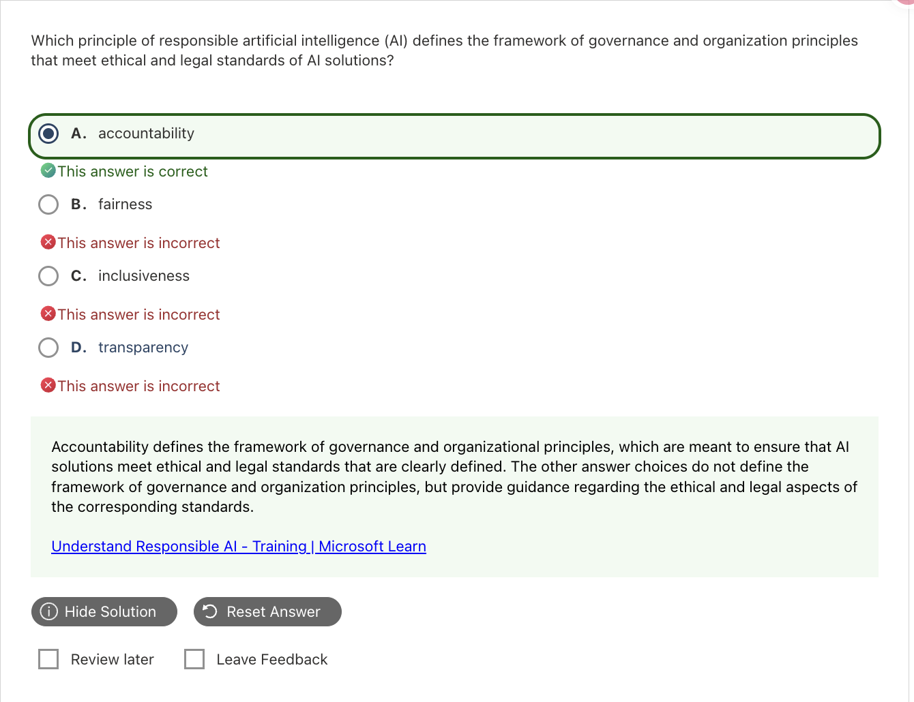

# Responsible AI｜負責任的人工智慧

這一個單元是蠻重要但是很好拿分的單元，可以把握答題先找情境要改善的**主要問題**，選最直接對應的原則。

## 1. 六大原則

| English Term | 中文重點 | 情境例子 | Exam Keywords |
|---|---|---|---|
| **Fairness** | 公平對待不同群體，避免偏差 | 招募時，資格相近者不因性別受到不同待遇 | bias、biased outcomes、demographic groups |
| **Reliability and Safety** | 正常與異常情境都可靠、不造成傷害 | 感測器故障時進入安全模式 | safe failure、unexpected conditions、robust |
| **Privacy and Security** | 保護個資，防止未授權存取 | 避免客服系統向其他客戶洩漏個資 | consent、personal data、unauthorized access / disclosure |
| **Inclusiveness** | 讓不同能力、語言與背景的人都能參與 | 提供字幕、語音與螢幕閱讀器支援 | accessibility、disability、empower everyone |
| **Transparency** | 讓人理解 AI 的運作、能力與限制 | 說明模型做決策的因素與限制 | explain decisions、limitations、understand behavior |
| **Accountability** | 人與組織負責監督 AI | 指定負責人，建立稽核與申訴流程 | governance、oversight、responsibility |

## 2. 最容易混淆的情境

| 容易混淆 | 判斷重點 |
|---|---|
| **Fairness** vs **Inclusiveness** | 公平看**待遇是否偏差**；包容看**誰能參與、誰被排除**。 |
| **Reliability and Safety** vs **Privacy and Security** | 前者看**系統失敗與傷害**；後者看**資料保護與存取**。 |
| **Transparency** vs **Accountability** | 透明是**說清楚**；問責是**有人負責與監督**。 |
| **Accuracy** vs **Fairness** | **整體準確率高 ≠ 各群體都受到公平待遇**。 |

## 3. Responsible Generative AI 與 NIST AI RMF

Microsoft GenAI 流程：**Identify → Measure → Mitigate → Operate**，記成「**找 → 量 → 降 → 管**」。

| 階段 | 重點 |
|---|---|
| **Identify** | 找出潛在傷害並排優先順序；題目問 **first stage**，選 **Identify potential harms**。 |
| **Measure** | 衡量傷害的**發生頻率與嚴重程度**（frequency and severity）。 |
| **Mitigate** | 用多層防護降低風險，例如 guardrails、system prompt、人工覆核與 UX 提醒；實施後再次評估效果。 |
| **Operate** | 規劃部署與營運，持續監控、收集回饋並處理事件。 |

**單一 content filter 不等於完成 Responsible AI**，仍需多層防護與持續評估。

**NIST AI RMF**（AI Risk Management Framework）是自願採用的外部風險管理框架，不是 Azure 產品。四個功能為 **GOVERN、MAP、MEASURE、MANAGE**；與 Microsoft 四階段密切相關，但名稱不能逐字互換。

## 4. 常見錯誤與詳解

### Q02 — Accountability 與治理責任

| 快速判斷 | 內容 |
|---|---|
| **答案** | **A. Accountability** |
| **線索** | `governance`、`organizational responsibility`、`ethical and legal standards` |
| **考點** | Microsoft Responsible AI principles |
| **錯誤原因** | 容易把「向人說明」的 Transparency 和「由誰負責」的 Accountability 混淆 |

**為什麼選 A：**題目要求建立治理、監督與責任歸屬，核心是人和組織必須對 AI 系統負責，因此選 **Accountability**。

| Option | 為什麼是／不是 |
|---|---|
| **A. Accountability** | **是。**負責任、治理與 human oversight。 |
| B. Fairness | 公平對待不同群體，重點是 bias 與 discrimination。 |
| C. Inclusiveness | 讓不同能力和背景的人都能使用與受益。 |
| D. Transparency | 說明系統如何運作、能力與限制，不是指定責任歸屬。 |

**補充與延伸：**目前 Microsoft 仍使用 **Accountability**。看到 governance、oversight、human responsibility 或「誰負責」，直接聯想到它。

> **記法：Transparency 說清楚；Accountability 說誰負責。**

**官方來源：** [Microsoft Responsible AI principles](https://www.microsoft.com/en-us/ai/principles-and-approach)、[AI-901 Study Guide](https://learn.microsoft.com/en-us/credentials/certifications/resources/study-guides/ai-901)

## 5. Official Sources
核對日期：**2026-09-08**。

- [AI-901 Study Guide](https://learn.microsoft.com/en-us/credentials/certifications/resources/study-guides/ai-901)
- [Microsoft Learn：Responsible AI 六大原則](https://learn.microsoft.com/en-us/azure/machine-learning/concept-responsible-ai)
- [Microsoft Responsible AI principles](https://www.microsoft.com/en-us/ai/principles-and-approach)
- [Responsible AI practices for Azure OpenAI models](https://learn.microsoft.com/en-us/azure/foundry/responsible-ai/openai/overview)
- [NIST AI Risk Management Framework](https://www.nist.gov/itl/ai-risk-management-framework)／[四個功能與 GOVERN 的定位](https://airc.nist.gov/airmf-resources/airmf/5-sec-core/)
