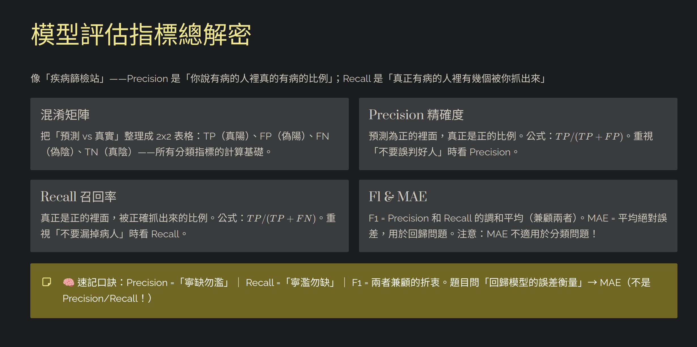

# AI Models and Workloads｜AI 模型與工作負載

答題順序：先看題目要處理的 **input**，再看需要的 **capability** 與 **output**。

## 1. AI Model 基本概念

| Concept | 簡化理解 | 考試區分 |
|---|---|---|
| **AI model** | 從資料學到規律，用來產生預測或內容 | 模型是能力本體；**deployment** 才是可供應用程式呼叫的執行個體 |
| **Generative AI** | 根據 prompt 產生新的文字、圖片、程式碼等內容 | 生成內容不代表內容已查證 |
| **Large Language Model (LLM)** | 處理與生成語言的大型生成式模型 | 依上下文預測下一個 token |
| **Small Language Model (SLM)** | 規模較小的語言模型 | 通常較輕量；仍要依任務表現選擇，不能只看大小 |
| **Multimodal model** | 能處理兩種以上資料形式，例如文字、圖片或聲音 | 能看圖不代表能產圖；須確認各模型支援的 input / output |
| **Agent** | 由 **model＋instructions＋tools** 組成，可呼叫工具完成任務 | 一般模型主要產生回覆；agent 還能採取行動 |

## 2. Generative Model 如何運作

```text
Prompt → Tokenization → Attention / Transformer → 預測下一個 token → 重複生成
```

| Concept | 簡化理解 |
|---|---|
| **Prompt** | 給模型的指示、問題或背景資料 |
| **Token** | 模型處理文字的基本單位，可能是字、子詞或標點；不等於固定一個單字 |
| **Tokenization** | 把文字切成 tokens |
| **Embedding** | 用數值向量表示語意；語意相近的內容，向量通常也較接近 |
| **Attention** | 判斷上下文中哪些 tokens 對目前預測較重要 |
| **Transformer** | 使用 attention 處理上下文關係的模型架構 |
| **Context window** | 一次請求中模型能處理的 token 容量，包含輸入與輸出 |
| **Inference** | 使用已訓練的模型處理新輸入；不是重新訓練模型 |

模型是依機率生成內容，因此可能產生錯誤資訊。若要回答公司文件或最新資料，可使用 **grounding** 或 **Retrieval-Augmented Generation (RAG)** 提供依據。

- **Retrieval**：找出既有資料。
- **Generation**：根據上下文寫出回答。
- **RAG**：先檢索資料，再把資料交給模型生成回答；不會因此重新訓練模型。

## 3. AI Workloads｜看輸入與輸出判斷

| Workload | Input → Output | 典型情境 |
|---|---|---|
| **Generative AI** | Prompt → 新內容 | 撰寫摘要、文案或程式碼 |
| **Agentic AI** | 目標＋工具 → 行動與回覆 | 查詢訂單後呼叫系統完成退款 |
| **Text analysis** | 文字 → 情緒、實體、關鍵片語或摘要 | 分析客服留言 |
| **Speech recognition** | 語音 → 文字 | 會議錄音轉逐字稿（speech-to-text） |
| **Speech synthesis** | 文字 → 語音 | 將通知內容朗讀出來（text-to-speech） |
| **Computer vision** | 圖片／影片 → 分類、物件位置、描述或文字 | 辨認物件、object detection、OCR |
| **Image generation** | 文字描述 → 新圖片 | 根據 prompt 產生海報插圖 |
| **Information extraction** | 文件、圖片、音訊或影片 → 結構化欄位 | 從合約擷取日期、姓名與金額 |

服務細節見 [Text and Language](05_Text_and_Language.md)、[Speech](06_Speech.md)、[Computer Vision](07_Computer_Vision.md) 與 [Content Understanding](08_Content_Understanding.md)。

## 4. Traditional Machine Learning｜相關基礎（Medium）

### 基本名詞

| Concept | 簡化理解 | 例子 |
|---|---|---|
| **Feature** | 提供給模型的輸入欄位 | 房屋面積、房間數 |
| **Label / Target** | 希望模型學會預測的正確答案 | 房屋成交價格 |
| **Training** | 用歷史資料讓模型學習規律 | 用過去房價建立模型 |
| **Inference** | 用訓練好的模型預測新資料 | 預測新房屋的價格 |

### 模型類型

| Model type | 輸出 | 題目關鍵字 |
|---|---|---|
| **Regression** | 數值 | price、amount、how much |
| **Binary classification** | 兩個類別之一 | yes / no、spam / not spam |
| **Multiclass classification** | 多個類別中選一個 | 把商品分成書籍、服飾或食品 |
| **Clustering** | 將相似資料自動分群 | group similar items；資料沒有預先提供 label |

**Multiclass** 是一筆資料選一類；**multilabel** 是一筆資料可同時有多個標籤。

### ML lifecycle

```text
Prepare data → Train → Evaluate → Deploy → Inference
```

- **Training data**：用來讓模型學習。
- **Validation data**：開發時比較模型或設定。
- **Test data**：最後獨立評估模型。

## 5. Model Evaluation｜只記用途



> **補充（Current）：** 圖中的 2×2 confusion matrix 用於二元分類。MAE 只是回歸指標之一；回歸也可能使用 MSE、RMSE 或 R²。

| Metric | 簡化理解 | 較佳方向 |
|---|---|---|
| **Accuracy** | 全部資料中，預測正確的比例 | 越高越好；類別不平衡時可能誤導 |
| **Precision** | 被預測為正類的資料中，多少是真的正類 | 越高越好；關心 **false positives** |
| **Recall** | 真正的正類中，模型找到了多少 | 越高越好；關心 **false negatives** |
| **F1 score** | Precision 與 Recall 的綜合分數 | 越高越好 |
| **MAE / MSE / RMSE** | 預測數值與實際數值的誤差 | 越低越好 |
| **R²** | 模型相對於平均值基準的表現 | 通常越接近 1 越好；可能小於 0 |

記法：**Precision 看「抓到的有多準」；Recall 看「該抓的抓到多少」。**

## 6. Model Selection 與 Configuration

### 選模型

依序確認：

1. **Modality**：能否接受需要的文字、圖片或聲音？
2. **Capability**：能否完成生成、分析、推理或工具呼叫？
3. **Quality**：在實際資料上的效果是否足夠？
4. **Context window**：輸入資料與預期回答是否放得下？
5. **Latency and cost**：速度與成本是否符合需求？
6. **Availability**：目標區域、部署類型與配額是否支援？

### 常見生成設定

| Setting | 控制什麼 | 不代表什麼 |
|---|---|---|
| **Temperature** | 生成結果的隨機性；較低通常較集中，較高通常更多樣 | 低 temperature 不保證答案正確 |
| **Top_p** | 限制模型從累積機率範圍內選 token | 不是輸出字數比例 |
| **Max output tokens** | 限制最多可生成的 token 數 | 不代表一定會生成到上限，也不等於字數 |
| **System instructions** | 定義模型的角色、行為與輸出格式 | 不會給模型原本沒有的資料或工具權限 |
| **Reasoning effort** | 支援的模型可調整推理投入程度 | 並非所有模型都支援相同設定 |

API 欄位名稱、部署方式與 SDK 用法見 [Microsoft Foundry](04_Microsoft_Foundry.md)。

## 7. Common Confusions｜快速區分

| Concepts | Difference |
|---|---|
| **Model vs deployment vs agent** | 能力本體 vs 可呼叫的執行個體 vs 結合模型、instructions 與 tools 的應用 |
| **Training vs inference** | 從資料學習 vs 使用模型處理新輸入 |
| **Embedding vs generated answer** | 語意數值向量 vs 給使用者閱讀的內容 |
| **Prompting vs fine-tuning** | 改變本次輸入指示 vs 用訓練資料調整模型 |
| **Retrieval vs generation** | 找既有資料 vs 產生新內容 |
| **Classification vs clustering** | 使用已知 labels 分類 vs 在沒有 labels 時找出相似群組 |

## 8. Official Sources

核對日期：**2026-09-08**。

- [AI-901 Study Guide](https://learn.microsoft.com/en-us/credentials/certifications/resources/study-guides/ai-901)
- [Large language models](https://learn.microsoft.com/en-us/training/modules/fundamentals-generative-ai/3-language-models)
- [AI agents](https://learn.microsoft.com/en-us/training/modules/fundamentals-generative-ai/7-agents)
- [Introduction to machine learning concepts](https://learn.microsoft.com/en-us/training/modules/fundamentals-machine-learning/)
- [Azure Machine Learning evaluation metrics](https://learn.microsoft.com/en-us/azure/machine-learning/how-to-understand-automated-ml?view=azureml-api-2)
- [Microsoft Foundry model benchmarks](https://learn.microsoft.com/en-us/azure/foundry/concepts/model-benchmarks)
- [RAG prompt engineering](https://learn.microsoft.com/en-us/azure/architecture/ai-ml/guide/rag/rag-prompt-engineering)
