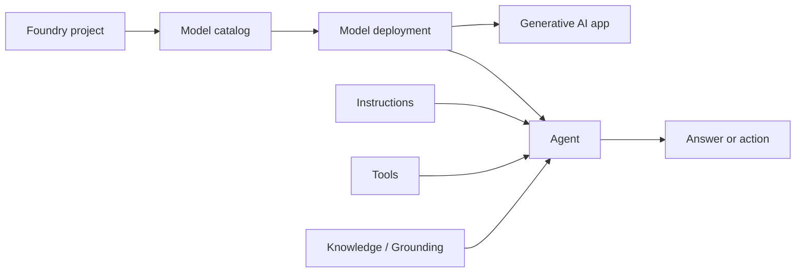
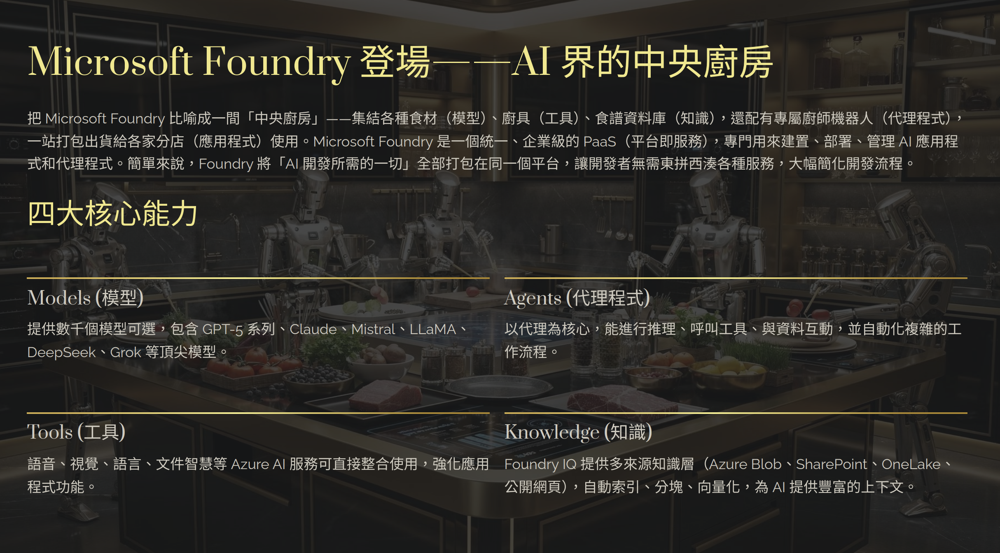

# Microsoft Foundry｜模型、應用程式與代理程式

Microsoft Foundry 是建立生成式 AI 應用程式與 agent 的整合平台。考試主線：**選模型 → 部署／測試 → 寫 prompt → 建立 agent → 用 SDK 呼叫**。

模型原理與生成參數見 [AI Models and Workloads](03_AI_Models_and_Workloads.md)。

## 1. Foundry platform map



| Component | 簡化理解 | 考試區分 |
|---|---|---|
| **Foundry portal** | 用網頁探索模型、部署、agent 與評估 | 適合操作與測試；程式整合使用 SDK / API |
| **Foundry project** | 組織模型部署、agent、連線與相關設定 | Project endpoint 與 deployment name 是不同值 |
| **Model catalog / Foundry Models** | 發現、比較與選擇模型 | 選到模型不代表模型已部署 |
| **Model deployment** | 讓模型可接受推論請求 | 呼叫時通常使用自訂的 deployment name |
| **Agent** | **Model＋instructions＋tools** 的應用 | Agent 可以使用工具；不是另一個 model name |
| **Knowledge / Grounding** | 提供模型回答所需的外部資料 | 模型不會因部署在 Foundry 就自動讀到企業資料 |
| **Foundry Tools** | 語言、語音、視覺與內容理解等能力 | 各服務實作見對應模組 |



> **補充（Current）：** 原圖是概念總覽。實際模型、版本和可用區域會變動，應以 model card 與部署頁面為準。

### Portal map：功能在哪裡

| Portal section | Scope / 主要內容 | Exam clue |
|---|---|---|
| **Discover** | Model catalog、model benchmarks / leaderboard | 找模型、比較 quality / safety / cost / throughput |
| **Build** | Models、playgrounds、Agents、Evaluations、fine-tuning | 建立、測試與改善 AI solution |
| **Operate** | Compliance、fleet health、tracing、assets | 監控、追蹤與治理跨 project 的營運狀態 |
| **Manage** | Quota、resource / project details、connected resources | 管理容量、專案與連線 |

> **Portal 版本提示：**現行 Portal 的頂層區域為 Home、Discover、Build、Operate、Manage、Docs。舊題或舊畫面可能使用 classic portal 位置；考試先依題目畫面作答，再用功能用途判斷。

## 2. 基礎概念

### Prompts：English instructions first

| Prompt part | 用途 | Example |
|---|---|---|
| **System prompt / Instructions** | 定義角色、規則、範圍與輸出格式 | `You help employees understand the travel policy.` |
| **User prompt** | 說明這一次要完成的任務 | `Summarize the reimbursement rules in three bullets.` |
| **Context / Grounding data** | 提供回答時可依據的資料 | 公司差旅規章片段 |
| **Few-shot examples** | 用少量範例示範預期模式 | 提供兩組「輸入 → 正確輸出」 |
| **Output constraints** | 指定長度、欄位或格式 | `Return Rule, Limit, and Source.` |

寫 prompt 時，先清楚說明：

1. **Role**：模型扮演什麼角色。
2. **Task**：要完成什麼。
3. **Context**：可以使用哪些資料。
4. **Constraints**：不能做什麼，以及輸出格式。

**Few-shot 是 prompt 範例，不是 fine-tuning。** System instructions 能引導行為，但仍需搭配 grounding、評估與安全控制。

### Search vocabulary：把資料變成可檢索內容

```text
Data source → Indexer / ingestion → Search index → Query → Ranked results
```

| Concept | 簡化理解 |
|---|---|
| **Azure AI Search** | 儲存、索引並查詢企業資料的搜尋服務 |
| **Search index** | 可被搜尋的文件與欄位集合；像搜尋系統的資料表 |
| **Indexer** | 從支援的資料來源拉取內容並填入 index |
| **Full-text search** | 根據文字與關鍵字尋找結果 |
| **Vector search** | 根據 embedding 的語意相似度尋找結果 |
| **Hybrid search** | 同時執行全文與向量搜尋，再合併排名 |
| **Semantic ranker** | 對初步搜尋結果做語意重新排序 |
| **AI enrichment / Skillset** | 索引時加入 OCR、分塊、實體擷取或向量化 |

記法：**Index stores；Indexer loads；Search retrieves。**

### Retrieval-Augmented Generation (RAG)

```text
User question → Search retrieves relevant content
→ content is added to the prompt → model generates a grounded answer
```

RAG 把檢索和生成接在一起，不會重新訓練模型。RAG 可以使用全文、向量或混合搜尋，並非一定只能使用 vector search。

## 3. Portal workflow：從模型到單一 agent

| Step | 做什麼 | 記住什麼 |
|---|---|---|
| **1. Select a project and model** | 比較模型能力、輸入輸出與可用性 | 先確認模型能完成任務 |
| **2. Deploy and test** | 選 deployment option / type，在 playground 測試 | 記下 project endpoint 與 deployment name |
| **3. Improve the prompt** | 加入角色、背景、限制與格式 | 用同一組案例比較修改前後 |
| **4. Create a single agent** | 選模型，設定 instructions、tools 與 knowledge | Agent = model＋instructions＋tools |
| **5. Test the agent** | 測正常、模糊、缺資料與工具失敗情境 | 確認它選對工具並依資料回答 |
| **6. Connect an app** | 使用 SDK 呼叫模型或既有 agent | 分清 model inference 與 agent invocation |

Portal 的按鈕位置可能改變，考試重點是操作流程與各元件的角色。

### Evaluation 與 Evaluator

```text
Test data / traces + target model or agent + evaluators
→ evaluation run → scores / pass-fail / comparison
```

| Concept | 簡化理解 | Example |
|---|---|---|
| **Evaluation** | 執行一組測試並彙整結果的流程 | 比較兩個 prompt 或 agent version |
| **Evaluator** | 評量單一品質或風險面向的評分規則 | Groundedness、Relevance、Coherence |
| **Model leaderboard** | 用公開 benchmark 比較 catalog 中的模型 | Quality、Safety、Cost、Throughput；**Preview** |

| Evaluator group | 在看什麼 | 常見 evaluator |
|---|---|---|
| **Quality** | 回答是否相關、完整、流暢且有根據 | Relevance、Groundedness、Coherence、Fluency |
| **Agent** | 是否理解任務並正確選擇、呼叫與使用工具 | Intent Resolution、Task Adherence、Tool Selection、Tool Call Accuracy |
| **Safety** | 是否含有風險內容 | Violence、Sexual、Self-harm、Hate / Unfairness |

**Model leaderboard** 用標準 benchmark 初步篩選模型；**Evaluation** 用自己的資料、prompt 或 agent 驗證實際方案。Leaderboard 分數高不保證符合特定業務情境。

## 4. Important API / SDK Patterns

### 先分清識別值與 connection

| Value / identifier | 意義 | Example shape |
|---|---|---|
| **Project endpoint** | Foundry 專案位址 | `https://<resource>.services.ai.azure.com/api/projects/<project>` |
| **Model deployment name** | 可呼叫的模型部署名稱 | `study-chat`；可與模型型號不同 |
| **Agent name** | 已建立的 agent 名稱 | `faq-agent` |
| **Conversation ID** | 持續多輪對話的識別碼 | 由 Conversations API 回傳 |
| **Connection name** | Project 中某個 connected resource 的連線名稱 | 例如連到 Azure OpenAI、Storage、AI Search |
| **Credential / API key** | 呼叫服務時用來驗證身分 | 應安全保存；不是 endpoint 或 deployment name |

### Clients：看到名稱先判斷責任

| Client / interface | 負責什麼 | 不要混淆 |
|---|---|---|
| **`AIProjectClient`** | 連接 Foundry project；存取 connections、deployments、agents、datasets 等專案操作 | 它是 project 入口，不是每次模型推論的 request shape |
| **OpenAI client** | 由 `project.get_openai_client()` 取得，用 Responses 或 Chat Completions 呼叫部署模型 | `model=` 通常放 deployment name |
| **Bound agent client** | `get_openai_client(agent_name=...)` 指向既有 agent endpoint | Agent name 不放入一般模型的 `model=` |
| **Responses API** | 統一文字、多模態、tools 與狀態的模型呼叫介面 | `input` / `instructions` / `output_text` |
| **Chat Completions API** | 使用 message-based 對話結構 | `messages` / `choices[0].message` |

> **Model Catalog Client 提示：**現行 `azure-ai-projects` 的主要入口是 `AIProjectClient`；Model catalog 是 Portal 的 **Discover** 功能。不要只因選項名稱含 `Model Catalog` 就假設存在一個通用的 `ModelCatalogClient`；應依題目提供的 SDK / API 版本判斷。

### AIProjectClient → OpenAI client → Responses API

```python
import os
from azure.ai.projects import AIProjectClient
from azure.identity import DefaultAzureCredential

project = AIProjectClient(
    endpoint=os.environ["AZURE_AI_PROJECT_ENDPOINT"],
    credential=DefaultAzureCredential(),
)
openai = project.get_openai_client()

response = openai.responses.create(
    model=os.environ["AZURE_AI_MODEL_DEPLOYMENT_NAME"],
    input="Explain Azure AI Search in one sentence.",
)
print(response.output_text)
```

記住呼叫順序：**Project client → OpenAI client → `responses.create()` → `output_text`**。

### Call an existing agent

目前 Python quickstart 使用預先綁定 agent 的 client：

```python
agent_client = project.get_openai_client(agent_name="faq-agent")
conversation = agent_client.conversations.create()

response = agent_client.responses.create(
    conversation=conversation.id,
    input="How do I reset my password?",
)
print(response.output_text)
```

- `agent_name` 指向已建立的 agent。
- `conversation.id` 讓後續問題延續同一段對話。
- 不要把 agent name 填入 `model=`。

**Legacy exam-bank context：**較舊題目可能要求在 request 中放 `agent_reference`。若題目是在 `model=agent_name` 與 `agent_reference` 間選擇，呼叫既有 agent 應選 `agent_reference`。

### Prompt/API shapes：避免把兩套欄位混寫

| API / approach | 輸入 | 讀取輸出 | 記憶點 |
|---|---|---|---|
| **Responses API** | `input`；可加 `instructions` | `output_text` | 統一模型呼叫介面：`responses.create(...)`；可搭配 tools、structured output 與 conversation state |
| **Chat Completions API** | `messages`，內含 role / content | `choices[0].message` | 是另一套 API shape |
| **Persisted Foundry agent** | 使用綁定 agent 的 client；舊型態可見 `agent_reference` | Agent response | 重用已儲存的 instructions / tools |
| **Ephemeral agent** | 每次 request 指定 model、instructions、tools | 當次 response | 定義存在應用程式請求中，不是持久化 agent 資源 |

若題目說「呼叫既有 agent」，要使用 persisted agent 的識別方式；不要在程式裡重新定義另一個 ephemeral agent。

> **Note — Responses API vs Chat Completions API：**Responses 使用 `input`／`instructions`，並從 `output_text` 取得文字；Chat Completions 使用 `messages`，並從 `choices[0].message` 取得結果。新應用通常優先考慮 **Responses API**，因為它把文字與多模態輸入、多輪狀態、tools 和 structured output 整合在同一套介面，建立 agent 或需要工具的應用時較容易擴充。**Chat Completions API** 仍可用於既有整合或單純的訊息式對話。題目出現 **unified model invocation API**，選 Responses API 的 `responses.create()`；不要混用兩套欄位。

## 5. Deployment 與 Knowledge 概念

### Deployment option vs deployment type

先選 **option（執行方式）**，再選 **type（處理位置、計費與效能）**。

| Level | Name | 簡化理解 | Status / trigger |
|---|---|---|---|
| 不建立 deployment | **Instant access** | 支援的模型可直接依名稱試用 | **Preview**；no deployment |
| Deployment option | **Serverless API** | Foundry 代管的模型 API；優先使用的主要路徑 | **Current**；依 token 或預留容量計費 |
| Deployment option | **Managed compute** | Foundry 管理專用 GPU，執行 open-source / custom-weight models | **Preview**；dedicated GPU |

> **Tip — Serverless API vs Managed compute：** **Serverless API** 不需要管理 GPU，適合直接呼叫 Foundry Models，依 token 用量或 PTU 預留容量計費；**Managed compute** 使用 Foundry 管理的專用 GPU，適合 open-source 或 custom-weight models，依 accelerator 和執行時間計費。記法：**Serverless 選代管 API；Managed compute 選專用 GPU。**

Serverless API 下再選 deployment type：

| Type family | 計費／處理方式 | 適合情境 |
|---|---|---|
| **Standard** | Pay-per-token | 一般、變動或突發流量 |
| **Provisioned** | 使用 **PTU** 預留處理容量 | 穩定高流量、可預測 throughput |
| **Batch** | 非同步批次處理 | 大量、不需即時完成的工作 |
| **Developer** | 暫時部署，無 SLA | 評估 fine-tuned model |

> **原筆記更正：**現行文件把 **Serverless API** 和 **Managed compute** 稱為 deployment options；**Standard** 是 Serverless API 下的 deployment type。

### Data processing scope

| Scope | 推論資料處理位置 |
|---|---|
| **Global** | 可能在任何支援的 Azure region 處理 |
| **Data Zone** | 只在指定的 US、EU 或 APAC data zone 內處理 |
| **Standard / Regional Provisioned** | 在指定 Azure geography 內處理，可能跨該 geography 內的 regions |

資料的 **at-rest location** 與推論時的 **processing location** 是兩個不同概念。並非所有模型都支援所有 deployment types。

### Knowledge mechanisms｜先看它如何取得資料

| Mechanism | 簡化理解 | 適合情境 |
|---|---|---|
| **Knowledge source** | Knowledge base 所連結的一個資料來源 | Blob、SharePoint、既有 Search index 或 web |
| **Knowledge base** | 組織多個 knowledge sources 與檢索設定 | 讓一或多個 agent 使用共同的知識層 |
| **Indexed source** | 將內容匯入 search index，處理分塊與向量化 | 需要可控索引與定期更新的企業資料 |
| **Remote source** | 查詢時才向外部系統取資料，不匯入 index | 需要即時查詢外部來源 |
| **Foundry IQ** | 以 knowledge base 執行 agentic retrieval | 多來源 grounding 與較進階檢索 |
| **Custom question answering** | 維護 question-answer pairs 的舊式 Q&A 服務 | **Retiring（2029-03-31）**；只保留舊題辨識 |

不要看到 **knowledge base** 就直接判定是同一產品；先看題目描述的是文件檢索、Foundry IQ，還是舊版 Q&A。

## 6. 補充：常見 Agent tools

### File Search vs Code Interpreter vs Azure AI Search

| Tool / service | 核心用途 | 題目情境 |
|---|---|---|
| **File Search** | 搜尋已上傳文件，取回相關片段做 grounding | 詢問 PDF / DOCX 中的規則 |
| **Code Interpreter** | 在沙箱執行 Python，計算、分析資料或產生檔案 | 分析 CSV、算平均、畫圖 |
| **Azure AI Search tool** | 查詢既有的企業 Search index | Agent 要使用既有搜尋系統 |
| **Foundry IQ knowledge base** | 對多個 knowledge sources 執行 agentic retrieval | 共用多來源知識層 |

記法：**File Search retrieves files；Code Interpreter computes；Azure AI Search queries an index。**


## 7. Quick Memory Rules

- **Catalog selects；deployment serves。**
- **Model＋instructions＋tools = agent。**
- **Project → OpenAI client → response。**
- **Agent name 不是 model deployment name。**
- **Index stores；indexer loads。**
- **File Search 查文件；Code Interpreter 做計算。**
- **先選 deployment option，再選 deployment type。**
- **Discover 找模型；Build 建方案；Operate 看營運；Manage 管資源。**
- **Leaderboard 比通用 benchmark；Evaluation 測自己的方案。**

## 8. Official Sources

核對日期：**2026-09-10**。

- [AI-901 Study Guide](https://learn.microsoft.com/en-us/credentials/certifications/resources/study-guides/ai-901)
- [Microsoft Foundry capability map](https://learn.microsoft.com/en-us/azure/foundry/concepts/capabilities)
- [Foundry Models deployment overview](https://learn.microsoft.com/en-us/azure/foundry/concepts/deployments-overview)
- [Deployment types](https://learn.microsoft.com/en-us/azure/foundry/foundry-models/concepts/deployment-types)
- [Prompt engineering techniques](https://learn.microsoft.com/en-us/azure/foundry/openai/concepts/prompt-engineering)
- [Foundry SDK quickstart](https://learn.microsoft.com/en-us/azure/foundry/quickstarts/get-started-code)
- [Current Foundry portal navigation](https://learn.microsoft.com/en-us/azure/foundry/how-to/navigate-from-classic)
- [Model leaderboards](https://learn.microsoft.com/en-us/azure/foundry/concepts/model-benchmarks)
- [Run evaluations in the Foundry portal](https://learn.microsoft.com/en-us/azure/foundry/how-to/evaluate-generative-ai-app)
- [AIProjectClient Python reference](https://learn.microsoft.com/en-us/python/api/azure-ai-projects/azure.ai.projects.aiprojectclient?view=azure-python)
- [ConnectionsOperations Python reference](https://learn.microsoft.com/en-us/python/api/azure-ai-projects/azure.ai.projects.operations.connectionsoperations?view=azure-python)
- [Responses API](https://learn.microsoft.com/en-us/azure/foundry/openai/how-to/responses)
- [Azure AI Search overview](https://learn.microsoft.com/en-us/azure/search/search-what-is-azure-search)
- [Hybrid search](https://learn.microsoft.com/en-us/azure/search/hybrid-search-overview)
- [Foundry IQ FAQ](https://learn.microsoft.com/en-us/azure/foundry/agents/concepts/foundry-iq-faq)
- [File Search](https://learn.microsoft.com/en-us/azure/foundry/agents/how-to/tools/file-search)
- [Code Interpreter](https://learn.microsoft.com/en-us/azure/foundry/agents/how-to/tools/code-interpreter)
- [Custom question answering overview](https://learn.microsoft.com/en-us/azure/ai-services/language-service/question-answering/overview)
