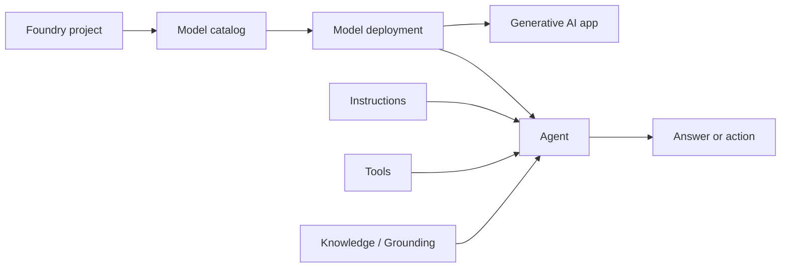
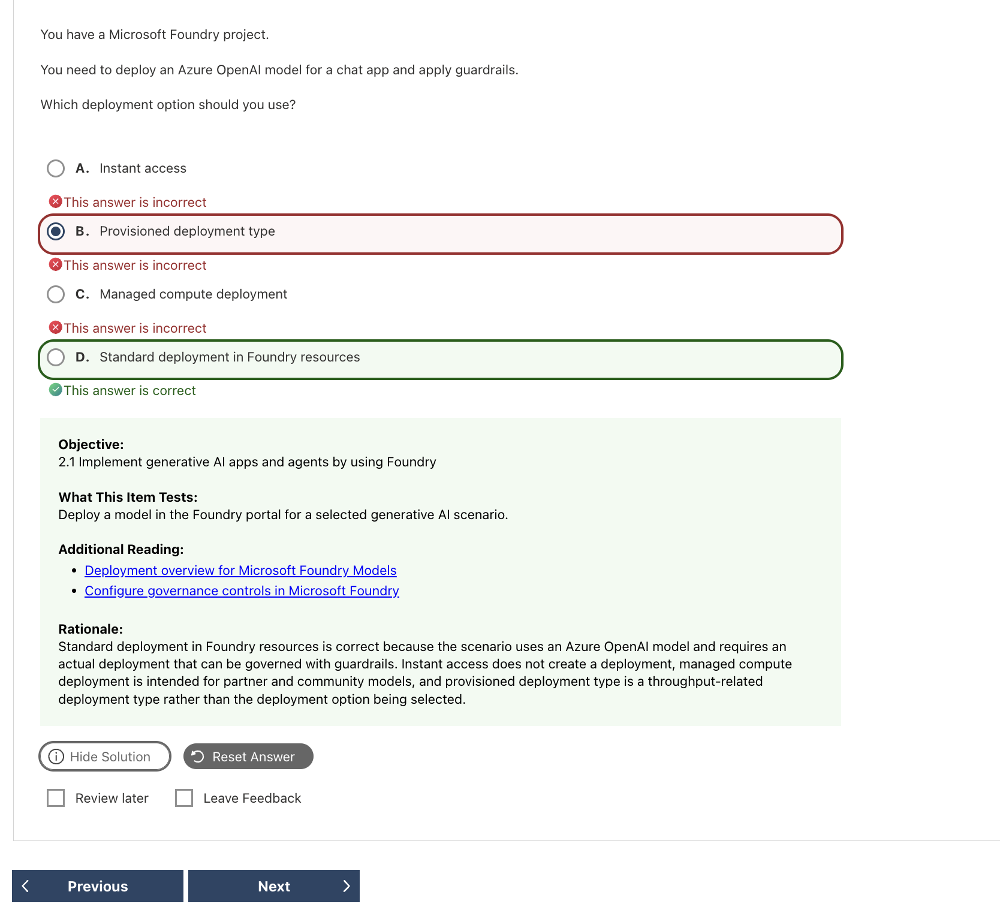
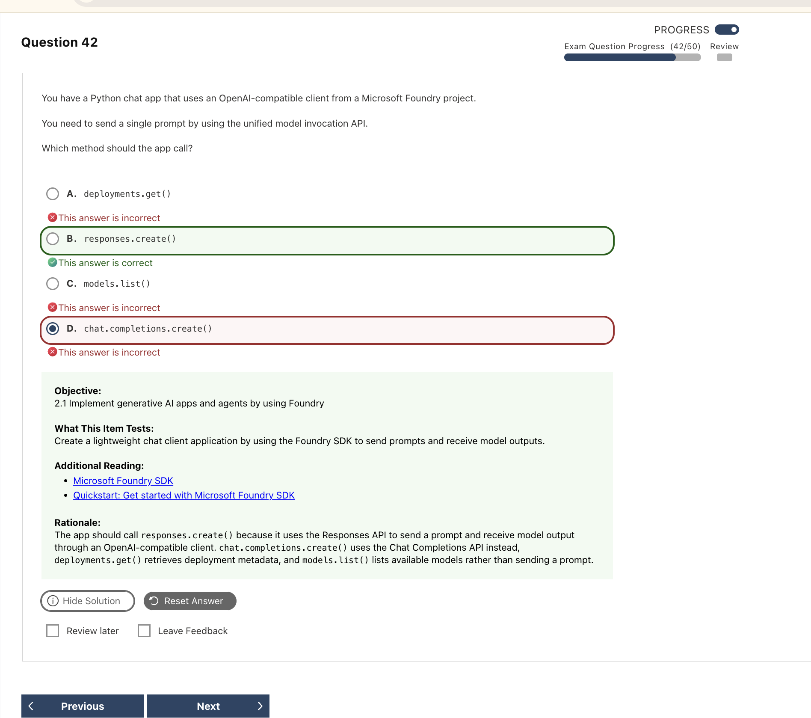

# Microsoft Foundry｜模型、應用程式與代理程式

Microsoft Foundry 是建立生成式 AI 應用程式與 agent 的整合平台。這一個考試沒有考很難的內容，主要就是知道說創建 Agent 的流程是：**選模型 → 部署／測試 → 寫 prompt → 建立 agent → 用 SDK 呼叫**。

模型原理與生成參數見 [AI Models and Workloads](03_AI_Models_and_Workloads.md)。

這篇可以依序閱讀：

```text
認識平台元件 → 在 Portal 建立方案 → 用 API / SDK 呼叫
→ 選擇部署方式 → 加入 knowledge 與 tools
```

## 1. Foundry platform map



| Component | 簡化理解 | 考試區分 |
|---|---|---|
| **Foundry portal** | 用網頁探索模型、部署、agent 與評估 | 適合操作與測試；程式整合使用 SDK / API |
| **Foundry project** | 組織模型部署、agent、連線與相關設定 | Project endpoint 與 deployment name 是不同值 |
| **Model catalog / Foundry Models** | 發現、比較與選擇模型 | 選到模型不代表模型已部署 |
| **Model deployment** | 讓模型可接受推論請求 | 呼叫時通常使用自訂的 deployment name |
| **Agent** | **Model＋instructions＋tools** 的應用 | Agent 可以使用工具；不是另一個 model name |
| **Knowledge / Grounding** | 提供模型回答所需的外部資料 | 模型不會因部署在 Foundry 就自動讀到企業資料 |
| **Foundry Tools** | 語言、語音、視覺與內容理解等能力 | 各服務實作見對應模組 |


### Portal map：先知道功能在哪裡

| Portal section | Scope / 主要內容 | Exam clue |
|---|---|---|
| **Discover** | Model catalog、model benchmarks / leaderboard | 找模型、比較 quality / safety / cost / throughput |
| **Build** | Models、playgrounds、Agents、Evaluations、fine-tuning | 建立、測試與改善 AI solution |
| **Operate** | Compliance、fleet health、tracing、assets | 監控、追蹤與治理跨 project 的營運狀態 |
| **Manage** | Quota、resource / project details、connected resources | 管理容量、專案與連線 |


## 2. Portal workflow｜從模型到單一 agent

### 建立流程

| Step | 做什麼 | 記住什麼 |
|---|---|---|
| **1. Select a project and model** | 比較模型能力、輸入輸出與可用性 | 先確認模型能完成任務 |
| **2. Deploy and test** | 選 deployment option / type，在 playground 測試 | 記下 project endpoint 與 deployment name |
| **3. Improve the prompt** | 加入角色、背景、限制與格式 | 用同一組案例比較修改前後 |
| **4. Create a single agent** | 選模型，設定 instructions、tools 與 knowledge | Agent = model＋instructions＋tools |
| **5. Test the agent** | 測正常、模糊、缺資料與工具失敗情境 | 確認它選對工具並依資料回答 |
| **6. Connect an app** | 使用 SDK 呼叫模型或既有 agent | 分清 model inference 與 agent invocation |


### Evaluation｜測試模型、app 或 agent

```text
Test data / traces + target model or agent + evaluators
→ evaluation run → scores / pass-fail / comparison
```

| Concept | 簡化理解 | Example |
|---|---|---|
| **Evaluation** | 執行一組測試並彙整結果的流程 | 比較兩個 prompt 或 agent version |
| **Evaluator** | 評量單一品質或風險面向的評分規則 | Groundedness、Relevance、Coherence |
| **Model leaderboard** | 用公開 benchmark 比較 catalog 中的模型 | Quality、Safety、Cost、Throughput；**Preview** |

| Evaluator group | 在看什麼 | 常見 evaluator |
|---|---|---|
| **Quality** | 回答是否相關、完整、流暢且有根據 | Relevance、Groundedness、Coherence、Fluency |
| **Agent** | 是否理解任務並正確選擇、呼叫與使用工具 | Intent Resolution、Task Adherence、Tool Selection、Tool Call Accuracy |
| **Safety** | 是否含有風險內容 | Violence、Sexual、Self-harm、Hate / Unfairness |

**Model leaderboard** 用標準 benchmark 初步篩選模型；**Evaluation** 用自己的資料、prompt 或 agent 驗證實際方案。Leaderboard 分數高不保證符合特定業務情境。

## 3. API / SDK｜只記重要呼叫關係

### Step 1：先分清識別值與 connection

| Value / identifier | 意義 | Example shape |
|---|---|---|
| **Project endpoint** | Foundry 專案位址 | `https://<resource>.services.ai.azure.com/api/projects/<project>` |
| **Model deployment name** | 可呼叫的模型部署名稱 | `study-chat`；可與模型型號不同 |
| **Agent name** | 已建立的 agent 名稱 | `faq-agent` |
| **Conversation ID** | 持續多輪對話的識別碼 | 由 Conversations API 回傳 |
| **Connection name** | Project 中某個 connected resource 的連線名稱 | 例如連到 Azure OpenAI、Storage、AI Search |
| **Credential / API key** | 呼叫服務時用來驗證身分 | 應安全保存；不是 endpoint 或 deployment name |

### Step 2：看到 client 名稱先判斷責任

| Client / interface | 負責什麼 | 不要混淆 |
|---|---|---|
| **`AIProjectClient`** | 連接 Foundry project；存取 connections、deployments、agents、datasets 等專案操作 | 它是 `azure-ai-projects` 的主要入口是 `AIProjectClient`，不是每次模型推論的 request shape |
| **OpenAI client** | 由 `project.get_openai_client()` 取得，用 Responses 或 Chat Completions 呼叫部署模型 | `model=` 通常放 deployment name |
| **Bound agent client** | `get_openai_client(agent_name=...)` 指向既有 agent endpoint | Agent name 不放入一般模型的 `model=` |
| **Responses API** | 統一文字、多模態、tools 與狀態的模型呼叫介面 | `input` / `instructions` / `output_text` |
| **Chat Completions API** | 使用 message-based 對話結構 | `messages` / `choices[0].message` |


### Step 3：呼叫已部署的模型

```python
import os
from azure.ai.projects import AIProjectClient
from azure.identity import DefaultAzureCredential

project = AIProjectClient(
    endpoint=os.environ["AZURE_AI_PROJECT_ENDPOINT"],
    credential=DefaultAzureCredential(),
)
openai = project.get_openai_client()

response = openai.responses.create(
    model=os.environ["AZURE_AI_MODEL_DEPLOYMENT_NAME"],
    input="Explain Azure AI Search in one sentence.",
)
print(response.output_text)
```

記住呼叫順序：**Project client → OpenAI client → `responses.create()` → `output_text`**。

### Step 4：呼叫已建立的 agent

目前 Python quickstart 使用預先綁定 agent 的 client：

```python
agent_client = project.get_openai_client(agent_name="faq-agent")
conversation = agent_client.conversations.create()

response = agent_client.responses.create(
    conversation=conversation.id,
    input="How do I reset my password?",
)
print(response.output_text)
```

- `agent_name` 指向已建立的 agent。
- `conversation.id` 讓後續問題延續同一段對話。
- 不要把 agent name 填入 `model=`。

有些較舊題目可能要求在 request 中放 `agent_reference`。若題目是在 `model=agent_name` 與 `agent_reference` 間選擇，呼叫既有 agent 應選 `agent_reference`。

### Step 5：分清 API shape

#### Responses API vs Chat Completions API

| API | 輸入欄位 | 讀取文字輸出 | 特點與選用方式 |
|---|---|---|---|
| **Responses API** | `input`；可用 `instructions` 設定行為 | `output_text` | 統一處理文字、多模態輸入、tools、structured output 與 conversation state。新應用、agent 或需要工具的方案通常優先考慮 `responses.create(...)` |
| **Chat Completions API** | `messages`，每則訊息包含 role / content | `choices[0].message` | 使用傳統的訊息式對話結構，適合既有整合或單純對話；它與 Responses API 是不同的 request / response shape |

> **啾啾筆記：** 題目出現 **unified model invocation API**，選 **Responses API** 的 `responses.create()`。Responses API 將多模態、工具與狀態整合在同一套介面，所以較方便繼續擴充；Chat Completions 仍然可以使用，只是不要把它的 `messages`／`choices[0].message` 和 Responses 的 `input`／`output_text` 混在一起喔～

#### Persisted agent vs Ephemeral agent

| Agent approach | 如何定義 | 記憶點 |
|---|---|---|
| **Persisted Foundry agent** | 使用綁定 agent 的 client；舊型態可見 `agent_reference` | 重用已儲存的 instructions 與 tools |
| **Ephemeral agent** | 每次 request 指定 model、instructions 與 tools | 定義存在應用程式請求中，不是持久化的 agent 資源 |

若題目說「呼叫既有 agent」，要使用 persisted agent 的識別方式；不要在程式裡重新定義另一個 ephemeral agent。

## 4. Model deployment｜先選 option，再選 type

### Deployment option vs deployment type

先選 **option（執行方式）**，再選 **type（處理位置、計費與效能）**。

| Level | Name | 簡化理解 | Status / trigger |
|---|---|---|---|
| 不建立 deployment | **Instant access** | 支援的模型可直接依名稱試用 | **Preview**；no deployment |
| Deployment option | **Serverless API** | Foundry 代管的模型 API；優先使用的主要路徑 | **Current**；依 token 或預留容量計費 |
| Deployment option | **Managed compute** | Foundry 管理專用 GPU，執行 open-source / custom-weight models | **Preview**；dedicated GPU |

> **Tip — Serverless API vs Managed compute：** **Serverless API** 不需要管理 GPU，適合直接呼叫 Foundry Models，依 token 用量或 PTU 預留容量計費；**Managed compute** 使用 Foundry 管理的專用 GPU，適合 open-source 或 custom-weight models，依 accelerator 和執行時間計費。記法：**Serverless 選代管 API；Managed compute 選專用 GPU。**

Serverless API 下再選 deployment type：

| Type family | 計費／處理方式 | 適合情境 |
|---|---|---|
| **Standard** | Pay-per-token | 一般、變動或突發流量 |
| **Provisioned** | 使用 **PTU** 預留處理容量 | 穩定高流量、可預測 throughput |
| **Batch** | 非同步批次處理 | 大量、不需即時完成的工作 |
| **Developer** | 暫時部署，無 SLA | 評估 fine-tuned model |


### Data processing scope

| Scope | 推論資料處理位置 |
|---|---|
| **Global** | 可能在任何支援的 Azure region 處理 |
| **Data Zone** | 只在指定的 US、EU 或 APAC data zone 內處理 |
| **Standard / Regional Provisioned** | 在指定 Azure geography 內處理，可能跨該 geography 內的 regions |

資料的 **at-rest location** 與推論時的 **processing location** 是兩個不同概念。並非所有模型都支援所有 deployment types。

## 5. Agent knowledge 與 tools

Agent 透過 **knowledge** 取得回答依據。而 Agent 可以透過 **tools** 執行搜尋、計算或其他動作。

### Knowledge mechanisms｜先看資料如何取得

| Mechanism | 簡化理解 | 適合情境 |
|---|---|---|
| **Knowledge source** | Knowledge base 所連結的一個資料來源 | Blob、SharePoint、既有 Search index 或 web |
| **Knowledge base** | 組織多個 knowledge sources 與檢索設定 | 讓一或多個 agent 使用共同的知識層 |
| **Indexed source** | 將內容匯入 search index，處理分塊與向量化 | 需要可控索引與定期更新的企業資料 |
| **Remote source** | 查詢時才向外部系統取資料，不匯入 index | 需要即時查詢外部來源 |
| **Foundry IQ** | 以 knowledge base 執行 agentic retrieval | 多來源 grounding 與較進階檢索 |
| **Custom question answering** | 維護 question-answer pairs 的舊式 Q&A 服務 | **Retiring（2029-03-31）**；只保留舊題辨識 |


### 常見內建的 Agent tools

| Tool / service | 核心用途 | 題目情境 |
|---|---|---|
| **File Search** | 搜尋已上傳文件，取回相關片段做 grounding | 詢問 PDF / DOCX 中的規則 |
| **Code Interpreter** | 在沙箱執行 Python，計算、分析資料或產生檔案 | 分析 CSV、算平均、畫圖 |
| **Azure AI Search tool** | 查詢既有的企業 Search index | Agent 要使用既有搜尋系統 |
| **Foundry IQ knowledge base** | 對多個 knowledge sources 執行 agentic retrieval | 共用多來源知識層 |


## 6. Common Confusions｜考前快速區分

| 容易混淆的概念 | 快速區分 |
|---|---|
| **Model catalog vs deployment** | Catalog 用來找模型；deployment 才能提供模型推論服務 |
| **Model deployment name vs agent name** | 前者呼叫已部署模型；後者指向已建立的 agent |
| **Leaderboard vs Evaluation** | Leaderboard 看公開 benchmark；Evaluation 用自己的資料測方案 |
| **Responses vs Chat Completions** | `input`／`output_text` vs `messages`／`choices[0].message` |
| **Serverless API vs Managed compute** | 代管模型 API vs Foundry 管理的專用 GPU |
| **Knowledge vs tools** | Knowledge 提供回答依據；tools 讓 agent 執行動作 |
| **File Search vs Code Interpreter** | 前者檢索文件；後者執行 Python 做計算或資料分析 |

### Quick Memory Rules

- **Catalog selects；deployment serves。**
- **Model＋instructions＋tools = agent。**
- **Project → OpenAI client → response。**
- **Agent name 不是 model deployment name。**
- **Index stores；indexer loads。**
- **File Search 查文件；Code Interpreter 做計算。**
- **先選 deployment option，再選 deployment type。**
- **Discover 找模型；Build 建方案；Operate 看營運；Manage 管資源。**
- **Leaderboard 比通用 benchmark；Evaluation 測自己的方案。**

## 7. 常見錯誤與詳解

### Q01 — Knowledge Base 匯入格式的混合年代題


| 快速判斷 | 內容 |
|---|---|
| **舊題庫答案** | **B. DOC、D. PDF** |
| **現行判斷** | 只說 Foundry knowledge base，資訊不足；必須先知道是哪種 knowledge 機制 |
| **線索** | `generate a knowledge base`、`DOC`、`PDF` |
| **考點** | 舊式 Q&A 文件匯入格式；current vs legacy |
| **錯誤原因** | 題幹與解說混用了 Foundry 和舊 Question Answering 語境 |

**為什麼選 B、D：**截圖的解說沿用舊式 Question Answering knowledge base 教材，因此題庫預期 DOC 和 PDF。

| Option | 為什麼是／不是（依舊題） |
|---|---|
| A. CSV | 不是該舊題指定的文件格式；其他現行機制可能處理結構化資料。 |
| **B. DOC** | **是。**符合舊式文件匯入語境。 |
| C. MP4 | 影音內容應看 Content Understanding 等相應能力。 |
| **D. PDF** | **是。**符合舊式文件匯入語境。 |
| E. ZIP | 壓縮檔本身不是該 knowledge base 的內容格式。 |

**補充與延伸：**現行 Foundry 可能使用 File Search、Foundry IQ knowledge source 或 Azure AI Search；支援格式各自不同，不能把 DOC＋PDF 套用到所有機制。

> **記法：先辨認 knowledge 機制，再判斷檔案格式。**

**官方來源：** [File Search](https://learn.microsoft.com/en-us/azure/foundry/agents/how-to/tools/file-search)、[Question Answering format guidelines](https://learn.microsoft.com/en-us/azure/ai-services/language-service/question-answering/reference/document-format-guidelines)

---

### Q09 — 呼叫既有 Prompt Agent


| 快速判斷 | 內容 |
|---|---|
| **答案** | **D. Call `responses.create()` with an `agent_reference`** |
| **線索** | `existing prompt agent`、`send a user message` |
| **考點** | 呼叫既有 agent vs 模型部署 vs ephemeral agent |
| **錯誤原因** | 把 agent name 當成 model deployment name |

**為什麼選 D：**這個題目版本以 `agent_reference` 指向 project 中已存在的 agent，才能重用其 instructions 和 tools。

| Option | 為什麼是／不是 |
|---|---|
| A. Create an ephemeral agent | 建立另一個臨時定義，沒有呼叫既有 agent。 |
| B. `responses.create(model="faq-agent")` | `model` 要放模型部署，不是 agent name。 |
| C. Generate embeddings | 只產生向量，不會執行 agent。 |
| **D. `responses.create()`＋`agent_reference`** | **是。**依題目 API 形狀引用既有 agent。 |

**補充與延伸：**現行 SDK 也可用 `get_openai_client(agent_name=...)` 取得預先綁定 agent 的 client。Agent API 變動快，作答時依題目版本判斷。

> **記法：既有 agent 用 agent 識別方式；`model=` 放 model deployment。**

**官方來源：** [Foundry SDK quickstart](https://learn.microsoft.com/en-us/azure/foundry/quickstarts/get-started-code#chat-with-an-agent)

---

### Q12 — Deployment Option 與 Deployment Type



| 快速判斷 | 內容 |
|---|---|
| **題庫答案** | **D. Standard deployment in Foundry resources** |
| **線索** | `Azure OpenAI model`、`chat app`、`guardrails`、`deployment option` |
| **考點** | Deployment option vs deployment type |
| **錯誤原因** | 把 Provisioned throughput type 當成題目所問的上層 option |

**為什麼選 D：**依這份舊題的用語，Standard deployment 是 Azure OpenAI 模型在 Foundry resource 中的受管理部署選項。

| Option | 為什麼是／不是 |
|---|---|
| A. Instant access | 不建立題目要求的 deployment。 |
| B. Provisioned deployment type | 是預留 throughput／PTU 的 type，不是這題的 option 層級。 |
| C. Managed compute | 用於需要專用 GPU 的 open／custom-weight models，不符合此題。 |
| **D. Standard deployment in Foundry resources** | **是。**符合這份題庫的部署語境。 |

**補充與延伸：**現行文件先分 **Serverless API vs Managed compute**，再於 Serverless 下分 Standard、Provisioned、Batch 等 types。Provisioned 也能搭配治理控制，不能用 guardrails 直接排除它。

> **記法：先看題目問 option，還是 Standard／Provisioned 這類 type。**

**官方來源：** [Deployment overview](https://learn.microsoft.com/en-us/azure/foundry/concepts/deployments-overview)、[Deployment types](https://learn.microsoft.com/en-us/azure/foundry/foundry-models/concepts/deployment-types)

---

### Q13 — AIProjectClient 取得 OpenAI Client


| 快速判斷 | 內容 |
|---|---|
| **答案** | **Call `get_openai_client()`** |
| **線索** | `After creating an AIProjectClient`、`before sending prompts` |
| **考點** | Foundry SDK client layering |
| **錯誤原因** | 混淆 project 管理入口與模型推論 client |

**為什麼選它：**`AIProjectClient` 連接 Foundry project；`get_openai_client()` 取得已設定專案 endpoint 與驗證的 OpenAI client，之後才能呼叫 Responses 或 Chat Completions。

截圖沒有展開全部選項，因此只保留可確認的方向：

| Choice / direction | 為什麼是／不是 |
|---|---|
| **`get_openai_client()`** | **是。**取得模型呼叫 client。 |
| 只有 deployment name | 只有識別值，沒有 client 或 authentication。 |
| Deployments management operations | 管 deployment metadata，不負責送 prompt。 |
| 用 deployment URL 建立 `AIProjectClient` | `AIProjectClient` 使用 project endpoint。 |

**補充與延伸：**一般順序為 `AIProjectClient → get_openai_client() → responses.create()`。SDK 版本可能改變個別介面，但兩層 client 的責任要分清楚。

> **記法：Project client 管專案；OpenAI client 呼叫模型。**

**官方來源：** [AIProjectClient reference](https://learn.microsoft.com/en-us/python/api/azure-ai-projects/azure.ai.projects.aiprojectclient?view=azure-python)

---

### Q19 — Unified Model Invocation API



| 快速判斷 | 內容 |
|---|---|
| **答案** | **B. `responses.create()`** |
| **線索** | `unified model invocation API`、`single prompt` |
| **考點** | Responses API vs Chat Completions API |
| **錯誤原因** | 把模型管理方法或 Chat Completions 當成題目指定的統一介面 |

**為什麼選 B：**`unified model invocation API` 直接指向 Responses API；使用 `responses.create()` 並以 `input=` 傳入內容。

| Option | 為什麼是／不是 |
|---|---|
| A. `deployments.get()` | 讀 deployment 資訊，不執行推論。 |
| **B. `responses.create()`** | **是。**送出 input 並取得模型 response。 |
| C. `models.list()` | 列出模型，不產生回答。 |
| D. `chat.completions.create()` | 仍可使用，但它是 `messages`／`choices` 的另一套 API。 |

**補充與延伸：**Responses 使用 `input`、可加 `instructions`，文字便利欄位是 `output_text`；Chat Completions 使用 `messages` 和 `choices[0].message`。

> **記法：Unified invocation → Responses → `responses.create()`。**

**官方來源：** [Responses API](https://learn.microsoft.com/en-us/azure/foundry/openai/how-to/responses)

## 8. Official Sources
核對日期：**2026-09-10**。

- [AI-901 Study Guide](https://learn.microsoft.com/en-us/credentials/certifications/resources/study-guides/ai-901)
- [Microsoft Foundry capability map](https://learn.microsoft.com/en-us/azure/foundry/concepts/capabilities)
- [Foundry Models deployment overview](https://learn.microsoft.com/en-us/azure/foundry/concepts/deployments-overview)
- [Deployment types](https://learn.microsoft.com/en-us/azure/foundry/foundry-models/concepts/deployment-types)
- [Prompt engineering techniques](https://learn.microsoft.com/en-us/azure/foundry/openai/concepts/prompt-engineering)
- [Foundry SDK quickstart](https://learn.microsoft.com/en-us/azure/foundry/quickstarts/get-started-code)
- [Current Foundry portal navigation](https://learn.microsoft.com/en-us/azure/foundry/how-to/navigate-from-classic)
- [Model leaderboards](https://learn.microsoft.com/en-us/azure/foundry/concepts/model-benchmarks)
- [Run evaluations in the Foundry portal](https://learn.microsoft.com/en-us/azure/foundry/how-to/evaluate-generative-ai-app)
- [AIProjectClient Python reference](https://learn.microsoft.com/en-us/python/api/azure-ai-projects/azure.ai.projects.aiprojectclient?view=azure-python)
- [ConnectionsOperations Python reference](https://learn.microsoft.com/en-us/python/api/azure-ai-projects/azure.ai.projects.operations.connectionsoperations?view=azure-python)
- [Responses API](https://learn.microsoft.com/en-us/azure/foundry/openai/how-to/responses)
- [Azure AI Search overview](https://learn.microsoft.com/en-us/azure/search/search-what-is-azure-search)
- [Hybrid search](https://learn.microsoft.com/en-us/azure/search/hybrid-search-overview)
- [Foundry IQ FAQ](https://learn.microsoft.com/en-us/azure/foundry/agents/concepts/foundry-iq-faq)
- [File Search](https://learn.microsoft.com/en-us/azure/foundry/agents/how-to/tools/file-search)
- [Code Interpreter](https://learn.microsoft.com/en-us/azure/foundry/agents/how-to/tools/code-interpreter)
- [Custom question answering overview](https://learn.microsoft.com/en-us/azure/ai-services/language-service/question-answering/overview)
