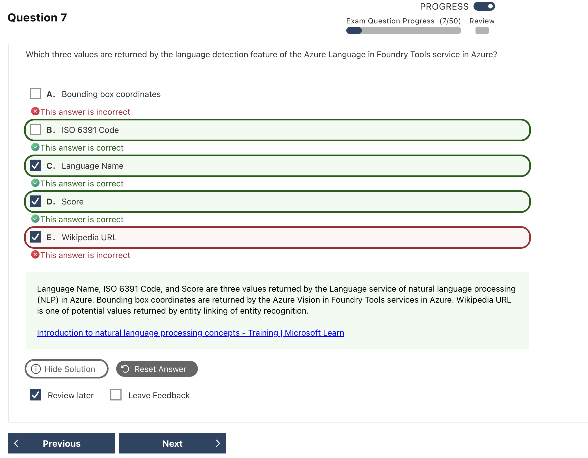

# Text and Language｜文字分析與語言

文字分析的核心是：將**非結構化文字**轉成主題、實體、情緒、語言或摘要等結構化結果。

## 1. 文字分析任務（Text analysis tasks）

以下任務主要由 **Azure Language in Foundry Tools** 提供。考試先看題目要求的輸出，再選功能。

下面全部使用同一段客服 utterance，這樣可以直接比較不同任務會從同一份文字中取出什麼：

> `On March 8, I visited the Microsoft Store in New York. The Surface staff were helpful, but the two-hour wait was terrible. Please send my refund to Contoso Bank.`

| Task | Microsoft service | 概念 | 例子 | Output | Exam keywords |
|---|---|---|---|---|---|
| **Key Phrase Extraction** | Azure Language in Foundry Tools | 找出文字中的主要概念 | 取出 `Microsoft Store`、`Surface staff`、`two-hour wait`、`refund` | 重點片語清單 | main topics、key phrases |
| **Named Entity Recognition (NER)** | Azure Language in Foundry Tools | 辨識實體並分類為人名、地點、組織、日期等 | `Microsoft`＝Organization、`New York`＝Location、`March 8`＝Date | Entity、category、位置、confidence | people、places、organizations |
| **Entity Linking** | Azure Language in Foundry Tools | 判斷文字中的實體實際指涉，並連到知識來源 | 將 `Microsoft` 連到對應的 Wikipedia 實體 | Linked entity、Wikipedia URL | disambiguate、Wikipedia、link |
| **Sentiment Analysis** | Azure Language in Foundry Tools | 判斷整句、句子或文件的情緒 | `helpful` 是正面、`terrible` 是負面，因此整體可能是 **mixed** | Positive、negative、neutral、mixed 與 confidence | customer feeling、positive / negative |
| **Opinion Mining** | Azure Language in Foundry Tools | 把情緒連回被評論的對象 | `staff`＝target、`helpful`＝assessment；`wait`＝target、`terrible`＝assessment | Target、assessment、sentiment | opinion about、aspect、target |
| **Extractive Summarization** | Azure Language in Foundry Tools | 從原文挑出重要句子，不改寫內容 | 直接選出 `The Surface staff were helpful, but the two-hour wait was terrible.` | 原文句子子集 | select sentences、preserve wording |
| **Abstractive Summarization** | Azure Language in Foundry Tools | 用新的句子濃縮原文意思 | `The customer praised the staff but complained about the wait and requested a refund.` | 新生成的摘要 | rewrite、concise summary |
| **Language Detection** | Azure Language in Foundry Tools | 判斷文件使用的主要語言 | 判斷這段 utterance 為 `English`，ISO code 為 `en` | Language name、ISO code、confidence | predominant language、ISO 639-1 |

> **啾啾筆記：** 同一句話可以同時送去做不同分析，差別在於你想取得哪一種 output。看到「主題」選 key phrases；看到「人、地點、組織」選 NER；看到「對什麼東西有什麼評價」則選 opinion mining 喔～

表格中的結果用來幫助理解概念；實際擷取的片語、摘要與 confidence 可能因模型版本而不同。

> **Exam priority vs lifecycle：**Key phrase、sentiment 和 summarization 仍在目前 AI-901 的文字分析範圍中，但其 Azure Language API 已公告退役日期。概念是否會考，和產品生命週期是兩件事。

## 2. Core Concepts

### Language detection output

| Field / concept | 意義 | Example | 易混淆處 |
|---|---|---|---|
| `name` | 人類可讀的語言名稱 | `English` | 不是文字主題 |
| `iso6391Name` | ISO 639-1 語言代碼 | `en`、`fr`、`zh` | 不是翻譯結果 |
| `confidenceScore` | 語言判斷的把握程度，範圍 0–1 | `0.99` | 不是 sentiment score |
| Script name / code | 使用的書寫系統 | `Latin`／`Latn` | Language 與 script 是不同概念 |
| Predominant language | 混合語言文件中的主要語言 | 每份 document 回傳一個主要語言 | 不會列出每一句的所有語言 |
| `countryHint` | 協助判斷短詞或歧義文字 | `fr` 可提示內容來自法國 | 只是提示，不是強制指定結果 |

> **Current correction — Unknown vs NaN：**現行官方範例中，無法辨識的文字會回傳 `(Unknown)` 與 `confidenceScore: 0.0`。舊題庫可能把 **NaN** 當答案，僅保留為 **Legacy exam-bank context**。

### Utterance、Intent 與 Entity

輸入：`幫我訂明天去台北的高鐵。`

| Concept | 簡化理解 | Example |
|---|---|---|
| **Utterance** | 使用者實際輸入的完整語句 | `幫我訂明天去台北的高鐵` |
| **Intent** | 使用者想完成的事情 | `BookTrainTicket` |
| **Entity** | 完成事情需要的參數 | 明天＝Date；台北＝Destination |
| **Conversational Language Understanding (CLU)** | 自訂模型，用來預測 intent 並擷取 entities | Utterance → intent＋entities |

CLU 只負責理解語句，不會因為辨識出 `BookTrainTicket` 就自行訂票；後續動作仍由應用程式或 agent 執行。

### Comparison / Common Confusions

| Compare | Difference |
|---|---|
| **Key phrases vs NER** | 找文章主題片語 vs 找人、地點、組織等實體並分類 |
| **NER vs Entity Linking** | 辨識實體類別 vs 消除歧義並附知識連結 |
| **Sentiment vs Opinion Mining** | 判斷整體／句子情緒 vs 判斷對特定 target 的評價 |
| **Summarization vs Key phrases** | 產生可閱讀的精簡內容 vs 回傳片語清單 |
| **Extractive vs Abstractive summary** | 挑選原句 vs 用新句子改寫 |
| **Language Detection vs Translation** | 判斷文字語言 vs 把內容轉成另一種語言 |
| **Utterance vs Intent vs Entity** | 使用者原句 vs 想完成的事 vs 完成任務所需參數 |

### Translator：相鄰服務邊界

| Capability | Microsoft service | Input → Output |
|---|---|---|
| **Text Translation** | Azure Translator in Foundry Tools | 文字 → 另一種語言的文字 |
| **Document Translation** | Azure Translator in Foundry Tools | 文件 → 保留結構的翻譯文件 |
| **Speech Translation** | Azure Speech in Foundry Tools | 語音 → 另一種語言的文字或語音 |

**Azure Translator** 是翻譯服務；不要因為輸入是文字，就把 translation 當成 Azure Language 的 text analysis。

## 3. Important API / SDK Patterns

### Python client：記住建立方式

```python
import os
from azure.ai.textanalytics import TextAnalyticsClient
from azure.core.credentials import AzureKeyCredential

client = TextAnalyticsClient(
    endpoint=os.environ["AZURE_LANGUAGE_ENDPOINT"],
    credential=AzureKeyCredential(os.environ["AZURE_LANGUAGE_KEY"]),
)

result = client.recognize_entities(["Contoso opened an office in Taipei."])
```

Language endpoint＋credential → `TextAnalyticsClient`

### 常見方法與輸出

| Task | Python method | 主要輸出 |
|---|---|---|
| Language detection | `detect_language(...)` | `primary_language.name`、`iso6391_name`、`confidence_score` |
| NER | `recognize_entities(...)` | `entities` 與 category |
| Key phrases | `extract_key_phrases(...)` | `key_phrases` |
| Sentiment | `analyze_sentiment(...)` | `sentiment` 與 confidence scores |
| Opinion mining | `analyze_sentiment(..., show_opinion_mining=True)` | Targets 與 assessments |
| Extractive summary | `begin_extract_summary(...)` | 被選取的原文句子 |
| Abstractive summary | `begin_abstract_summary(...)` | 新生成的摘要文字 |

摘要使用 `begin_...`，表示它是需要等待結果的 long-running operation。REST JSON 通常使用 camelCase；Python SDK 使用 snake_case，不要混寫欄位名稱。

## 4. Current vs Legacy

| Term / capability | Status | 快速理解 |
|---|---|---|
| **Azure Language in Foundry Tools** | **Current** | 現行服務名稱；SDK 仍可能保留 Text Analytics 名稱 |
| **NER、Language Detection** | **Current** | Azure Language 的 core capabilities，適合新開發 |
| **Key Phrase Extraction** | **Retiring（2029-03-31）** | 概念仍在目前 AI-901 範圍 |
| **Sentiment Analysis / Opinion Mining** | **Retiring（2029-03-31）** | 概念仍在目前 AI-901 範圍 |
| **Summarization** | **Retiring（2029-03-31）** | Extractive / abstractive 仍需分辨 |
| **CLU** | **Retiring（2029-03-31）** | 保留 utterance / intent / entity 概念 |
| **Entity Linking** | **Retiring（2028-09-01）** | 保留 Wikipedia link 與消歧義題型 |
| **LUIS、Cognitive Services、Text Analytics 舊稱** | **Legacy exam-bank context** | 看到舊題時對照現行 Azure Language 術語 |
| Unknown language → `NaN` | **Legacy exam-bank context** | 現行官方範例為 `(Unknown)` 與 `0.0` |

## 5. Quick Memory Rules

- **Key phrases = What is it about?**
- **NER = Who / Where / Which organization?**
- **Sentiment = feeling；Opinion mining = feeling about what。**
- **Extractive = select；Abstractive = rewrite。**
- **Utterance = words；Intent = goal；Entity = details。**
- **Detection 判斷語言；Translation 轉換語言。**

## 6. 常見錯誤與詳解

### Q04 — Language Detection 回傳欄位



| 快速判斷 | 內容 |
|---|---|
| **答案** | **B. ISO 639-1 Code、C. Language Name、D. Score** |
| **線索** | `values returned`、`language detection` |
| **考點** | Language Detection output |
| **錯誤原因** | 把其他服務的輸出欄位混進 Language Detection |

**為什麼選 B、C、D：**Language Detection 的主要結果包含語言名稱、ISO 639-1 code 和 confidence score，例如 `English`、`en`、`0.99`。

| Option | 為什麼是／不是 |
|---|---|
| A. Bounding box coordinates | 影像或文件的位置資訊，與文字語言偵測無關。 |
| **B. ISO 639-1 Code** | **是。**例如 `en`。 |
| **C. Language Name** | **是。**例如 `English`。 |
| **D. Score** | **是。**`confidenceScore` 通常介於 0 和 1。 |
| E. Wikipedia URL | Entity Linking 的舊式結果可能含連結，不是 Language Detection。 |

**補充與延伸：**現行 REST 欄位常見 `name`、`iso6391Name`、`confidenceScore`；SDK 命名可能因語言而不同。

> **記法：Language Detection = name＋ISO code＋confidence。**

**官方來源：** [Overview](https://learn.microsoft.com/en-us/azure/ai-services/language-service/language-detection/overview)、[Call the API](https://learn.microsoft.com/en-us/azure/ai-services/language-service/language-detection/how-to/call-api)

---

### Q06 — Unknown Language 的 Confidence Score


| 快速判斷 | 內容 |
|---|---|
| **現行答案** | **`0.0`；題目沒有正確選項** |
| **舊題庫答案** | **C. `NaN`** |
| **線索** | `unknown language name`、`confidence score` |
| **考點** | Current behavior vs legacy exam-bank behavior |
| **錯誤原因** | 把舊版 `NaN` 當成現行 API 規格 |

**為什麼是 `0.0`：**現行文件說明，無法判定語言時會回傳 `(Unknown)`、空的 ISO code，以及 `confidenceScore: 0.0`。

| Option | 現行為什麼不是 |
|---|---|
| A. `1` | 表示最高信心，和 unknown 相反。 |
| B. `-1` | 不在一般 confidence 的 0–1 範圍內。 |
| C. `NaN` | 只符合這份舊題庫的預期答案。 |
| D. `Unknown` | 是語言名稱的語意，不是數值 score。 |

**補充與延伸：**舊題若明確沿用這組選項，辨識其預期答案為 `NaN`；實作與現行知識題則記 `0.0`。

> **記法：現行 Unknown language → empty ISO code＋0.0。**

**官方來源：** [Ambiguous content](https://learn.microsoft.com/en-us/azure/ai-services/language-service/language-detection/how-to/call-api#ambiguous-content)

## 7. Official Sources
核對日期：**2026-09-08**。

- [AI-901 Study Guide](https://learn.microsoft.com/en-us/credentials/certifications/resources/study-guides/ai-901)
- [Azure Language in Foundry Tools overview](https://learn.microsoft.com/en-us/azure/ai-services/language-service/overview)
- [Language detection](https://learn.microsoft.com/en-us/azure/ai-services/language-service/language-detection/how-to/call-api)
- [Named Entity Recognition](https://learn.microsoft.com/en-us/azure/ai-services/language-service/named-entity-recognition/overview)
- [Key Phrase Extraction](https://learn.microsoft.com/en-us/azure/ai-services/language-service/key-phrase-extraction/overview)
- [Sentiment Analysis and Opinion Mining](https://learn.microsoft.com/en-us/azure/ai-services/language-service/sentiment-opinion-mining/overview)
- [Summarization](https://learn.microsoft.com/en-us/azure/ai-services/language-service/summarization/overview)
- [Conversational Language Understanding](https://learn.microsoft.com/en-us/azure/ai-services/language-service/conversational-language-understanding/overview)
- [Entity Linking](https://learn.microsoft.com/en-us/azure/ai-services/language-service/entity-linking/overview)
- [TextAnalyticsClient Python reference](https://learn.microsoft.com/en-us/python/api/azure-ai-textanalytics/azure.ai.textanalytics.textanalyticsclient?view=azure-python)
- [Azure Translator overview](https://learn.microsoft.com/en-us/azure/ai-services/translator/overview)
