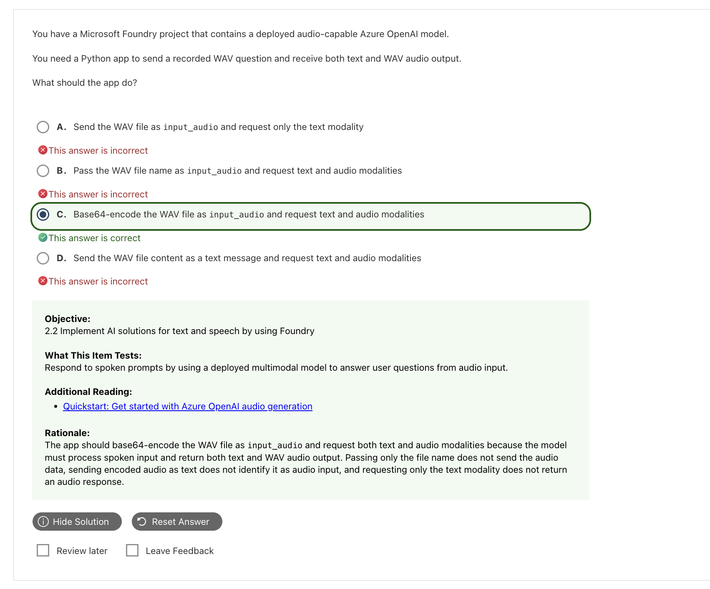
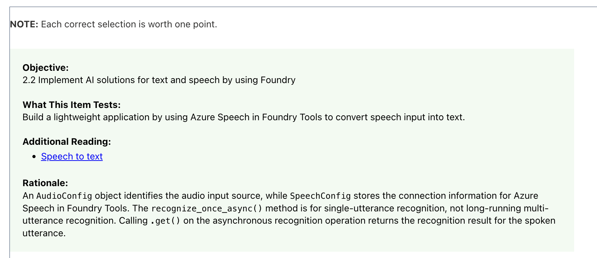
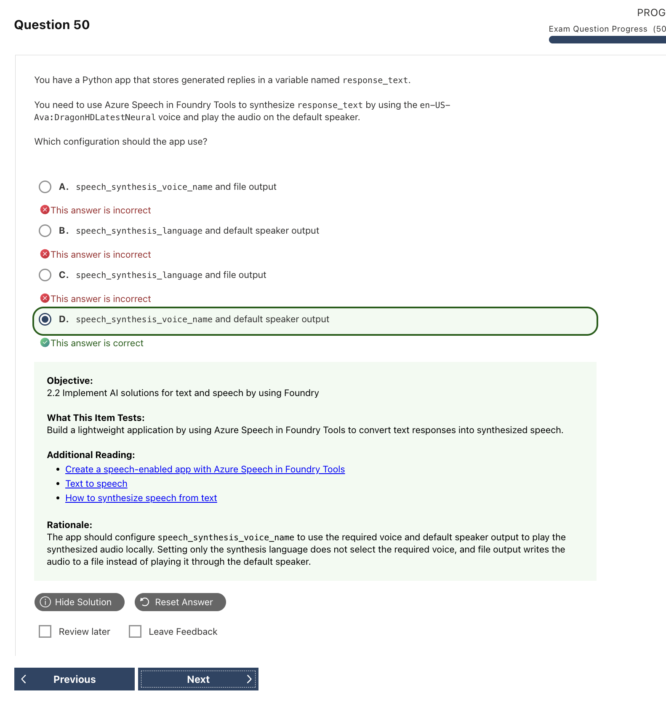

# Speech and Audio｜語音與多模態音訊

先看題目需要的是**轉錄、朗讀、翻譯、辨識語言，還是回答語音問題**。相同的 audio input，可能對應不同工作負載。

```text
認識語音能力 → 看懂 workload flow → 判斷是否需要 Custom Speech
→ 最後辨認 SDK objects、methods 與 API fields
```

## 1. Core Concepts

下面全部使用同一個情境：**Contoso 客服中心收到一通跨語言來電，客戶用西班牙文說「我想申請 X200 裝置的退款」，客服人員則使用英文回答。**

| Capability | Azure service / product | Input → Output | 同一個客服情境的例子 | Exam keywords |
|---|---|---|---|---|
| **Speech Recognition / Speech to Text (STT)** | Azure Speech in Foundry Tools | Audio → Transcript | 將客戶與客服的通話錄音轉成逐字稿 | transcribe、recognize、caption |
| **Speech Synthesis / Text to Speech (TTS)** | Azure Speech in Foundry Tools | Text / SSML → Audio | 將系統產生的退款說明朗讀給客戶聽 | voice、read aloud、synthesize |
| **Speech Translation** | Azure Speech in Foundry Tools | 語音 → 另一語言的文字或語音 | 將客戶的西班牙文語音翻譯成英文，讓客服理解 | translate spoken language、real-time translation |
| **Language Identification (LID)** | Azure Speech in Foundry Tools | Audio＋candidate languages → Language | 先判斷客戶說的是西班牙文 | identify spoken language、candidate languages |
| **Speaker Diarization** | Azure Speech in Foundry Tools | 多人音訊 → Speaker labels＋transcript | 在逐字稿中標示 Speaker 1 與 Speaker 2，區分每段發言 | who spoke when、speaker labels |
| **Custom Speech** | Azure Speech in Foundry Tools | 領域資料 → Custom STT model | 提供產品詞彙與音訊資料，改善 `X200` 等專有名詞的辨識 | domain vocabulary、acoustic conditions、custom STT |
| **Call center transcription / analytics** | Azure Speech＋Azure Language in Foundry Tools | 通話 → Transcript＋speaker labels＋analysis | 轉錄整通電話後，分析情緒、遮蔽 PII 並產生摘要 | call recording、PII redaction、sentiment、summary |
| **Multimodal Audio Model** | Audio-capable model in Microsoft Foundry | Text / Audio → Generated text / audio | 讓模型直接聽懂退款問題，再生成文字或語音回答 | spoken prompt、generated response、modalities |

> **啾啾筆記：** 這些功能可以出現在同一通客服電話中，但目的不同。STT 是把原話寫下來；Speech Translation 是換語言；diarization 是分辨誰在說話；audio model 則是理解問題後產生新的回答喔～

> **Speech transcription vs audio model：**STT 的輸出是使用者說話內容的逐字稿；audio-capable model 可以理解問題並生成回答。兩者都有 audio input，但目的不同。

## 2. Workload flows｜服務如何串聯

| 需求 | Flow | 判斷重點 |
|---|---|---|
| 將語音寫成文字 | Audio → Speech Recognition → Transcript | **STT**；保留原本說話內容 |
| 將文字朗讀出來 | Text / SSML → Speech Synthesis → Audio | **TTS**；可設定 language、voice 與輸出格式 |
| 翻譯口說內容 | Audio → Speech Translation → Target text / audio | 目標是換成另一種語言 |
| 判斷口說語言 | Audio＋candidate languages → LID → Language | 不等於文字的 Language Detection |
| 區分多人發言 | Multi-speaker audio → Diarization → Speaker labels＋transcript | Speaker label 不一定等於 Agent / Customer 等業務角色 |
| 分析客服通話 | Call audio → Transcription / diarization → PII、sentiment、summary | Speech 負責轉錄與 speakers；Language 負責後續文字分析 |
| 回答口說問題 | Audio prompt → Deployed audio model → Generated answer | 模型理解問題並回答，不只是產生逐字稿 |

> **啾啾筆記：** 這裡先看 input 和 output 就好。等確定要做 STT 或 TTS 之後，再到 SDK 章節辨認 `SpeechRecognizer` 或 `SpeechSynthesizer`。

## 3. 預設模型與客製化（Universal Language Model vs customization）

**Universal Language Model (ULM)** 是 Azure Speech 預先訓練的通用 **base model**。它可以先處理兩種常見的語音情境：

| Base model scenario | 說話方式 | 例子與考試區分 |
|---|---|---|
| **Conversational speech** | 兩人以上自然交談，語句較口語，也可能互相打斷 | 會議、客服通話；多人錄音常搭配 diarization |
| **Dictation** | 通常由單人清楚地對裝置口述，希望系統直接寫成文字 | 口述 email、報告或筆記；例如 Microsoft 365 Dictate |

> **啾啾筆記：** 可以把 Conversational speech 和 Dictation 記成 ULM 能處理的兩種常見情境，但它們不是兩個獨立的 base models。Dictation 就是把「想寫下來的內容」直接念給系統聽喔～

先用真實音訊測試 base model。如果一般會議、客服對話或口述內容已能正確辨識，就不需要另外訓練模型；只有辨識效果不足時，才加入額外設定或考慮 **Custom Speech**。

```text
Base model / ULM
→ 測試 Conversational speech 或 Dictation
→ 少量特殊詞彙：Phrase list
→ 專業詞彙、特殊發音或錄音環境仍辨識不佳：Custom Speech
```

| 改善方式 | 作用 | 例子 |
|---|---|---|
| **Phrase list** | 在執行時提高少量特定詞語的辨識權重，不需要訓練新模型 | 人名、地名、產品名稱 |
| **Language data** | 改善領域詞彙與文字模式 | 醫療術語、公司內部用語 |
| **Structured text / pronunciation** | 指定特殊發音與顯示文字格式 | 人名、縮寫、品牌名稱 |
| **Audio＋reference transcriptions** | 使用音訊及正確逐字稿改善特定錄音條件下的辨識 | 工廠噪音、特殊麥克風環境 |

> **Dictation SDK 提示：** `SpeechConfig.enable_dictation()` 用來啟用 dictation，且只支援 continuous recognition；它是辨識設定，不代表切換到另一個 ULM 模型。

Custom Speech 可使用的資料類型會依 locale 而異，因此要先確認目標語言是否支援。

## 4. API / SDK｜先分清 Speech SDK 與 audio model

### Speech SDK

#### SDK objects｜設定、音訊來源與執行物件

Speech SDK 會把服務設定、音訊來源／去向，以及實際執行辨識或合成的物件分開。

**Speech to Text**

```text
SpeechConfig + AudioConfig → SpeechRecognizer → Recognition result / events
```

| SDK object | 負責什麼 | Example |
|---|---|---|
| **SpeechConfig** | 認證、region / endpoint 與辨識語言等服務設定 | `speech_recognition_language = "en-US"` |
| **AudioConfig** | 指定要辨識的音訊來源 | 麥克風、WAV 檔或 input stream |
| **SpeechRecognizer** | 執行 speech-to-text | Audio → recognized text |

例子：轉錄客服 WAV 錄音時，`SpeechConfig` 指定服務與語言，`AudioConfig` 指定檔案，最後由 `SpeechRecognizer` 執行辨識。

**Text to Speech**

```text
Text + SpeechConfig + AudioOutputConfig → SpeechSynthesizer → Audio
```

| SDK object | 負責什麼 | Example |
|---|---|---|
| **SpeechConfig** | 認證、region / endpoint、voice 與輸出格式 | `speech_synthesis_voice_name = "en-US-Ava:DragonHDLatestNeural"` |
| **AudioOutputConfig** | 指定合成音訊要播放或儲存到哪裡 | 預設喇叭、檔案或 output stream |
| **SpeechSynthesizer** | 執行 text-to-speech | Text → synthesized audio |

例子：朗讀客服系統的退款說明時，先用 `SpeechConfig` 選擇 voice，再用 `AudioOutputConfig` 指定從喇叭播放，最後由 `SpeechSynthesizer` 執行合成。

> **SDK 記法：** `SpeechConfig` 管服務與語音設定；`AudioConfig` 管 STT 輸入；`AudioOutputConfig` 管 TTS 輸出。

#### Python 程式碼

```python
import os
import azure.cognitiveservices.speech as speechsdk

speech_config = speechsdk.SpeechConfig(
    subscription=os.environ["SPEECH_KEY"],
    region=os.environ["SPEECH_REGION"],
)
speech_config.speech_recognition_language = "en-US"
audio_config = speechsdk.audio.AudioConfig(filename="question.wav")
recognizer = speechsdk.SpeechRecognizer(
    speech_config=speech_config,
    audio_config=audio_config,
)

result = recognizer.recognize_once_async().get()
print(result.text)
```

常見 Method:

| API / event | 用途 | 必記區分 |
|---|---|---|
| `recognize_once_async()` | 辨識單一 utterance | 依結尾靜音或約 30 秒上限結束；不是長時間多句辨識 |
| `start_continuous_recognition_async()` | 啟動持續辨識 | 後續結果透過事件取得；需要停止／結束處理 |
| `.get()` | 等待 `ResultFuture` 完成並取得結果 | 會阻塞等候；加了 `_async` 不代表整段程式都非阻塞 |
| `recognized` event | 接收 continuous recognition 的辨識結果 | 啟動操作完成不代表所有語音已辨識完 |

#### Python：指定 voice 與輸出

```python
speech_config.speech_synthesis_voice_name = "en-US-Ava:DragonHDLatestNeural"
audio_output = speechsdk.audio.AudioOutputConfig(use_default_speaker=True)
synthesizer = speechsdk.SpeechSynthesizer(
    speech_config=speech_config,
    audio_config=audio_output,
)

result = synthesizer.speak_text_async("Your request is complete.").get()
```

| Setting / object | 作用 | Exam trigger |
|---|---|---|
| `speech_synthesis_language` | 指定語言／locale | 只指定語言，沒有指定人物聲線 |
| `speech_synthesis_voice_name` | 指定完整 voice identity | Ava、Jenny、Andrew 等 named voice |
| `AudioOutputConfig(use_default_speaker=True)` | 從預設喇叭播放 | play on default speaker |
| `AudioOutputConfig(filename="output.wav")` | 儲存到檔案 | save audio to file |
| `set_speech_synthesis_output_format(...)` | 指定音訊編碼格式 | 與播放／存檔去向是不同設定 |
| `SpeechSynthesizer` | 執行語音合成 | `speak_text_async(...)` |

### Multimodal audio model API


#### Audio Chat Completions：WAV → Base64 → input_audio

```python
import base64
from pathlib import Path

encoded_audio = base64.b64encode(
    Path("question.wav").read_bytes()
).decode("utf-8")

response = client.chat.completions.create(
    model=audio_deployment,
    modalities=["text", "audio"],
    audio={"voice": "alloy", "format": "wav"},
    messages=[{"role": "user", "content": [{
        "type": "input_audio",
        "input_audio": {"data": encoded_audio, "format": "wav"},
    }]}],
)
```

| Field | 用途 |
|---|---|
| `input_audio.data` | Base64 音訊內容，不是檔案路徑 |
| `input_audio.format` | 輸入音訊格式 |
| `modalities=["text"]` | 只要求文字輸出 |
| `modalities=["text", "audio"]` | 要求文字與音訊輸出 |
| `audio.voice` / `audio.format` | 設定輸出聲音與格式，和 input format 分開 |

## 5. Comparison / Common Confusions

| Compare | Difference |
|---|---|
| **Speech to Text 與 Text to Speech** | 語音轉文字，與文字轉語音 |
| **Transcription 與 generated response** | 記錄使用者說的原話，與理解問題後產生新的回答 |
| **SpeechConfig 與 AudioConfig** | 前者設定服務、語言與 voice；後者指定 Speech to Text 的音訊來源 |
| **AudioConfig 與 AudioOutputConfig** | 前者指定辨識輸入；後者指定語音合成的輸出去向 |
| **Language 與 voice name** | 前者是語言或 locale；後者是特定人物聲線 |
| **Single-shot recognition 與 continuous recognition** | 前者辨識單一 utterance；後者持續接收多段事件式結果 |
| **Language Identification 與 Speaker Diarization** | 前者判斷使用哪種語言；後者判斷是哪位 speaker 在說話 |
| **Spoken Language Identification 與文字 Language Detection** | 前者接收 audio input；後者接收 text input |
| **Azure Speech voice 與 audio model voice** | 前者使用 Ava 等 Speech voice；後者可能使用 alloy 等模型 voice，兩套名稱不可混用 |


## 6. Quick Memory Rules

- **Recognize = 聽寫；Synthesize = 朗讀。**
- **SpeechConfig 管服務；AudioConfig 管輸入；AudioOutputConfig 管輸出。**
- **Once 一句；Continuous 多句；`.get()` 等結果。**
- **Language 是語言；Voice 是特定聲線。**
- **Audio model 的 input / modalities 不是 Speech SDK 的 AudioConfig。**
- **先測 base model，不足時再做 Custom Speech。**

## 7. 常見錯誤與詳解

### Q15 — WAV 輸入與文字／音訊輸出



| 重點 | 答案 |
|---|---|
| **正確答案** | **C. Base64 WAV → `input_audio`，並要求 text + audio modalities** |
| **題目線索** | `recorded WAV`、`both text and WAV audio output` |
| **考點** | Audio-capable model 的輸入格式與輸出 modalities |

**為什麼選 C：** 服務不能直接讀取本機檔名。WAV 內容要先轉成 Base64，標示為 `input_audio`；若要同時取得文字和聲音，輸出 modalities 必須同時包含 text 與 audio。

| 選項 | 為什麼選／不選 |
|---|---|
| A | 只有 text modality，不會回傳音訊。 |
| B | 檔名不是音訊內容，服務無法存取本機檔案。 |
| **C** | 同時提供真正的音訊內容，並要求兩種輸出。 |
| D | WAV bytes 不能當成一般文字輸入。 |

**補充與延伸：** 這題考的是支援 audio 的模型 API，不是 Speech SDK。模型名稱與 API 版本可能改變，但判斷方式不變：先確認音訊是否真的傳入，再確認輸出 modalities。

> **記憶：** 本機音訊 → Base64 `input_audio`；要聲音回覆 → 加入 audio modality。

**官方來源：** [Azure OpenAI audio generation quickstart](https://learn.microsoft.com/en-us/azure/foundry/openai/audio-completions-quickstart)

---

### Q16 — SpeechConfig、AudioConfig 與辨識模式




| 重點 | 答案 |
|---|---|
| **正確答案** | **No / Yes / No** |
| **題目線索** | `long-running`、`.get()`、`AudioConfig` |
| **考點** | 單次／持續辨識與 SDK 物件責任 |

| 敘述 | 判斷 | 原因 |
|---|---:|---|
| `recognize_once_async()` 用於長時間、多段語音 | **No** | 它只辨識一個 utterance；多段語音要用 continuous recognition。 |
| `recognize_once_async().get()` 取得單一 utterance 的結果 | **Yes** | `.get()` 會等待非同步操作完成並取回結果。 |
| `AudioConfig` 保存 endpoint／region／key | **No** | 連線資料屬於 `SpeechConfig`；`AudioConfig` 指定麥克風、檔案或輸出裝置。 |

**補充與延伸：** 方法名稱有 `_async`，不代表呼叫 `.get()` 後仍不阻塞；`.get()` 會等到該次辨識完成。Continuous recognition 的結果則透過事件陸續取得，最後還要停止辨識。

> **記憶：** `SpeechConfig` 管服務；`AudioConfig` 管聲音；Once 一段、Continuous 多段。

**官方來源：** [Speech-to-text quickstart](https://learn.microsoft.com/en-us/azure/ai-services/speech-service/get-started-speech-to-text)、[AudioConfig class](https://learn.microsoft.com/en-us/python/api/azure-cognitiveservices-speech/azure.cognitiveservices.speech.audio.audioconfig)

---

### Q17 — 指定 TTS Voice 並直接播放



| 重點 | 答案 |
|---|---|
| **正確答案** | **D. `speech_synthesis_voice_name` + default speaker** |
| **題目線索** | `Ava`、`play ... on the default speaker` |
| **考點** | Voice selection 與 audio output destination |

**為什麼選 D：** 題目指定 Ava，因此要設定完整的 `speech_synthesis_voice_name`；題目又要求直接播放，因此輸出要設為 default speaker。

| 選項 | 為什麼選／不選 |
|---|---|
| A | Voice 正確，但 file output 只會寫檔。 |
| B | Speaker 正確，但 locale 只指定語言，無法保證使用 Ava。 |
| C | Voice 與輸出目的地都不符合。 |
| **D** | 同時指定 Ava 與預設喇叭。 |

**補充與延伸：** Language／locale 決定語言範圍；voice name 才會選定特定聲音。實作時仍要確認該 voice 在目標區域是否可用。

> **記憶：** 誰來說 → Voice Name；播到哪裡 → AudioOutputConfig。

**官方來源：** [Speech synthesis](https://learn.microsoft.com/en-us/azure/ai-services/speech-service/how-to-speech-synthesis)、[Language and voice support](https://learn.microsoft.com/en-us/azure/ai-services/speech-service/language-support?tabs=tts)

## 8. Official Sources
核對日期：**2026-09-10**。

- [AI-901 Study Guide](https://learn.microsoft.com/en-us/credentials/certifications/resources/study-guides/ai-901)
- [Azure Speech in Foundry Tools overview](https://learn.microsoft.com/en-us/azure/ai-services/speech-service/overview)
- [Speech to text quickstart](https://learn.microsoft.com/en-us/azure/ai-services/speech-service/get-started-speech-to-text)
- [SpeechRecognizer Python reference](https://learn.microsoft.com/en-us/python/api/azure-cognitiveservices-speech/azure.cognitiveservices.speech.speechrecognizer?view=azure-python)
- [Text to speech quickstart](https://learn.microsoft.com/en-us/azure/ai-services/speech-service/get-started-text-to-speech)
- [SpeechConfig Python reference](https://learn.microsoft.com/en-us/python/api/azure-cognitiveservices-speech/azure.cognitiveservices.speech.speechconfig?view=azure-python)
- [AudioConfig Python reference](https://learn.microsoft.com/en-us/python/api/azure-cognitiveservices-speech/azure.cognitiveservices.speech.audio.audioconfig?view=azure-python)
- [AudioOutputConfig Python reference](https://learn.microsoft.com/en-us/python/api/azure-cognitiveservices-speech/azure.cognitiveservices.speech.audio.audiooutputconfig?view=azure-python)
- [Custom Speech overview](https://learn.microsoft.com/en-us/azure/ai-services/speech-service/custom-speech-overview)
- [Post-call transcription and analytics](https://learn.microsoft.com/en-us/azure/ai-services/speech-service/call-center-quickstart)
- [Language identification](https://learn.microsoft.com/en-us/azure/ai-services/speech-service/language-identification)
- [Audio generation quickstart](https://learn.microsoft.com/en-us/azure/foundry/openai/audio-completions-quickstart)
- [Azure OpenAI Chat REST](https://learn.microsoft.com/en-us/rest/api/microsoft-foundry/azureopenai/chat)
