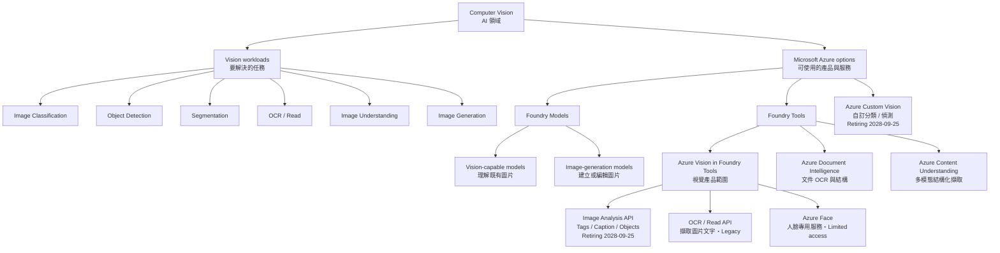
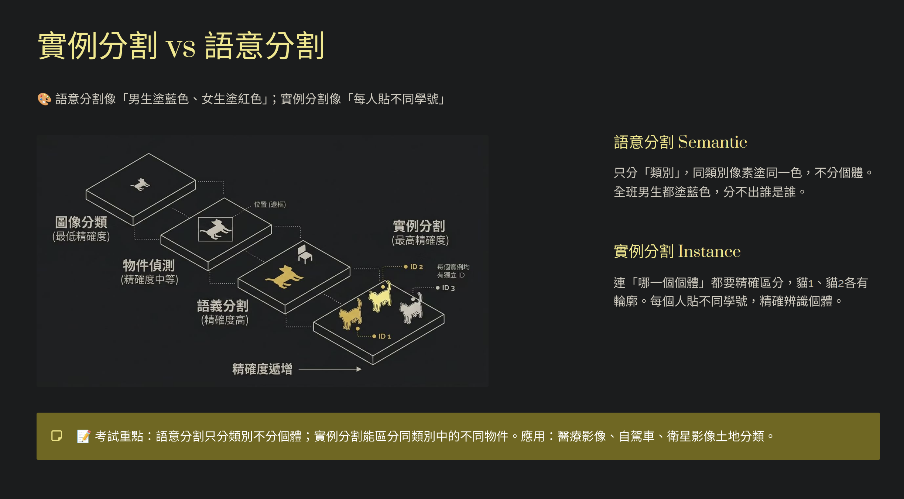

# Computer Vision｜電腦視覺

答題先看需要的輸出：**整張圖的類別、物件位置、像素輪廓、圖片文字、畫面描述，還是新生成的圖片**。

## 1. Vision Workloads

| Workload | Input → Output | 典型情境 |
|---|---|---|
| **Image Classification** | Image → Class / labels | 判斷整張圖片是貓、狗或鳥 |
| **Object Detection** | Image → Classes＋bounding boxes | 找出每個物件及所在位置 |
| **Segmentation** | Image → Pixel classes / masks | 標出物體的精確輪廓 |
| **OCR / Read** | Image → Text＋location | 讀取照片中的印刷字或手寫字 |
| **Image Analysis** | Image → Tags、caption、objects 等 | 描述與分析既有圖片 |
| **Multimodal Vision** | Text＋images → Generated answer | 比較兩張圖片或回答圖片問題 |
| **Image Generation** | Prompt＋可選原圖 → New / edited image | 產生插圖或修改圖片 |

## 2. Core Concepts

### Concept and service hierarchy｜概念與服務階層



這張圖同時呈現兩種分類方式：

| Layer | 在回答什麼 | Examples |
|---|---|---|
| **AI field** | 研究與應用的領域是什麼？ | Computer Vision |
| **Workload / task** | 圖片需要完成什麼工作？ | Classification、Detection、OCR、Generation |
| **Product / service** | 使用哪個 Microsoft 產品？ | Azure Vision、Azure Face、Document Intelligence、Content Understanding |
| **API / capability** | 服務內呼叫哪項具體能力？ | Image Analysis、Read、Face Detect |
| **Model** | 哪個部署模型處理輸入？ | Vision-capable model、image-generation model |

> **Azure Vision vs Image Analysis：** **Azure Vision in Foundry Tools** 是上層視覺產品範圍；**Image Analysis** 是其中一組特定 API，回傳 tags、captions、objects 等結果。兩者不是同義詞，也不是兩個完全無關的服務。Image Analysis 3.2 / 4.0 API 正在退役，不代表 Azure Face、Document Intelligence、Content Understanding 或 Computer Vision 工作負載一起退休。

### Image Classification、Object Detection 與 Segmentation

| Task | 判斷單位 | 位置輸出 | 例子 |
|---|---|---|---|
| **Multiclass Classification** | 整張圖，互斥類別中選一個 | 無 | Cat / Dog / Bird → Dog |
| **Multilabel Classification** | 整張圖，可同時有多個標籤 | 無 | Dog＋Beach＋Outdoor |
| **Object Detection** | 圖中的每個物件 | **Bounding box** | Dog #1、Dog #2 各有一個框 |
| **Semantic Segmentation** | 每個 pixel | Pixel class map | 兩隻貓都屬於 Cat pixels |
| **Instance Segmentation** | 每個物件的 pixels | 每個 instance 的 mask | Cat #1 與 Cat #2 各有輪廓 |

分類模型可能回傳多個 class scores；**Multiclass** 的重點是最終類別互斥，不代表只能回傳一個分數。



> **原圖更正：**Classification、Detection 與 Segmentation 解決不同問題，不能因輸出更細就稱為 Accuracy 更高。正確比較是 **Label → Bounding box → Pixel class / instance mask** 的輸出粒度。

### Image Analysis

場景：一隻狗在草地跑，背景有房子。

| Feature | 簡化理解 | Example output |
|---|---|---|
| **Tags** | 用多個詞描述圖片內容 | `dog`、`grass`、`outdoor`、`running` |
| **Caption** | 用完整自然語言句子描述圖片 | `A dog running on grass near a house.` |
| **Objects** | 找出物件並附上位置 | `dog`＋`(x, y, width, height)` |
| **People Detection** | 找出圖片中的人與位置 | Person bounding boxes；不會提供姓名 |
| **Categories** | 舊版固定 taxonomy 分類 | `animal_dog`；屬 legacy API 語境 |
| **Image Type** | 判斷圖片呈現形式 | Clip art / line drawing；屬 legacy API 語境 |

**Computer Vision** 是領域；**Azure Vision** 是 Microsoft 的視覺產品範圍；**Image Analysis** 是其中的 API；Classification、Detection、OCR 是視覺任務。這些層級不要混在一起。

### OCR / Read

**Optical Character Recognition (OCR)** 從圖片中讀取印刷或手寫文字，常包含文字內容與位置資訊。

```text
Image → OCR / Read → Recognized text + location
```

OCR 只負責「讀到文字」。若題目還需要理解 invoice number、table、key-value pairs 或自訂 schema，應考慮 [Content Understanding](08_Content_Understanding.md) 或 Document Intelligence。

### Azure Face

| Capability | 比對方式 | Output / example |
|---|---|---|
| **Face Detection** | 不做身分比對 | 找出 face rectangle；不知道姓名 |
| **Face Identification** | **1-to-many** | 從已註冊人物集合找出可能身分 |
| **Face Verification** | **1-to-1** | 判斷兩張臉是否屬於同一人 |
| **Find Similar Faces** | Target face 對候選臉 | `matchPerson` 偏向同一人；`matchFace` 偏向外觀相似 |
| **Face Group** | 多個 face IDs 互相比較 | 依相似度分群，不會自動提供真實姓名 |

**Face attributes** 是 Detect API 找到臉後，可選擇回傳的臉部或影像特徵預測；它們描述臉的狀態與照片品質，**不代表人物身分**。

| Attribute | 說明 / example |
|---|---|
| **Head pose** | 以 roll、yaw、pitch 表示臉部朝向 |
| **Accessories / Glasses / Mask** | 是否有帽子、眼鏡或口罩等配件；mask 也可指出口鼻是否被遮住 |
| **Blur / Exposure / Noise** | 模糊、曝光與雜訊程度，用來判斷照片品質 |
| **Occlusion** | 眼睛、額頭或嘴巴是否被物體遮住 |
| **QualityForRecognition** | `low`、`medium`、`high`；評估照片是否適合後續人臉辨識 |

```text
Face rectangle → 臉在哪裡
Face attributes → 臉的姿勢、遮擋與影像品質
Identification / Verification → 是誰／是否為同一人
```

> **生命週期提示：**Azure Face 為 **Limited access**。`emotion`、`gender` attributes 已 **Retired**；`age`、`smile`、facial hair、hair、makeup 屬受限能力。可回傳的 attribute 也會依 detection model、recognition model 與存取資格而異。Face attributes 是統計模型的預測結果，不應當作絕對事實或防偽依據；防偽應使用 Face Liveness。

### Multimodal Vision

Vision-capable model 能在同一個 prompt 中接收文字與一張或多張圖片，再依問題產生文字回答。

```text
Text instruction + image content parts → Vision-capable model → Text answer
```

適合比較圖片、解釋畫面或 visual question answering。模型仍可能在小字、精確計數、空間位置或模糊圖片上出錯。

### Image Generation

Image-generation model 根據 prompt 建立新圖片；支援的模型也能以原圖和指示進行編輯。

好的 prompt 可依序寫：**subject → action / scene → composition → style → constraints**。

```text
Create a clean product illustration of a reusable bottle,
centered on a white background, with no text.
```

能理解圖片的 model 不一定能產生圖片；要分別確認 **vision input** 與 **image generation / editing** 能力。

### Comparison / Common Confusions

| Compare | Difference |
|---|---|
| **Multiclass vs Multilabel** | 互斥類別擇一 vs 一張圖可同時有多個 labels |
| **Classification vs Object Detection** | 整張圖的類別 vs 每個物件的 class＋bounding box |
| **Semantic vs Instance Segmentation** | 每個 pixel 的 class vs 同類物件也分開成不同 masks |
| **Tags vs Caption** | 多個描述詞 vs 一句完整描述 |
| **Tagging vs Categorizing** | 描述性 metadata vs 舊版固定 taxonomy |
| **People Detection vs Face Identification** | 人在哪裡 vs 是哪位已註冊人物 |
| **Face Detection vs Face Verification** | 找到臉 vs 判斷是否同一人 |
| **OCR vs Structured Field Extraction** | 讀到文字 vs 理解欄位意義與結構 |
| **Vision-capable vs Image-generation model** | 解讀既有圖片 vs 建立新圖片 |

## 3. Important API / SDK Patterns

### Multimodal Responses API：文字 + 多張圖片

```python
import os
from openai import OpenAI

client = OpenAI(
    base_url=os.environ["AZURE_OPENAI_BASE_URL"],
    api_key=os.environ["AZURE_OPENAI_API_KEY"],
)

response = client.responses.create(
    model=os.environ["AZURE_OPENAI_VISION_DEPLOYMENT"],
    input=[{
        "role": "user",
        "content": [
            {"type": "input_text", "text": "Compare these images."},
            {"type": "input_image", "image_url": os.environ["IMAGE_URL_1"]},
            {"type": "input_image", "image_url": os.environ["IMAGE_URL_2"]},
        ],
    }],
)
print(response.output_text)
```

| Field | 記住什麼 |
|---|---|
| `model` | Vision-capable model 的 deployment name，不是 agent name |
| `input_text` | 告訴模型要對圖片做什麼 |
| `input_image` | 每張圖片各是一個 content part |
| `image_url` | 可放遠端 URL；本機圖可轉成 Base64 Data URI |
| `detail` | 圖片處理細節，支援程度依模型；較高可能增加 token 與延遲 |
| `output_text` | 取得文字回答；不代表產生新圖片 |

### Local image：Base64 Data URI

```python
import base64
from pathlib import Path

encoded = base64.b64encode(Path("photo.jpg").read_bytes()).decode("utf-8")
image_part = {
    "type": "input_image",
    "image_url": f"data:image/jpeg;base64,{encoded}",
}
```

MIME type 必須符合檔案格式，例如 PNG 使用 `image/png`。

### Image Generation API

```python
import base64

result = image_client.images.generate(
    model=image_deployment,
    prompt="A reusable bottle on a white background, no text.",
    n=1,
    size="1024x1024",
    quality="high",
    output_format="png",
)
image_bytes = base64.b64decode(result.data[0].b64_json)
```

| Parameter / output | 用途 |
|---|---|
| `model` | Image-generation deployment name |
| `prompt` | 描述要建立的圖片 |
| `n` | 產生圖片數量；限制依模型／API |
| `size` / `quality` | 控制輸出尺寸與品質；選項依模型 |
| `output_format` | 圖片編碼格式 |
| `b64_json` | Base64 圖片資料，decode 後才能儲存為影像 |

看圖使用 vision input；產圖使用 image-generation capability。兩種 API shape 不可直接互換。

## 4. Current vs Legacy

### Current services

| Service / capability | Status | 快速理解 |
|---|---|---|
| **Multimodal vision models** | **Current** | 現行考綱重點：在 prompt 中解讀圖片 |
| **Image-generation models** | **Current** | 現行考綱重點：建立新視覺輸出 |
| **Azure Face** | **Current；limited access** | Face detection、identification、verification 等依資格與用途限制 |
| **OCR workload** | **Current concept** | 舊 OCR endpoint 的生命週期不等於 OCR 技術本身退休 |
| **Image Analysis 3.2 / 4.0 API** | **Deprecated / Retiring（2028-09-25）** | 現有客戶需依 migration guide 遷移 |
| **Azure Custom Vision** | **Retiring（2028-09-25）** | 自訂分類／偵測概念仍可用於理解舊題 |

### Legacy Image Analysis 3.2 capability map

舊題常見的 Image Analysis features：

| Legacy feature | Output / exam clue |
|---|---|
| **Tags** | 多個描述詞與 confidence |
| **Categories** | 固定 86-category taxonomy |
| **Description** | 自然語言圖片描述 |
| **Objects** | Classes＋bounding boxes |
| **Brands** | 品牌／logo 與位置 |
| **Image Type** | Clip art／line drawing |
| **Domain-specific Models** | Celebrities、landmarks |

這些是舊 API 題型，不可直接當成現行 Image Analysis 4.0 或所有 multimodal models 的固定 feature 清單。

### Tags vs Categories vs Domain-specific Models

這三項都屬於 **Azure Vision Image Analysis** 的圖片理解功能；Categories 與 Domain-specific Models 是 **3.2 legacy** 題型。

| Feature | 回答的問題 | Example | Version / service |
|---|---|---|---|
| **Tags** | 圖片中有什麼？ | `dog`、`grass`、`outdoor`＋confidence | Image Analysis 3.2 / 4.0 |
| **Categories** | 整張圖屬於哪個固定類別？ | `animal_dog`、`people_group` | Image Analysis 3.2；固定 86-category taxonomy |
| **Domain-specific Models** | 圖中的名人或地標具體是誰／哪裡？ | `Satya Nadella`、`Forbidden City` | Image Analysis 3.2；`celebrities`、`landmarks` |

```text
Tags：person、building → 一般描述
Categories：people_、outdoor_ → 固定階層分類
Domain-specific Models：名人姓名、地標名稱 → 特定領域識別
```

`people_` 不代表一定是名人，`outdoor_` 或 `building_` 也不代表一定是知名地標；它們只能作為進一步執行 domain-specific analysis 的線索。Domain-specific Models 是 Microsoft 預先訓練的固定模型，不是使用自有圖片訓練的 **Custom Vision**。

### Legacy terminology

| Legacy wording | Current understanding |
|---|---|
| Azure Cognitive Services / Computer Vision | 現行文件可見 Azure Vision in Foundry Tools；仍要依 API 版本判斷 |
| Associating an image with metadata | **Tagging** |
| Specialized domain models | 舊版 **celebrities＋landmarks** |
| Chat Completions `image_url` content | Responses 使用 `input_image`，欄位內仍可使用 `image_url` |

## 5. Quick Memory Rules

- **Classification = What；Detection = What＋Where。**
- **Semantic = pixel 的 class；Instance = pixel 屬於哪個物件。**
- **Tags 是詞；Caption 是句子；Categories 是舊 taxonomy。**
- **Detect 找臉；Identify 多人中找身分；Verify 比對同一人。**
- **OCR 讀文字；Content Understanding 理解結構。**
- **Vision 看圖；Image generation 產圖。**

## 6. Official Sources

核對日期：**2026-09-08**。

- [AI-901 Study Guide](https://learn.microsoft.com/en-us/credentials/certifications/resources/study-guides/ai-901)
- [Azure Vision in Foundry Tools overview](https://learn.microsoft.com/en-us/azure/ai-services/computer-vision/overview)
- [Image Analysis migration guide](https://learn.microsoft.com/en-us/azure/ai-services/computer-vision/migration-options)
- [Image Analysis overview](https://learn.microsoft.com/en-us/azure/ai-services/computer-vision/overview-image-analysis)
- [Azure Face overview](https://learn.microsoft.com/en-us/azure/ai-services/face/overview-identity)
- [Face detection and attributes](https://learn.microsoft.com/en-us/azure/ai-services/face/concept-face-detection)
- [Face recognition concepts](https://learn.microsoft.com/en-us/azure/ai-services/face/concept-face-recognition)
- [Azure OpenAI Responses API](https://learn.microsoft.com/en-us/azure/foundry/openai/how-to/responses)
- [Image generation](https://learn.microsoft.com/en-us/azure/foundry/openai/how-to/dall-e)
- [Image tagging](https://learn.microsoft.com/en-us/azure/ai-services/computer-vision/concept-tagging-images)
- [Legacy image categorization](https://learn.microsoft.com/en-us/azure/ai-services/computer-vision/concept-categorizing-images)
- [Legacy domain-specific content](https://learn.microsoft.com/en-us/azure/ai-services/computer-vision/concept-detecting-domain-content)
- [Custom Vision migration](https://learn.microsoft.com/en-us/azure/ai-services/custom-vision-service/migration-options)
