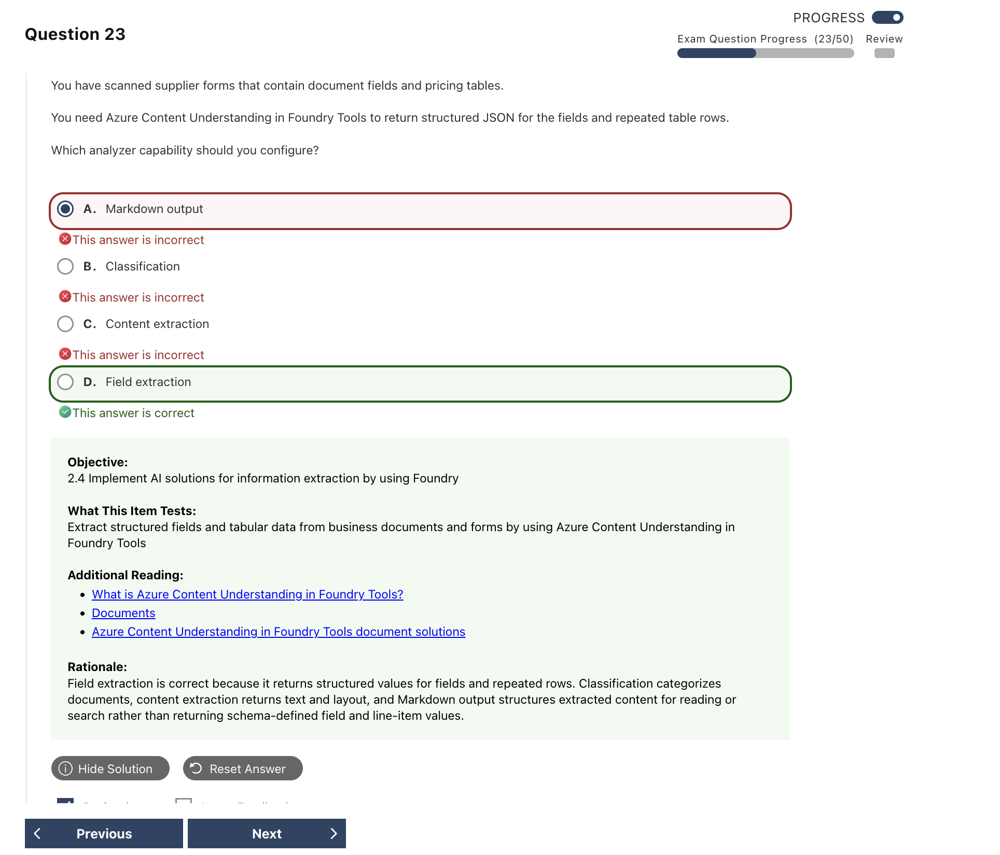
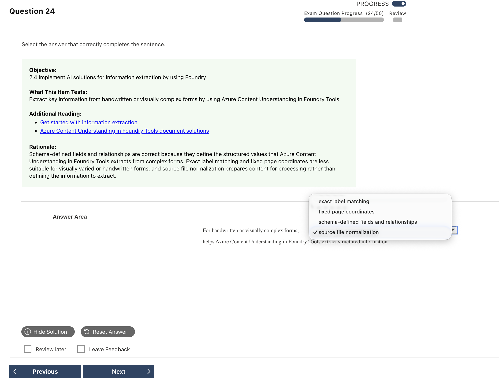
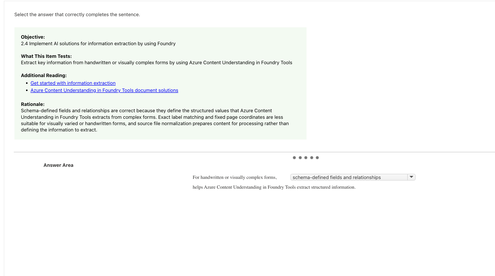
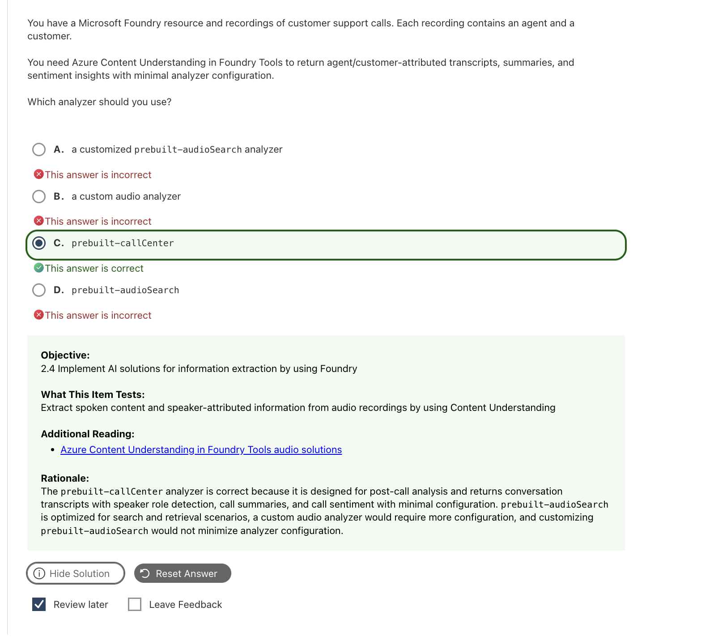

# Content Understanding｜內容理解與結構化擷取

**Azure Content Understanding in Foundry Tools** 可以讀取文件、圖片、音訊與影片，再把內容整理成程式容易使用的結構化資料。

例如輸入一張發票，它不只能用 OCR 讀出文字，還能把內容整理成 `SupplierName`、`InvoiceDate`、`TotalAmount` 和 `LineItems` 等欄位。

```text
輸入內容 → 選擇 analyzer → 讀取內容與結構
→ 依 schema 擷取欄位 → Markdown / structured fields / source details
```

> **啾啾筆記：** OCR 只是在「讀字」；Content Understanding 還會理解這些字代表供應商、日期、金額或明細，並整理成指定欄位喔～

## 1. 四種輸入｜先看要處理什麼內容

| Modality | 常見 analyzer | 會取得什麼 | 具體例子 |
|---|---|---|---|
| **Document** | `prebuilt-document`、`prebuilt-invoice` | 文字、版面、表格與指定欄位 | 發票 PDF → 供應商、日期、總額與品項明細 |
| **Image** | `prebuilt-image`、`prebuilt-imageSearch` | 圖片描述、可見文字與自訂欄位 | 跑鞋照片 → 圖片描述、顏色、產品類別 |
| **Audio** | `prebuilt-audio`、`prebuilt-audioSearch`、`prebuilt-callCenter` | 逐字稿、speaker、時間與分析欄位 | 客服錄音 → 對話逐字稿、角色、摘要與情緒 |
| **Video** | `prebuilt-video`、`prebuilt-videoSearch` | 逐字稿、shots、key frames、segments 與自訂欄位 | 商品介紹影片 → 語音內容、代表畫面與主題片段 |

四個可供 custom analyzer 繼承的 base analyzers 是：

```text
prebuilt-document / prebuilt-image / prebuilt-audio / prebuilt-video
```

`*Search` analyzer 偏向準備搜尋或 RAG 使用的內容；`prebuilt-invoice`、`prebuilt-callCenter` 則是針對特定業務情境。

## 2. Core Concepts｜先分清楚要哪種結果

| Concept | 白話理解 | 發票例子 | Exam keywords |
|---|---|---|---|
| **Analyzer** | 決定要怎麼分析內容的設定 | 使用 `prebuilt-invoice`，或建立自己的 analyzer | analyzer ID、prebuilt、custom |
| **Content Extraction** | 先把文字與基本結構讀出來 | 讀出標題、段落、表格與所有文字 | text、layout、table、transcript |
| **Field Extraction** | 按照指定欄位整理答案 | 填入 `SupplierName`、`TotalAmount`、`LineItems` | named fields、schema、structured data |
| **Classification** | 判斷內容屬於哪一類 | 判斷文件是 Invoice、Contract 或 Resume | document type、categorize、classify |
| **Markdown Output** | 將分析結果整理成容易閱讀與搜尋的文字 | 保留標題、段落與表格結構 | readable content、RAG、chunking |
| **Source locations** | 指出擷取結果來自原始內容的哪裡 | 標示總金額位於發票的哪個區域 | evidence、grounding、where it came from |
| **Field Schema** | 告訴 analyzer 想取得哪些欄位及型別 | 定義供應商是 string、總額是 number | fieldSchema、type、description |

### Markdown、Fields 與 Source 怎麼選

| 想完成的事情 | 使用什麼 | 為什麼 |
|---|---|---|
| 將完整內容放進搜尋索引 | **Markdown output** | 適合閱讀、分塊與檢索 |
| 讓程式取得固定欄位 | **Structured fields** | 有欄位名稱、型別與結構，方便自動化 |
| 查明答案來自哪裡 | **Source locations** | 可以追溯原始內容的位置 |

這三種結果可以同時存在。**JSON 只是回應格式**；看到 JSON 不代表一定在做 Field Extraction，還要看是否存在 schema 與具名欄位。

## 3. Field Schema｜把內容整理成業務欄位

Schema 的重點是描述「想取得哪些欄位、每個欄位代表什麼，以及資料要用哪種型別保存」。不用要求每份文件都使用完全相同的標籤或版面。

### 欄位定義｜告訴 analyzer 要找什麼

| Schema element | 白話理解 | Example |
|---|---|---|
| **Field name** | 程式讀取結果時使用的固定名稱 | `SupplierName` |
| **Description** | 用自然語言說明這個欄位真正要找什麼 | `Name of the supplier or vendor` |

同一個欄位在不同文件中可能寫成 `Supplier`、`Vendor` 或 `公司`。透過 description 描述共同意義，都可以對應到 `SupplierName`。

### Field types｜決定資料怎麼保存

| Field type | 適合保存什麼 | Example |
|---|---|---|
| **String** | 文字，或不需要拿來計算的編號 | 公司名稱、訂單編號 |
| **Number** | 可以包含小數的數值 | 金額 `5000.5` |
| **Integer** | 不含小數的整數 | 數量 `3` |
| **Boolean** | 是或否 | `IsPaid: true` |
| **Date** | 日期 | `2026-09-10` |
| **Object** | 將同一筆資料中互相關聯的欄位放在一起 | 一項商品的名稱、數量與價格 |
| **Array** | 保存多筆重複資料 | 多筆 line items |

固定比對文字或頁面座標，在標籤或版面改變時比較容易失敗；field description 則是根據欄位的意義描述需求。

```json
{
  "fieldSchema": {
    "fields": {
      "SupplierName": {
        "type": "string",
        "description": "Name of the supplier or vendor"
      },
      "TotalAmount": {
        "type": "number",
        "description": "Total amount payable"
      },
      "Items": {
        "type": "array",
        "items": {
          "type": "object",
          "properties": {
            "Product": {"type": "string"},
            "Quantity": {"type": "number"},
            "Price": {"type": "number"}
          }
        }
      }
    }
  }
}
```

欄位可依需求使用 `extract`、`classify` 或 `generate` 等 method；可用方式會依 modality 與 API version 而不同。

### Markdown、JSON、Object 與 Array of Objects

Content Understanding 的分析結果常包含 **Markdown**，用來呈現讀取後的標題、段落、表格或逐字稿；如果 analyzer 定義了 schema，結果也可以包含 **structured fields**。

API 傳回資料時，外層通常使用 **JSON**。JSON 是資料交換格式，裡面可以同時放 Markdown、fields、source details，以及其他分析結果。因此：

```text
JSON response
├─ markdown：方便人閱讀、搜尋或交給 RAG
└─ fields：方便程式讀取的結構化欄位
   ├─ object：一筆彼此相關的資料
   └─ array of objects：多筆具有相同結構的資料
```

| 資料形狀 | 白話理解 | 發票例子 |
|---|---|---|
| **Object** | 用 `{ }` 包住一筆相關資料 | 一項商品：名稱、數量與價格 |
| **Array** | 用 `[ ]` 保存多個值或多筆資料 | 發票中的多項商品 |
| **Array of Objects** | Array 裡的每一項都是一個 Object | `[{商品 A, 數量, 價格}, {商品 B, 數量, 價格}]` |

> **啾啾筆記：** Markdown 是給人閱讀與搜尋的內容；JSON 是 API 傳回資料的格式；Object 保存一筆資料；Array of Objects 保存多筆完整資料。發票明細通常使用 Array of Objects，才能保留每項商品自己的名稱、數量與價格喔～

## 4. Analyzer｜預建或自訂怎麼選

先找是否有符合情境的 prebuilt analyzer；需要額外欄位時，再調整 schema 或建立 custom analyzer。

| Analyzer | 適合情境 | 主要結果 |
|---|---|---|
| **`prebuilt-invoice`** | 快速處理發票 | 發票欄位與 line items |
| **`prebuilt-imageSearch`** | 將圖片內容放進搜尋或 RAG | 可搜尋的圖片描述與內容 |
| **`prebuilt-audioSearch`** | Podcast、會議或一般音訊搜尋 | 逐字稿、speaker 與摘要 |
| **`prebuilt-callCenter`** | 客服通話後分析 | Agent／Customer、摘要、情緒與相關欄位 |
| **`prebuilt-videoSearch`** | 建立影片搜尋或 RAG | 逐字稿、key frames 與片段資訊 |
| **Custom analyzer** | 預建結果無法滿足業務欄位 | 依自訂 field schema 產生結果 |

### Audio：從聲音變成通話洞察


| Capability | 白話理解 | Example output |
|---|---|---|
| **Transcription** | 把說話內容寫下來 | 對話逐字稿 |
| **Speaker Diarization** | 區分哪段是哪位 speaker 說的 | Speaker 1、Speaker 2 |
| **Role Detection** | 判斷 speaker 在通話中的角色 | Agent、Customer |
| **Timestamp** | 記錄每句話發生的時間 | Start time、end time |
| **Field Extraction** | 把通話整理成需要的業務資訊 | 問題摘要、情緒、主題、人物或公司 |

**Speaker 1 / Speaker 2** 只是區分聲音；**Agent / Customer** 才是角色判斷。兩者都可能出錯，需要依實際結果驗證。

### Video：同時理解聲音與畫面


| Result | 白話理解 |
|---|---|
| **Transcript phrases** | 誰在什麼時間說了什麼 |
| **Key-frame times** | 代表畫面出現的時間點 |
| **Camera-shot times** | 影片切換鏡頭的時間點 |
| **Segments** | 依內容或設定切出的片段 |
| **Fields** | Analyzer 依 schema 整理出的業務資料 |
| **Markdown** | 方便閱讀、搜尋或交給 RAG 的內容 |

**Key frame** 是能代表內容的畫面；**camera shot** 是鏡頭切換，兩者不是同一件事。

## 5. API / SDK｜記住 analyzer、poller、result

```python
import os
from azure.ai.contentunderstanding import ContentUnderstandingClient
from azure.ai.contentunderstanding.models import AnalysisInput
from azure.core.credentials import AzureKeyCredential

client = ContentUnderstandingClient(
    endpoint=os.environ["CONTENTUNDERSTANDING_ENDPOINT"],
    credential=AzureKeyCredential(os.environ["CONTENTUNDERSTANDING_KEY"]),
)

poller = client.begin_analyze(
    analyzer_id="prebuilt-invoice",
    inputs=[AnalysisInput(url=os.environ["INVOICE_URL"])],
)

result = poller.result()
for content in result.contents or []:
    print(content.markdown)
    for name, field in (content.fields or {}).items():
        print(name, field.value)
```

```text
ContentUnderstandingClient
→ begin_analyze(analyzer_id, inputs)
→ poller.result()
→ result.contents → markdown / fields
```

| 程式元件 | 用途 | 考試記憶點 |
|---|---|---|
| **`ContentUnderstandingClient`** | 連接 Content Understanding | 不是 `SpeechRecognizer` 或 `AIProjectClient` |
| **`analyzer_id`** | 指定要使用的分析設定 | 不是 model deployment name |
| **`AnalysisInput`** | 指定要分析的內容 | 範例使用可存取的 URL |
| **`begin_analyze`** | 啟動分析工作 | 回傳 poller，不是立刻取得完整結果 |
| **`poller.result()`** | 等待工作完成並取得結果 | 完成後才讀取內容 |
| **`result.contents`** | 一個或多個分析內容區段 | 不要假設永遠只有一段 |
| **`markdown` / `fields`** | 可閱讀內容／結構化欄位 | 依 analyzer 與 schema 決定 |

REST 或 JavaScript 常使用 camelCase，Python SDK 通常使用 snake_case：

| REST / JavaScript | Python SDK |
|---|---|
| `transcriptPhrases` | `transcript_phrases` |
| `startTimeMs` | `start_time_ms` |
| `endTimeMs` | `end_time_ms` |
| `keyFrameTimesMs` | `key_frame_times_ms` |
| `cameraShotTimesMs` | `camera_shot_times_ms` |

> **版本提示：** 核心 REST API `2025-11-01` 為 GA；部分較新的設定與影音文件可能使用 Preview API。Python quickstart 目前也使用預發行套件。實作時要確認文件的 API 與 SDK 版本，不要混用欄位。

## 6. Common Confusions｜服務與概念怎麼選

### OCR、Document Intelligence、Content Understanding

| 需求 | 選擇 | 判斷方式 |
|---|---|---|
| 只要讀出圖片中的文字 | **OCR / Read** | Image → recognized text |
| 處理文件版面、表格、key-value pairs 或文件模型 | **Azure Document Intelligence** | 題目聚焦文件處理或明確指定 Document Intelligence |
| 將文件、圖片、音訊或影片依 schema 轉成欄位 | **Azure Content Understanding** | 題目出現 analyzer、fieldSchema 或多模態結構化擷取 |
| 專門做語音辨識或語音合成 | **Azure Speech** | Speech ↔ Text；見 [Speech](06_Speech.md) |
| 看圖片並根據問題產生回答 | **Vision-capable model** | Image＋prompt → generated answer；見 [Computer Vision](07_Computer_Vision.md) |

### 常見概念比較

| 容易混淆 | 快速區分 |
|---|---|
| **Content Extraction 與 Field Extraction** | 讀出一般內容與結構；依 schema 填入具名欄位 |
| **Classification 與 Field Extraction** | 判斷內容類型；取得文件內的指定資料 |
| **Markdown 與 Fields** | 適合閱讀與搜尋；適合程式與自動化 |
| **OCR 與 Schema-based extraction** | 讀出字；理解這個值屬於哪個欄位 |
| **Fixed coordinates 與 Field Schema** | 依固定位置取值；依欄位意義與結構取值 |
| **Speaker diarization 與 Role detection** | Speaker 1 / 2；Agent / Customer |
| **Transcript timestamp 與 Key-frame timestamp** | 語音出現時間；代表畫面出現時間 |

## 7. Exam Keywords｜看到關鍵字就這樣想

| Question keywords | Think |
|---|---|
| document type、categorize | **Classification** |
| text、layout、table、transcript | **Content Extraction** |
| invoice number、vendor、total、named fields | **Field Extraction** |
| readable content、RAG、chunking | **Markdown Output** |
| evidence、where did it come from | **Source locations** |
| repeated rows、line items | **Array of Objects** |
| Agent / Customer＋summary＋sentiment | **`prebuilt-callCenter`** |
| general audio、searchable transcript | **`prebuilt-audioSearch`** |
| who spoke、phrase start / end | **Transcript phrases** |
| representative video frames | **Key-frame times** |
| camera transitions | **Camera-shot times** |
| asynchronous analysis | **Submit → poll → result** |

## 8. Quick Memory Rules

- **Content 讀內容；Field 填欄位；Classification 分類。**
- **Markdown 可搜尋；Fields 可自動化；Source 可追溯。**
- **Schema 寫意義；Object 保關係；Array 留多筆。**
- **Diarization 分誰說；Role detection 分角色。**
- **Transcript 看聲音；Key frame 看代表畫面；Shot 看鏡頭切換。**
- **Analyzer 決定抽什麼；API / SDK version 決定怎麼呼叫。**

## 9. 常見錯誤與詳解

### Q07 — 表單欄位與重複列



| 重點 | 答案 |
|---|---|
| **正確答案** | **D. Field extraction** |
| **題目線索** | `structured JSON`、`fields`、`repeated table rows` |
| **考點** | 一般內容擷取與 schema 欄位擷取的差異 |

**為什麼選 D：** 題目要的是具名欄位與重複的 line items。Field extraction 會依 schema 回傳結構化欄位；重複列可表示為 object array。

| 選項 | 為什麼選／不選 |
|---|---|
| A. Markdown output | 保留易讀的全文與結構，但不是指定的業務欄位 JSON。 |
| B. Classification | 判斷文件類別，不抽取欄位值。 |
| C. Content extraction | 擷取文字、版面、表格等一般內容，未必映射到指定 schema。 |
| **D. Field extraction** | 依 schema 取得具名欄位與重複列。 |

**補充與延伸：** 要閱讀、索引全文時看 Markdown／content extraction；要 invoice number、customer name、line items 等固定欄位時看 field extraction。

> **記憶：** 要全文 → Content extraction；要欄位 JSON → Field extraction。

**官方來源：** [Analyzer reference](https://learn.microsoft.com/en-us/azure/ai-services/content-understanding/concepts/analyzer-reference)

---

### Q08 — 複雜表單使用 Schema-defined Fields





| 重點 | 答案 |
|---|---|
| **正確答案** | **Schema-defined fields and relationships** |
| **題目線索** | `handwritten`、`visually complex`、`structured information` |
| **考點** | 用 schema 定義抽取目標 |

**為什麼選 schema-defined fields：** Schema 直接描述欄位名稱、型別、意義及巢狀關係。即使表單版面或標籤稍有變動，analyzer 仍知道要輸出什麼結構。

| 選項 | 為什麼選／不選 |
|---|---|
| Exact label matching | 標籤文字或手寫方式改變就容易失效。 |
| Fixed page coordinates | 欄位位置改變便不可靠。 |
| **Schema-defined fields and relationships** | 定義真正需要的欄位與資料結構。 |
| Source file normalization | 只是輸入前處理，沒有定義抽取結果。 |

**補充與延伸：** 陣列適合表示重複資料，nested objects 適合表示欄位關係。Schema 是輸出 contract；normalization 是讓輸入較一致，兩者用途不同。

> **記憶：** 版面會變也要固定輸出 → 定義 schema，不背座標。

**官方來源：** [Analyzer reference](https://learn.microsoft.com/en-us/azure/ai-services/content-understanding/concepts/analyzer-reference)、[Best practices](https://learn.microsoft.com/en-us/azure/ai-services/content-understanding/concepts/best-practices)

---

### Q10 — Video Transcript 與 Key Frames


| 重點 | 答案 |
|---|---|
| **正確答案** | **A. `transcriptPhrases`、C. `keyFrameTimesMs`** |
| **題目線索** | `speaker-attributed`、`start and end times`、`representative visual frames` |
| **考點** | AudioVisual 內建輸出欄位 |

**為什麼選 A、C：** `transcriptPhrases` 記錄說話者、內容與起訖時間；`keyFrameTimesMs` 記錄代表性畫面的時間點。

| 選項 | 為什麼選／不選 |
|---|---|
| **A. `transcriptPhrases`** | 對應帶 speaker 與時間的逐字稿。 |
| B. `cameraShotTimesMs` | 記錄鏡頭切換，不是代表性 key frames。 |
| **C. `keyFrameTimesMs`** | 對應代表畫面的時間戳。 |
| D. `width`／`height` | 只是影片尺寸。 |
| E. `fields` | 是自訂 schema 結果，不是上述內建時間元素。 |

**補充與延伸：** JSON 文件常用 camelCase；Python SDK 物件可能顯示 snake_case，例如 `key_frame_times_ms`。題目若問服務回應欄位，通常依 JSON 名稱作答。

> **記憶：** 誰在何時說什麼 → `transcriptPhrases`；代表畫面在哪裡 → `keyFrameTimesMs`。

**官方來源：** [AudioVisualContent interface](https://learn.microsoft.com/en-us/javascript/api/@azure/ai-content-understanding/audiovisualcontent?view=azure-node-latest)

---

### Q14 — Call Center 預建 Analyzer



| 重點 | 答案 |
|---|---|
| **正確答案** | **C. `prebuilt-callCenter`** |
| **題目線索** | `agent/customer-attributed`、`summary`、`sentiment`、`minimal configuration` |
| **考點** | 客服通話的預建 analyzer |

**為什麼選 C：** `prebuilt-callCenter` 已針對客服通話提供 Agent／Customer 角色逐字稿、摘要與 sentiment，最符合 minimal configuration。

| 選項 | 為什麼選／不選 |
|---|---|
| A. Customized `prebuilt-audioSearch` | 可以再客製，但不是最少設定。 |
| B. Custom audio analyzer | 要自行設計 schema，設定較多。 |
| **C. `prebuilt-callCenter`** | 已包含客服情境需要的預建輸出。 |
| D. `prebuilt-audioSearch` | 偏一般音訊搜尋，不含完整客服預設欄位。 |

**補充與延伸（Current）：** `prebuilt-callCenter` 是 Content Understanding 的 analyzer ID，不是另一個獨立 Azure 服務。若只做逐字稿，也可能使用 Azure Speech；題目同時要求摘要、情緒與最少設定時，才明確指向此 analyzer。

> **記憶：** 客服 + 角色 + 摘要 + 情緒 + 最少設定 → `prebuilt-callCenter`。

**官方來源：** [Content Understanding audio solutions](https://learn.microsoft.com/en-us/azure/ai-services/content-understanding/audio/overview)

---

### Q18 — 圖片描述搜尋與產品分類


| 重點 | 答案 |
|---|---|
| **正確答案** | **A. Markdown → search content；B. schema field 使用 `classify`** |
| **題目線索** | `descriptive text`、`indexed for image search`、`structured product category` |
| **考點** | Markdown、schema field 與 source location 的用途 |

**為什麼選 A、B：** 題目同時要求「可搜尋的描述文字」和「固定產品類別」。Markdown 適合作為 search index 的文字內容；`classify` field 則輸出結構化 category。

| 選項 | 為什麼選／不選 |
|---|---|
| **A. Markdown → content field** | 讓描述性文字可被搜尋。 |
| **B. Schema field + `classify`** | 取得預定義的產品類別。 |
| C. Source locations → content field | Source location 用來追溯證據位置，不是搜尋內容。 |
| D. Content Safety moderation | 偵測有害內容，不產生產品描述或分類。 |

**補充與延伸：** Markdown 是人可讀、可索引的內容；fields 是結構化值；source locations 是結果證據。三者可一起出現在結果中，但不能互換。

> **記憶：** Markdown 用來搜尋；`classify` 取得固定類別；source 用來追溯。

**官方來源：** [Image overview](https://learn.microsoft.com/en-us/azure/ai-services/content-understanding/image/overview)、[Analyzer reference](https://learn.microsoft.com/en-us/azure/ai-services/content-understanding/concepts/analyzer-reference)

## 10. Official Sources
核對日期：**2026-09-10**。

- [AI-901 Study Guide](https://learn.microsoft.com/en-us/credentials/certifications/resources/study-guides/ai-901)
- [Content Understanding overview](https://learn.microsoft.com/en-us/azure/ai-services/content-understanding/overview)
- [Image overview](https://learn.microsoft.com/en-us/azure/ai-services/content-understanding/image/overview)
- [Analyzer configuration and reference](https://learn.microsoft.com/en-us/azure/ai-services/content-understanding/concepts/analyzer-reference)
- [Best practices](https://learn.microsoft.com/en-us/azure/ai-services/content-understanding/concepts/best-practices)
- [Audio overview](https://learn.microsoft.com/en-us/azure/ai-services/content-understanding/audio/overview)
- [Video overview](https://learn.microsoft.com/en-us/azure/ai-services/content-understanding/video/overview)
- [Quickstart: REST API and SDKs](https://learn.microsoft.com/en-us/azure/ai-services/content-understanding/quickstart/use-rest-api)
- [Prebuilt analyzer catalog](https://learn.microsoft.com/en-us/azure/ai-services/content-understanding/concepts/prebuilt-analyzers)
- [Python AudioVisualContent](https://learn.microsoft.com/en-us/python/api/azure-ai-contentunderstanding/azure.ai.contentunderstanding.models.audiovisualcontent?view=azure-python-preview)
- [AudioVisualContent interface](https://learn.microsoft.com/en-us/javascript/api/@azure/ai-content-understanding/audiovisualcontent?view=azure-node-latest)
- [Content Analyzers: Get, API 2025-11-01](https://learn.microsoft.com/en-us/rest/api/contentunderstanding/content-analyzers/get?view=rest-contentunderstanding-2025-11-01)
- [Document Intelligence overview](https://learn.microsoft.com/en-us/azure/ai-services/document-intelligence/overview)
