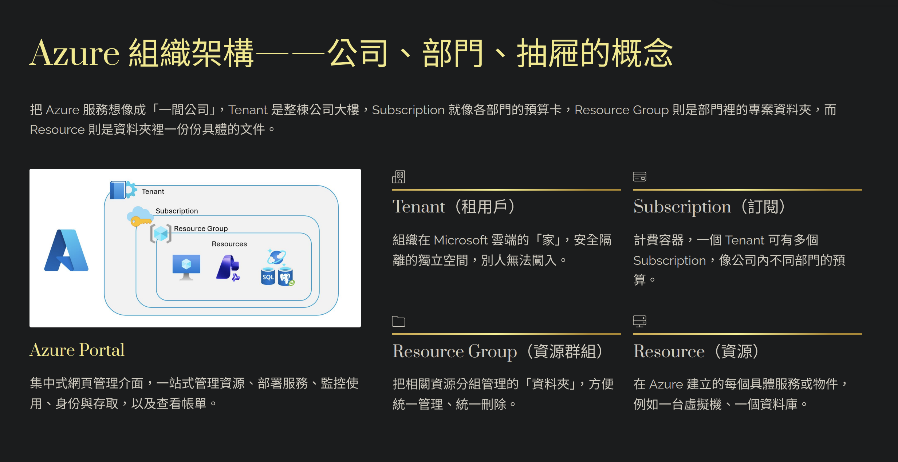

# Azure Fundamentals｜Azure 基礎與 AI 服務入門

沒用過 Azure，可以先讀這篇，再進入 [04 Microsoft Foundry](04_Microsoft_Foundry.md)。先看懂三件事：**資源放在哪裡、誰可以使用、各服務負責什麼。**

| 閱讀順序 | 內容 | 讀到什麼程度就好 |
|---|---|---|
| **先讀：1–3** | 資源、權限、AI 應用的組成 | 能用自己的話解釋用途 |
| **接著讀：4** | 雲端共同責任 | 知道用了雲端，自己仍要負責什麼 |
| **選讀：5** | Azure Machine Learning | 看得懂基本詞彙，不必背管理程式 |
| **複習：6–7** | 新舊名稱、容易混淆的觀念 | 辨認題目關鍵字 |

> **考試定位｜查核：2026-09-10：**[現行英文 AI-901 Study Guide](https://learn.microsoft.com/en-us/credentials/certifications/resources/study-guides/ai-901) 要求熟悉 Azure resources，主要實作重點是 Microsoft Foundry。本篇的 Azure 基礎作為前置知識；AML 與一般雲端管理屬 **Adjacent（延伸）**。這是依大綱做的讀書取捨，不代表官方保證某個細節不會出題。

## 1. Azure 資源：先知道東西放在哪裡

### 1.1 Service、Resource、Portal 有什麼不同？

把 Azure 想成可以建立各種雲端服務的平台。以存放客服文件為例：

| English concept | 白話解釋 | 例子 |
|---|---|---|
| **Service** | Azure 提供的一種能力 | Azure Blob Storage 提供檔案儲存能力 |
| **Resource** | 你實際建立、可以管理的服務資源 | 建立一個名為 `supportstorage` 的 Storage account |
| **Azure portal** | 用瀏覽器管理 Azure 的入口 | 在網頁上建立資源、查看設定與權限 |

**辨識重點：**服務是「提供什麼功能」，資源是「你建立的那一份」，Portal 是「操作入口」。

### 1.2 Subscription → Resource Group → Resource

以下是常見的簡化管理結構；更上層的 Management group 先不展開。

```text
Subscription：訂閱（管理與計費範圍）
└── Resource Group：資源群組，例如 rg-support-demo
    ├── Resource：存放文件的 Storage account
    └── Resource：執行客服網站的 Web App
```

| English concept | 白話解釋 | 初學者要記住的事 |
|---|---|---|
| **Subscription** | 一個 Azure 訂閱，提供管理與計費範圍 | 裡面可以有多個 Resource groups |
| **Resource Group** | 把相關資源放在一起管理的容器 | 常將同一專案、一起建立與移除的資源放在一起 |
| **Resource** | 真正使用的雲端資源 | 例如儲存帳戶、網站、AML workspace |

**例子：**做客服 Demo 時，網站和存放文件的儲存帳戶可以放在同一個 `rg-support-demo`，方便一起管理。刪除 Resource group 也會刪除裡面的資源。

### 1.3 Tenant 是管理「身分」的地方

**Microsoft Entra tenant** 可以先想成組織的身分目錄，裡面管理使用者、群組與應用程式身分。**Microsoft Entra ID** 是提供身分與存取管理的服務。

- **Tenant：**有哪些人或應用程式身分？
- **Subscription：**Azure 資源在哪個訂閱中管理與計費？
- 一個 Subscription 信任一個 Entra tenant；同一個 Tenant 可以對應多個 Subscriptions。



**讀圖補充：**公司／部門只是比喻。Tenant 是身分目錄，Subscription 是管理與計費範圍；Azure portal 是操作入口，不是多一層資源容器。

**官方來源：**[Resource Manager](https://learn.microsoft.com/en-us/azure/azure-resource-manager/management/overview)、[Subscription 與 Tenant 的關係](https://learn.microsoft.com/en-us/entra/fundamentals/how-subscriptions-associated-directory)、[Microsoft Entra](https://learn.microsoft.com/en-us/entra/fundamentals/what-is-entra)。

## 2. 身分與權限：登入成功，不代表什麼都能做

### 2.1 Authentication vs Authorization

| English concept | 中文理解 | 客服系統的例子 |
|---|---|---|
| **Authentication** | 驗證身分：「你是誰？」 | 確認登入的是員工小明 |
| **Authorization** | 授權：「你可以做什麼？」 | 小明可以查看資源，但不能修改設定 |
| **Azure RBAC** | 依角色控制 Azure 資源的存取權限 | 給小明某個 Resource group 的 Reader 角色 |

**RBAC 的三件事：誰（身分）＋能做什麼（Role）＋在哪裡（Scope）。** Scope 就是權限適用的範圍，例如某個資源或整個 Resource group。

### 2.2 應用程式也需要身分

網站要讀取其他服務的資料時，也需要證明自己是誰。

| English concept | 白話解釋 | 要避免的誤會 |
|---|---|---|
| **Managed Identity** | Azure 幫應用程式管理的身分，不必自己保存這個身分的密碼 | 有身分，仍要取得目標資源的權限 |
| **Token** | 呼叫服務時出示的存取權杖 | Token 不是資源名稱，也不代表擁有所有權限 |
| **Azure Key Vault** | 集中保存 Secrets、Keys、Certificates 的服務 | 把密鑰放進去後，仍要控制誰可以讀取 |

**例子：網站需要讀取 Key Vault 裡的一個 Secret。**

```text
網站使用 Managed Identity
→ 向 Microsoft Entra ID 取得 Token
→ 呼叫 Key Vault
→ 通過身分、權限與網路存取檢查
→ 取得允許讀取的 Secret
```

這樣不必把讀取 Key Vault 所需的身分密碼寫在程式裡。若目標服務本身支援 Managed Identity，也可以直接以此身分存取，不一定要先讀取一把 API key。

**辨識重點：**Entra ID 協助確認身分；RBAC 控制角色權限；Key Vault 保存敏感資訊。

**官方來源：**[Azure RBAC](https://learn.microsoft.com/en-us/azure/role-based-access-control/overview)、[Managed identities](https://learn.microsoft.com/en-us/entra/identity/managed-identities-azure-resources/overview)、[Key Vault authentication](https://learn.microsoft.com/en-us/azure/key-vault/general/authentication)。

## 3. AI 應用：網站、資料、模型各有工作

### 3.1 用「客服問答網站」理解服務分工

以下是一種示意組合，不是每個 AI 應用都必須使用全部服務。

| 需要做的事 | 可以使用的服務 | 在例子中負責什麼 |
|---|---|---|
| 執行網站與後端 API | **Azure App Service** | 接收使用者問題、執行應用程式邏輯 |
| 保存 PDF、圖片等原始檔案 | **Azure Blob Storage** | 存放產品手冊 |
| 從文件中找相關內容 | **Azure AI Search** | 找到與「如何退貨」有關的段落 |
| 建立使用模型與 Agent 的 AI 方案 | **Microsoft Foundry** | 開發、測試與管理 AI 能力，供應用程式呼叫 |

```text
使用者問「如何退貨？」
→ 網站後端接收問題
→ 搜尋系統找出相關退貨規則
→ 應用程式把問題與查到的內容交給模型
→ 網站顯示模型生成的回答
```

**辨識重點：**App Service 負責跑網站；Blob Storage 保存檔案；Search 找資料；模型依輸入生成回答。把網站部署好，還需要程式把這些能力接起來。

模型部署、Endpoint、API／SDK 與 Agent 呼叫方式，接著讀 [04 Microsoft Foundry](04_Microsoft_Foundry.md)；檢索與 RAG 原理見 [03 AI Models and Workloads](03_AI_Models_and_Workloads.md)。

### 3.2 掃描文件如何變得可以搜尋？

**AI Enrichment** 是在建立搜尋索引的過程中，用 AI 把原始內容加工成可搜尋資訊。

例如：**掃描手冊 → OCR 擷取文字 → 寫入 Search index → 使用者搜尋手冊內容**。

| 遇到的詞 | 先這樣理解 |
|---|---|
| **Indexer** | 從支援的資料來源讀取資料、更新索引 |
| **Skillset** | 指定加工步驟，例如 OCR、擷取關鍵片語 |
| **Knowledge Mining** | 從大量資料萃取、組織可用知識的解決方案概念 |

**辨識重點：**這裡的 OCR 是索引建立／更新時的處理，不是每問一次問題就重新掃描全部文件。Enrichment 依需求使用，不是每個搜尋方案都必須加入。

### 3.3 使用者變多時：Scale Up vs Scale Out（選讀）

| English concept | 中文理解 | 簡單例子 |
|---|---|---|
| **Scale Up / Vertical scaling** | 提高單一執行個體的規格 | 換成較多 CPU、記憶體的規格 |
| **Scale Out / Horizontal scaling** | 增加執行個體的數量 | 從 1 個增加到 3 個，一起分擔工作 |

**記法：Up 加規格，Out 加數量。**是否能自動擴展，取決於服務方案與設定。

**官方來源：**[App Service](https://learn.microsoft.com/en-us/azure/app-service/overview)、[Blob Storage](https://learn.microsoft.com/en-us/azure/storage/blobs/storage-blobs-introduction)、[Microsoft Foundry](https://learn.microsoft.com/en-us/azure/foundry/what-is-foundry)、[AI Enrichment](https://learn.microsoft.com/en-us/azure/search/cognitive-search-concept-intro)、[App Service scaling](https://learn.microsoft.com/en-us/azure/app-service/manage-scale-up)。

## 4. Shared Responsibility｜用了雲端，自己還要負責什麼？

先記住：**Microsoft 管理雲端基礎設施，不表示客戶可以不管資料、帳號與權限設定。**

| 模式 | 白話理解 | 作業系統由誰管理？ |
|---|---|---|
| **On-premises** | 自己準備並維運設備 | 客戶 |
| **IaaS — Infrastructure as a Service** | 使用雲端基礎設施，例如虛擬機器 | 客戶 |
| **PaaS — Platform as a Service** | 使用平台來執行自己開發的應用程式 | Microsoft |
| **SaaS — Software as a Service** | 直接使用供應商提供的軟體 | Microsoft |

**例子：**使用 App Service 時，不必自己維護底層作業系統，但仍要保護網站處理的客戶資料、設定存取權限，並負責自己的程式與組態。


**原圖校正：**現行 Microsoft 表格將 PaaS／SaaS 的應用程式責任、SaaS 的用戶端裝置責任列為「共同」。不要把圖中的簡化歸屬當成所有情境的完整分工。客戶在各種模式下仍對自己的資料、設定、身分與使用者負責。

這裡理解原則即可；AI 使用上的責任與風險判斷，見 [02 Responsible AI](02_Responsible_AI.md)。

**官方來源：**[Shared responsibility in the cloud](https://learn.microsoft.com/en-us/azure/security/fundamentals/shared-responsibility)。

## 5. Azure Machine Learning｜看懂訓練流程的基本詞彙（選讀）

**Azure Machine Learning（AML）** 用來管理機器學習的開發、訓練與部署。以下以「用歷史房屋資料訓練房價預測模型」為例。模型原理與工作負載分類見 [03](03_AI_Models_and_Workloads.md)。

### 5.1 先認識管理、資料、運算

| English concept | 白話解釋 | 房價預測例子 |
|---|---|---|
| **Workspace** | ML 專案的管理中心 | 集中查看資料參照、訓練工作與模型 |
| **Datastore** | 指向外部儲存體的連線／參照 | 告訴 AML 從哪個儲存體讀取資料；不是資料本體 |
| **Data Asset** | 可以命名與管理版本的資料參照 | 將某版房屋資料命名為 `house-data:1` |
| **Compute** | 執行程式所需的運算資源 | 使用 CPU／GPU 執行訓練 |

Compute 有兩個常見名稱：**Compute Instance** 像個人的雲端開發工作站；**Compute Cluster** 是可擴縮、執行訓練等工作的運算叢集。

### 5.2 再看一次訓練如何留下結果

| English concept | 白話解釋 | 房價預測例子 |
|---|---|---|
| **Job** | 一次執行的工作 | 用這份資料與設定訓練一次 |
| **Experiment** | 把相關 Jobs 分組，方便比較 | 比較不同訓練設定的結果 |
| **Registered Model** | 登錄後可管理版本的模型產物 | 保存 `house-model:1` |
| **Endpoint** | 程式呼叫模型推論的介面 | 輸入房屋條件，取得預測價格 |
| **Pipeline** | 串起多個步驟的流程 | 資料處理 → 訓練 → 評估 |

**例子：**在 Workspace 裡選好資料，讓 Compute 執行訓練 Job；比較結果後註冊模型，再部署供應用程式呼叫。

**記法：Workspace 管、Datastore 連、Data Asset 記版本、Compute 算。Job 跑一次，Experiment 放一起比。**

### 5.3 Designer vs AutoML

| 工具 | 幫你做什麼？ | 人仍要做什麼？ |
|---|---|---|
| **Designer** | 用拖拉元件的方式建立 ML Pipeline | 安排處理、訓練與評估的步驟 |
| **Automated ML（AutoML）** | 在指定條件內，自動嘗試演算法與參數組合 | 準備資料、指定目標與評估指標、確認結果 |

**辨識重點：**Designer 是「組流程」；AutoML 是「自動試模型與設定」。AutoML 不代表資料與結果都不必檢查。

**官方來源：**[Workspace](https://learn.microsoft.com/en-us/azure/machine-learning/concept-workspace?view=azureml-api-2)、[Data concepts](https://learn.microsoft.com/en-us/azure/machine-learning/concept-data?view=azureml-api-2)、[Designer](https://learn.microsoft.com/en-us/azure/machine-learning/concept-designer?view=azureml-api-2)、[Automated ML](https://learn.microsoft.com/en-us/azure/machine-learning/concept-automated-ml?view=azureml-api-2)。

## 6. Current vs Legacy｜遇到舊名稱時怎麼讀

產品是否現行，與它是不是 AI-901 重點，是兩件事。以下於 **2026-09-10** 對照官方文件。

| 名稱／概念 | 狀態與讀法 | 本篇定位 |
|---|---|---|
| **Microsoft Entra ID** | **Current**；舊名 Azure Active Directory／Azure AD | 身分與權限基礎 |
| **App Service、Blob Storage、Key Vault、Azure AI Search** | **Current**；各自提供主機、儲存、安全或搜尋能力 | 理解 AI 應用的服務分工 |
| **Azure Machine Learning** | **Current**；不是因為屬於延伸知識就已淘汰 | **Adjacent**，選讀基本詞彙 |
| **Classic Designer** | **Legacy exam-bank context**；classic v1 與 custom v2 元件不能放進同一個 Pipeline | 不必背舊版操作 |
| **Knowledge Mining** | 解決方案概念，不是已退休的產品名稱 | 理解 Search 資料加工即可 |

舊版 LUIS／CLU 的狀態與名稱對照見 [05 Text and Language](05_Text_and_Language.md)；內容安全見 [02 Responsible AI](02_Responsible_AI.md)。本篇不重複展開。

**名稱查核來源：**[Azure AD renamed to Microsoft Entra ID](https://learn.microsoft.com/en-us/entra/fundamentals/new-name)；其他產品依前述各節官方來源。

**本次精簡範圍：**現行 skills measured 未逐項列出舊 AML SDK 管理參數、Monte Carlo／K-fold 交叉驗證細節、Bot Connector／Channels／Direct Line、AKS 操作與各資料庫產品比較，因此移出本篇。保留能幫助理解 Azure 的基礎；原始內容仍在 `source/` 與 `raw notes/`。

**原始材料提醒：**原 Datastore 段落有缺字，不能由 SQL Database 等殘留字詞推定現行支援清單；原段所指版本與連線方式仍為 **NEEDS VERIFICATION**。

## 7. Common Confusions｜讀完應該分得清楚

| 容易混淆 | 一句話區分 |
|---|---|
| Tenant vs Subscription | 身分目錄 vs 資源管理與計費範圍 |
| Resource Group vs Workspace | Azure 相關資源的管理容器 vs AML 專案的管理中心 |
| Authentication vs Authorization | 你是誰 vs 你能做什麼 |
| Managed Identity vs Key Vault | 應用程式的身分 vs 保存敏感資訊的服務 |
| App Service vs Foundry | 跑網站與後端 vs 建立與管理 AI 方案 |
| Blob Storage vs Azure AI Search | 存原始檔案 vs 建立索引並搜尋內容 |
| Registered Model vs Endpoint | 模型產物 vs 呼叫推論的介面 |
| Designer vs AutoML | 組流程 vs 自動嘗試模型與設定 |

讀完可以進入 [04 Microsoft Foundry](04_Microsoft_Foundry.md)，把資源、權限與模型呼叫串起來；或回到 [AI-901 README](00_README.md)。

---

**原始來源：**`source/901 files 2/AI-901 Notes 3cf7254587ee802da82de782e6a42941.md` 的 Azure／AML／Search 等段落。兩張知識圖分別來自原匯出的 `image.png`、`image 4.png`；原始檔、缺字段落與圖片均保留。
