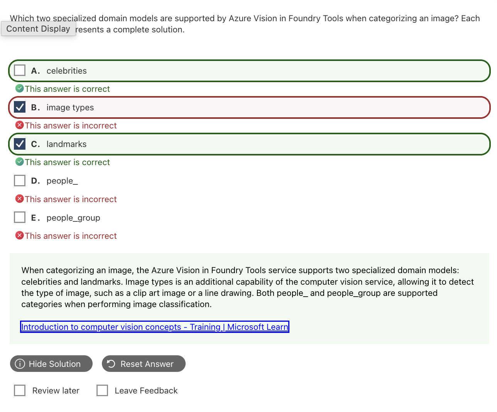
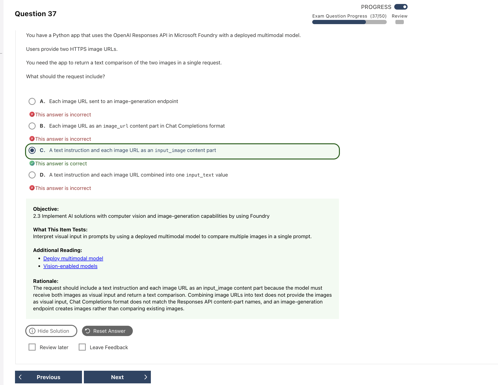

# Computer Vision Mistakes｜電腦視覺錯題

## Q03 — Legacy Domain-specific Models

| 重點 | 答案 |
|---|---|
| **正確答案** | **A. celebrities、C. landmarks** |
| **題目線索** | `two specialized domain models` |
| **考點** | Legacy Image Analysis 3.2 功能名稱 |

**為什麼選 A、C：** 舊版 Image Analysis 的兩個 domain-specific models 就是 `celebrities` 與 `landmarks`，分別辨識名人和知名地標。

| 選項 | 為什麼選／不選 |
|---|---|
| **A. celebrities** | 辨識名人的 domain model。 |
| B. image types | 判斷 clip art／line drawing，不是 domain model。 |
| **C. landmarks** | 辨識地標的 domain model。 |
| D. people_ | 舊版 category 名稱／前綴。 |
| E. people_group | 舊版固定 taxonomy 中的 category。 |

**補充與延伸（Legacy exam-bank context）：** 這組功能屬於舊版 Image Analysis 3.2 題型，不能直接當成現行 Image Analysis 或 multimodal model 的固定功能清單。舊題看到 specialized domain models，仍選 celebrities + landmarks。

> **記憶：** Domain models = 名人 + 地標；`people_` 是 category。

- 延伸筆記：[Tags、Categories 與 Domain-specific Models](../knowledge/07_Computer_Vision.md#tags-vs-categories-vs-domain-specific-models)
- 官方來源：[Detect domain-specific content](https://learn.microsoft.com/en-us/azure/ai-services/computer-vision/concept-detecting-domain-content)、[Migration options](https://learn.microsoft.com/en-us/azure/ai-services/computer-vision/migration-options)

---

## Q05 — Tagging 是描述性 Metadata

| 重點 | 答案 |
|---|---|
| **正確答案** | **D. tagging** |
| **題目線索** | `metadata that summarizes the attributes` |
| **考點** | Tags、Categories 與 Image Type 的差異 |

**為什麼選 D：** Tagging 會回傳多個描述圖片內容的詞彙與 confidence，例如 `outdoor`、`building`、`person`，符合「描述屬性的 metadata」。

| 選項 | 為什麼選／不選 |
|---|---|
| A. categorizing | 將圖片放入固定 taxonomy，不是產生多個描述詞。 |
| B. content organization | 是應用情境，不是影像分析的輸出功能名稱。 |
| C. detecting image types | 判斷 clip art／line drawing。 |
| **D. tagging** | 產生多個描述性 tags 與 confidence。 |

**補充與延伸：** Tag 可同時有很多個；Category 是從固定分類集合選類別。題目提到 metadata、keywords、descriptive words，通常指 Tags。

> **記憶：** Tags 是多張標籤；Categories 是固定分類箱。

- 延伸筆記：[Tags、Categories 與 Domain-specific Models](../knowledge/07_Computer_Vision.md#tags-vs-categories-vs-domain-specific-models)
- 官方來源：[Image tagging concepts](https://learn.microsoft.com/en-us/azure/ai-services/computer-vision/concept-tagging-images)

---

## Q11 — Responses API 比較兩張圖片

| 重點 | 答案 |
|---|---|
| **正確答案** | **C. 文字指令 + 每張圖片各一個 `input_image`** |
| **題目線索** | `two HTTPS image URLs`、`single request`、`Responses API` |
| **考點** | Responses API 的多張圖片輸入格式 |

**為什麼選 C：** 模型需要一段比較指令，以及兩個明確標示為 `input_image` 的視覺輸入。這樣才能在同一次 request 中看到並比較兩張圖片。

| 選項 | 為什麼選／不選 |
|---|---|
| A | Image generation 用來產圖，不是分析既有圖片。 |
| B | 這是另一套 API schema；題目指定 Responses API。 |
| **C** | 指令與兩張視覺輸入的格式都正確。 |
| D | 把 URL 寫在 `input_text` 中，不等於提供圖片內容。 |

**補充與延伸：** Responses API 使用 `input_text`／`input_image`；Chat Completions 使用另一套 message content 格式。題目指定 API 時，不能混用欄位。

> **記憶：** Responses：文字用 `input_text`，每張圖各用一個 `input_image`。

- 延伸筆記：[Multimodal Responses API](../knowledge/07_Computer_Vision.md#multimodal-responses-api文字--多張圖片)
- 官方來源：[Responses API](https://learn.microsoft.com/en-us/azure/foundry/openai/how-to/responses)
