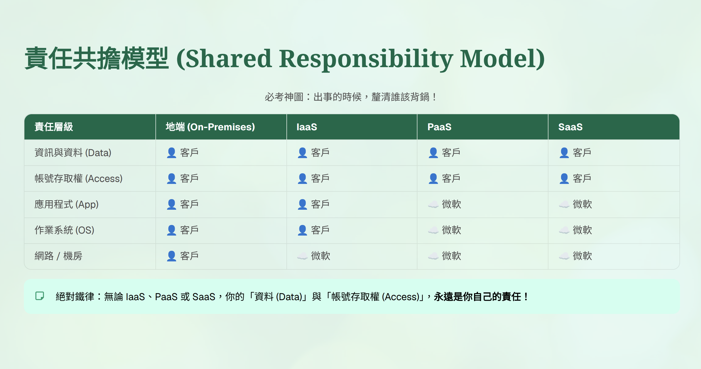

# Legacy and Adjacent Topics｜舊版與周邊知識

查核日期：**2026-09-06**。本模組保留原筆記的 Azure 基礎、Azure Machine Learning 與舊題庫服務。**Adjacent 代表考綱周邊，不代表產品已淘汰**；退休狀態另行標示。

## 1. Module Overview

| Item | Details |
|---|---|
| Official service/module name | Azure 基礎、Azure Machine Learning、Azure AI Bot Service、LUIS、Azure AI Content Moderator、Knowledge Mining |
| AI-901 relevance | Low；身分驗證、部署與搜尋概念可支援主要模組 |
| Current status | Mixed：現行 Azure 服務與 Legacy exam-bank context 並存 |
| Main exam workloads | 辨認 ML 資源、雲端責任、服務分工與舊版題目脈絡 |
| Primary Microsoft products | Azure Machine Learning、Microsoft Entra ID、Azure Key Vault、Azure AI Search、Azure App Service、AKS |

## 2. Core Concepts

### 2.1 Azure Machine Learning 資源詞彙

| Official English Term | 中文解釋 | What it does | Input | Output | Exam Keywords |
|---|---|---|---|---|---|
| **Azure Machine Learning (AML)** | 管理 ML 生命週期的平台 | 組織開發、訓練、評估與部署 | 資料、程式、設定 | 模型與推論服務 | ML lifecycle |
| **Workspace** | ML 專案的管理中心；本身也是 Azure resource | 集中管理 jobs、assets、compute、endpoints | 專案資源與設定 | 可管理、追蹤的工作環境 | project management |
| **Datastore** | 外部儲存體的連線／參照，並非資料本體 | 提供存取儲存體的設定 | 儲存體位置與存取設定 | 可引用的資料連線 | where / how to connect |
| **Data Asset** | 可命名、版本化、重複使用的資料參照 | 管理資料版本 | 檔案、資料夾或資料表參照 | `customer-data:1` | named / versioned data |
| **Compute** | 執行程式所需的 CPU／GPU 等運算資源 | 提供執行環境 | 工作與環境設定 | 運算結果 | processing resources |
| **Compute Instance** | 開發者使用的雲端工作站 | 執行 Notebook、開發與測試 | Python / Notebook | 開發成果 | development workstation |
| **Compute Cluster** | 可擴縮的運算叢集 | 執行訓練等 jobs | 訓練工作 | 工作結果 | scalable training |
| **Job** | 一次執行的 ML 工作 | 執行訓練或其他工作 | 程式、資料與參數 | 指標、記錄、產物 | one execution |
| **Experiment** | 將相關 jobs 分組 | 比較不同訓練結果 | 多個 jobs | 可比較的執行紀錄 | group jobs |
| **Model / Registered Model** | 訓練產物；註冊後可管理版本 | 保存與重複使用模型 | 模型檔案 | 例如 `fraud-model:3` | trained artifact / version |
| **Endpoint** | 呼叫已部署模型的介面 | 接收推論要求 | 推論輸入 | 預測結果 | inference interface |
| **Pipeline** | 將多個工作步驟串成流程 | 重複執行資料處理、訓練、評估 | 步驟與相依關係 | 多步驟工作結果 | workflow |

例如：在 `house-price-workspace` 內，以 Datastore 指向 Blob Storage；將房屋資料建立為 Data Asset，透過 Compute 執行訓練 Job，把不同演算法的 Jobs 放進同一個 Experiment 比較，再註冊模型並部署至 Endpoint。模型訓練與評估原理見 [02 模型與工作負載](02_AI_Models_and_Workloads.md)。

**原文缺損：**匯出筆記中另有一段 Datastore 說明出現缺字，只剩 Blob Storage、Data Lake、SQL Database 等片段。本節以現行文件重新說明 Datastore；**SQL Database 在該段所指的 SDK 版本與連線方式：NEEDS VERIFICATION**，不把殘句補成現行 v2 支援清單。

### 2.2 Designer、AutoML 與交叉驗證

| 概念 | 做法 | 人仍需決定什麼 | 原筆記例子／辨識重點 |
|---|---|---|---|
| **Azure Machine Learning Designer** | 以視覺化元件組合 ML pipeline | 步驟、元件、資料流與設定 | 自己排列資料處理、訓練、評估；像組裝流程 |
| **Automated ML (AutoML)** | 在指定任務與限制內，嘗試模型、特徵處理與超參數組合 | 問題、資料、目標欄位、主要評估指標與訓練限制 | 自動選擇與調整候選模型；不是免除資料準備與驗證 |
| **Monte Carlo Cross-validation** | 每次隨機切分 training / validation，重複後彙總指標 | 切分比例、重複次數與適合的資料切分策略 | 例如重複 20 次取平均；不保證每筆資料都曾進入驗證集 |
| **K-fold Cross-validation** | 分成 K 份，輪流用一份驗證、其餘訓練 | K 與資料切分方式 | 一輪 K 次中，每份資料各作一次驗證；不同於反覆隨機抽樣 |

Designer 是建構流程的方式，AutoML 是自動搜尋模型的能力；兩者不是互斥的 ML 理論。舊版 **classic Designer** 與目前自訂元件流程的相容性，也不能只靠相同名稱判斷。

### 2.3 Azure 資源與安全

| Official English Term | 中文解釋 | 在架構中的作用 | 易混淆點 |
|---|---|---|---|
| **Microsoft Entra Tenant** | 組織的身分目錄 | 管理使用者、應用程式與身分 | 不等於 Subscription |
| **Subscription** | Azure 訂閱與管理／計費範圍 | 包含 resource groups 與 resources | 一個訂閱信任一個 Entra tenant；同一 tenant 可供多個訂閱使用 |
| **Resource Group** | 相關 Azure 資源的管理容器 | 組織共同管理的資源 | 不是實體伺服器，也不是身分目錄 |
| **Resource** | 具體建立的服務執行個體 | 如 Storage account、AML workspace | 服務名稱不等於某個實際資源 |
| **Azure Portal** | 管理 Azure 的網頁介面 | 建立、查看與設定資源 | 不是資源階層中的容器 |
| **Microsoft Entra ID** | 雲端身分與存取管理服務 | 驗證誰在登入／呼叫 | 舊名 Azure Active Directory；正式名稱不是「Azure Entra ID」 |
| **Azure RBAC** | 依角色控制 Azure 資源存取 | 將角色在指定 scope 指派給 security principal | Authentication 驗證身分；Authorization 決定能做什麼 |
| **Managed Identity** | 由 Azure 管理的工作負載身分 | 應用程式取得 token，不必自行保存身分密碼 | 有身分不表示自動取得所有資源權限 |
| **Azure Key Vault** | 保存 secrets、keys、certificates | 集中管理敏感資訊 | 應用程式仍需驗證身分並具有適當權限 |

**讀圖補充：**公司／部門比喻僅用來理解管理範圍。Tenant 是身分邊界，Subscription 是 Azure 管理與計費範圍；兩者不是同一種容器。Azure Portal 是管理入口。

### 2.4 Shared Responsibility｜共同責任

| 責任項目 | On-premises | IaaS | PaaS | SaaS |
|---|---|---|---|---|
| 客戶資料、組態、身分與使用者 | 客戶 | 客戶 | 客戶 | 客戶 |
| 用戶端裝置 | 客戶 | 客戶 | 客戶 | 共同 |
| 應用程式 | 客戶 | 客戶 | 共同 | 共同 |
| 網路控制 | 客戶 | 客戶 | 共同 | Microsoft |
| 作業系統 | 客戶 | 客戶 | Microsoft | Microsoft |
| 實體主機、實體網路、資料中心 | 客戶 | Microsoft | Microsoft | Microsoft |

**以文字表為準：**目前 Microsoft 文件把 SaaS 用戶端裝置及 PaaS／SaaS 應用程式列為共同責任。圖中若簡化為單方責任，不應直接延伸到所有情境；實體網路與客戶設定的網路控制也要分開。

### 2.5 部署平台、擴展與資料庫

| Official English Term | 中文理解 | 適合情境 | 關鍵差異 |
|---|---|---|---|
| **Azure Kubernetes Service (AKS)** | 受控 Kubernetes 容器編排服務 | 多容器、微服務、需要 Kubernetes 控制能力的工作負載 | 管理容器化工作負載，不是模型演算法 |
| **Azure App Service** | 部署 Web App、REST API 與後端的 PaaS 平台 | AI 應用程式的網站與 API | 提供應用程式主機，不等於 Foundry 模型部署 |
| **Scale Out / Horizontal Scaling** | 增加執行個體數量 | 流量增加，需要多個執行個體分擔 | 加數量；是否自動擴展取決於服務與設定 |
| **Scale Up / Vertical Scaling** | 提高單一執行個體規格 | 單台算力或記憶體不足 | 加 CPU／記憶體等容量；可選規格依服務而定 |
| **Azure SQL Database** | 以 SQL Server 引擎為基礎的受控關聯式資料庫 | 訂單、ERP、會員、金融交易 | 結構化資料、SQL、交易、JOIN；如 Customers 與 Orders 關聯 |
| **Azure Cosmos DB** | 全球分散式資料庫；原筆記重點是 NoSQL 文件資料 | 聊天訊息、IoT、遊戲狀態、JSON session | 分割與水平擴展；API 與資料模型須依具體產品功能確認 |
| **Azure Database for PostgreSQL** | 受控 PostgreSQL | 既有 PostgreSQL、開源應用程式、Django 後端 | PostgreSQL 生態與 SQL；不是 SQL Server |

### 2.6 Bot、LUIS 與內容審核

| Official English Term | 中文解釋 | Input → Output / 例子 | 狀態與閱讀方式 |
|---|---|---|---|
| **Azure AI Bot Service** | 管理 Bot 與通訊管道的連接 | 一個客服 Bot 連接多個 Channels | 保留舊題庫服務分工；勿直接等同 Foundry Agent Service |
| **Channels** | 使用者接觸 Bot 的平台 | Teams、Slack、Facebook Messenger、Web Chat 等 | 個別管道可用性與設定需查相應文件 |
| **Bot Connector Service** | Bot 與不同管道之間的訊息橋樑 | Channel 訊息 ↔ Bot 訊息格式 | 著重訊息傳遞與格式轉換 |
| **Web Chat** | 嵌入網站的聊天 UI | 官網中的客服聊天視窗 | 是介面，不是理解意圖的模型 |
| **Direct Line** | 讓自訂 client 與 Bot 通訊的 API | 手機 App 自製 UI → 同一個 Bot | 自訂介面的連接方式 |
| **Language Understanding Intelligent Service (LUIS)** | 舊版 NLU 服務 | Utterance → Intent + Entities | **Retired：2026-03-31**；移轉脈絡見 CLU |
| **Conversational Language Understanding (CLU)** | 判斷對話意圖、擷取實體 | 「訂明天到台北的車票」→ 意圖與欄位 | LUIS 後續移轉功能，目前為 **Retiring**；詳見 [04](04_Text_and_Language.md) |
| **Azure AI Content Moderator** | 舊版不當內容審核服務 | Text / Image / Video → 內容標記 | **Deprecated / Retiring**；成人、挑逗、冒犯文字、自訂禁止詞等舊題庫情境 |

Content Moderator 的輸出供應用程式決定封鎖、標記或人工處理，不代表所有被標記內容都由服務自動刪除。現行 **Azure AI Content Safety** 的能力與負責任 AI 控制見 [01](01_Responsible_AI.md)，不能假設它與舊版服務的每種輸入、輸出及審核流程一一相同。

### 2.7 Knowledge Mining 與 AI Enrichment

| 概念 | 中文理解 | 原筆記場景 |
|---|---|---|
| **Knowledge Mining** | 從大量原始資料萃取、組織並提供可查詢的知識 | 幾萬份合約經處理後，可搜尋其中內容 |
| **AI Enrichment** | 索引流程中加入 AI 技能，補充可搜尋欄位 | 掃描 PDF → OCR 文字；文字 → NER／關鍵片語 |
| **Skillset** | 描述要執行的 enrichment skills 與資料流 | OCR 後再做文字分析 |
| **Indexer** | 從支援的資料來源擷取並更新索引 | 將 Blob Storage 文件加入 Search Index |

Knowledge Mining 是解決方案概念，不是已退休的服務名稱。**Azure AI Search** 的 Index、全文／向量／混合搜尋、Semantic Ranker 與 Agent 檢索工具集中在 [03 Microsoft Foundry](03_Microsoft_Foundry.md)。

## 3. How It Works

| 流程 | 步驟 | 判斷重點 |
|---|---|---|
| ML 生命週期的 Azure 資源 | Workspace → Data Asset / Datastore → Compute 執行 Job → 比較 Experiment → 註冊 Model → Endpoint | 管理、資料參照、運算、產物與介面各自負責不同部分 |
| 安全讀取 Secret | 應用程式使用 Managed Identity → Entra ID 核發 token → Key Vault 驗證與授權 → 回傳可存取的 secret | 不把 secret 硬編碼；身分與權限缺一不可 |
| Bot 多管道 | 使用者 → Channel → Connector → Bot 邏輯 → 回覆原管道 | 訊息連接與模型推理是不同層次 |
| 搜尋資料加工 | Data Source → Indexer → Skillset（需要時）→ Search Index → Query | Enrichment 是可選的索引處理；不是每次查詢都重新 OCR |

## 4. Important API / SDK Patterns

本模組以辨認用途為主，不要求背誦周邊服務的管理程式。Foundry 實作集中在 [03](03_Microsoft_Foundry.md)。

| Pattern / Parameter | 要理解的用途 | 版本／限制 |
|---|---|---|
| **MLClient**，`azure.ai.ml` | Azure Machine Learning SDK v2 的資源與工作管理 client | 不等於 Foundry 的 `AIProjectClient` |
| **AIProjectClient**，`azure.ai.projects` | 連接 Foundry project 與相關開發功能 | 請依 [03](03_Microsoft_Foundry.md) 的版本與範例使用 |
| `azureml://datastores/<datastore-name>/paths/<path-on-datastore>/` | 在 AML 指向 Datastore 內的資料路徑 | 是資料 URI，不是模型推論 endpoint |
| **Token + RBAC** | 身分驗證後，以角色及 scope 控制授權 | 不要把 Key Vault 名稱或 endpoint 當成憑證 |
| 舊 `AutoMLConfig.validation_size` | 控制驗證資料比例，例如 `0.2` | **SDK v1 / Legacy**；不是所有任務都支援 |
| 舊 `AutoMLConfig.n_cross_validations` | 單獨設定時用於 K-fold；舊文件同時設定 `validation_size` 時描述 Monte Carlo 重複隨機切分 | 不把 v1 參數直接套到 v2；forecasting 有不同限制 |

## 5. Comparison / Common Confusions

| Concept A | Concept B | Key Difference |
|---|---|---|
| Datastore | Data Asset | 前者描述資料位置與連線；後者讓特定資料參照可命名與版本化 |
| Compute Instance | Compute Cluster | 個人開發工作站 vs 可擴縮的工作運算叢集 |
| Job | Experiment | 一次執行 vs 相關執行的分組 |
| Registered Model | Endpoint | 保存的模型產物 vs 對外推論介面 |
| Designer | AutoML | 組織流程 vs 自動搜尋候選模型及設定 |
| Microsoft Entra ID | Azure RBAC | 驗證身分的基礎 vs Azure 資源的角色授權機制 |
| Web Chat | Direct Line | 網頁聊天介面 vs 自訂 client 通訊 API |
| Bot Connector | Foundry Agent tools | 傳遞管道訊息 vs Agent 可呼叫的能力 |
| AI Enrichment | Semantic Ranker | 索引階段加工內容 vs 查詢時重新排列搜尋結果 |
| Scale Out | Scale Up | 增加數量 vs 提高單一規格 |

## 6. Current vs Legacy

| 名稱／內容 | 2026-09-06 查核狀態 | 舊題庫閱讀方式 |
|---|---|---|
| Azure Machine Learning、AKS、App Service、Key Vault、Entra ID | **Current / Adjacent** | 考綱周邊，不代表淘汰 |
| Azure Machine Learning SDK v1 | **Deprecated；已於 2026-06-30 結束支援** | 保留 AutoML 舊參數解題脈絡；新實作查 v2。結束支援不等於既有程式在當天必然停止執行 |
| Classic Designer | **Legacy context** | 舊版預建元件與 v2 自訂元件不可直接視為相容 |
| Azure Active Directory / Azure AD | 舊品牌名稱 | 現名 **Microsoft Entra ID** |
| LUIS | **Retired：2026-03-31** | 了解 Utterance / Intent / Entity 與 CLU 移轉，不再當成新方案選擇 |
| Bot Framework SDK / Emulator | 已封存；官方說明支援票單於 **2025-12-31** 後停止受理 | 舊 SDK 的支援狀態，不等於所有 Azure Bot Service 管道同時退休；新開發需查 Microsoft 目前 agent 指引 |
| Azure AI Content Moderator | **Deprecated / Retiring** | 新方案查 Content Safety。官方頁面目前顯示不同退休日；日期不影響 AI-901 解題，因此不把其中一日當成必背規格 |
| Knowledge Mining | **概念仍有效** | 不因用語較舊而標成 Retired；對應現行 Search enrichment 流程 |

| Current terminology | Legacy / exam-bank terminology | What to answer if this wording appears on an older question |
|---|---|---|
| **Microsoft Entra ID** | Azure Active Directory / Azure AD | 身分驗證、tenant 或 directory 題目選對應的 Entra 身分服務 |
| **Microsoft Foundry Agent Service** | Bot Framework／Azure AI Bot Service 題目中的 bot 與 channels | 若題幹明示 Channels、Connector、Web Chat、Direct Line，依舊版 Bot 架構回答；不要改答 Agent tool |
| 新建 NLU 方案需查看目前 Language／Foundry 能力與遷移指引 | **LUIS**、**CLU** | Intent + Entity 的舊題可依 LUIS／CLU 概念作答；不要把已退休的 LUIS 選作新建服務 |
| **Azure AI Content Safety** | Azure AI Content Moderator | Adult／Racy／offensive words 加人工審核的舊題依 Moderator 語境；新方案選 Content Safety 並核對能力差異 |

## 7. Exam Keywords & Triggers

| If the question says... | Think... |
|---|---|
| manage ML project resources | Workspace |
| reference storage / named version of data | Datastore / Data Asset，依題目區分 |
| cloud development workstation / scalable training | Compute Instance / Compute Cluster |
| visually arrange pipeline steps | Designer |
| automatically try algorithms and hyperparameters | AutoML |
| repeated random train-validation splits | Monte Carlo Cross-validation |
| one bot, multiple communication channels | Bot Service / Connector（舊題庫脈絡） |
| custom client communicates with bot | Direct Line |
| secrets without hard-coded credentials | Key Vault + Managed Identity + 適當授權 |
| more instances / larger instance | Scale Out / Scale Up |
| enrich scanned documents before indexing | AI Enrichment / Skillset |

## 8. Memory Rules

- **Workspace 管、Datastore 連、Data Asset 記版本、Compute 算。**
- **Job 跑一次，Experiment 放一起比。**
- **Out 加數量；Up 加規格。**
- **Adjacent 看關聯；Retired 看生命週期。**

## 9. Official Sources

下列為 Microsoft 官方文件；舊版 SDK 文件僅支援標明 Legacy 的內容。

| 支援主題 | 官方文件 |
|---|---|
| 考試範圍 | [AI-901 Study Guide](https://learn.microsoft.com/en-us/credentials/certifications/resources/study-guides/ai-901) |
| AML 資源與資料 | [Workspace](https://learn.microsoft.com/en-us/azure/machine-learning/concept-workspace?view=azureml-api-2)、[Data concepts](https://learn.microsoft.com/en-us/azure/machine-learning/concept-data?view=azureml-api-2)、[Model management](https://learn.microsoft.com/en-us/azure/machine-learning/how-to-manage-models?view=azureml-api-2) |
| Designer / AutoML | [Designer](https://learn.microsoft.com/en-us/azure/machine-learning/concept-designer?view=azureml-api-2)、[Automated ML](https://learn.microsoft.com/en-us/azure/machine-learning/concept-automated-ml?view=azureml-api-2) |
| SDK 與交叉驗證 | [v1 migration](https://learn.microsoft.com/en-us/azure/machine-learning/how-to-migrate-from-v1?view=azureml-api-2)、[v1 validation / Monte Carlo](https://learn.microsoft.com/en-us/previous-versions/azure/machine-learning/how-to-configure-cross-validation-data-splits?view=azureml-api-1)、[v2 YAML core syntax](https://learn.microsoft.com/en-us/azure/machine-learning/reference-yaml-core-syntax?view=azureml-api-2) |
| 資源階層與授權 | [Resource Manager](https://learn.microsoft.com/en-us/azure/azure-resource-manager/management/overview)、[Azure RBAC](https://learn.microsoft.com/en-us/azure/role-based-access-control/overview)、[Key Vault authentication](https://learn.microsoft.com/en-us/azure/key-vault/general/authentication) |
| 雲端責任 | [Shared responsibility](https://learn.microsoft.com/en-us/azure/security/fundamentals/shared-responsibility) |
| 應用程式主機與擴展 | [AKS](https://learn.microsoft.com/en-us/azure/aks/what-is-aks)、[App Service](https://learn.microsoft.com/en-us/azure/app-service/overview)、[App Service scaling](https://learn.microsoft.com/en-us/azure/app-service/manage-scale-up) |
| 資料庫 | [SQL Database](https://learn.microsoft.com/en-us/azure/azure-sql/database/sql-database-paas-overview?view=azuresql)、[Cosmos DB](https://learn.microsoft.com/en-us/azure/cosmos-db/overview)、[PostgreSQL](https://learn.microsoft.com/en-us/azure/postgresql/overview) |
| Bot 與舊 SDK | [Channels](https://learn.microsoft.com/en-us/azure/bot-service/bot-service-manage-channels?view=azure-bot-service-4.0)、[Bot Service updates](https://learn.microsoft.com/en-us/azure/bot-service/what-is-new?view=azure-bot-service-4.0) |
| LUIS 移轉 | [Language migration](https://learn.microsoft.com/en-us/azure/ai-services/language-service/reference/migrate) |
| Moderator 狀態差異 | [Content Moderator overview](https://learn.microsoft.com/en-us/azure/ai-services/content-moderator/overview)、[Lifecycle dates](https://learn.microsoft.com/en-us/lifecycle/products/azure-ai-content-moderator) |
| 知識挖掘 | [AI enrichment](https://learn.microsoft.com/en-us/azure/search/cognitive-search-concept-intro)、[Skillset tutorial](https://learn.microsoft.com/en-us/azure/search/tutorial-skillset) |

原始來源：`source/901 files 2/AI-901 Notes 3cf7254587ee802da82de782e6a42941.md` 的 Azure／AML／Bot／Search／Content Moderator 段落，以及原始 `image.png`、`image 4.png`。原始檔與缺字段落均保留於 `source/`。
