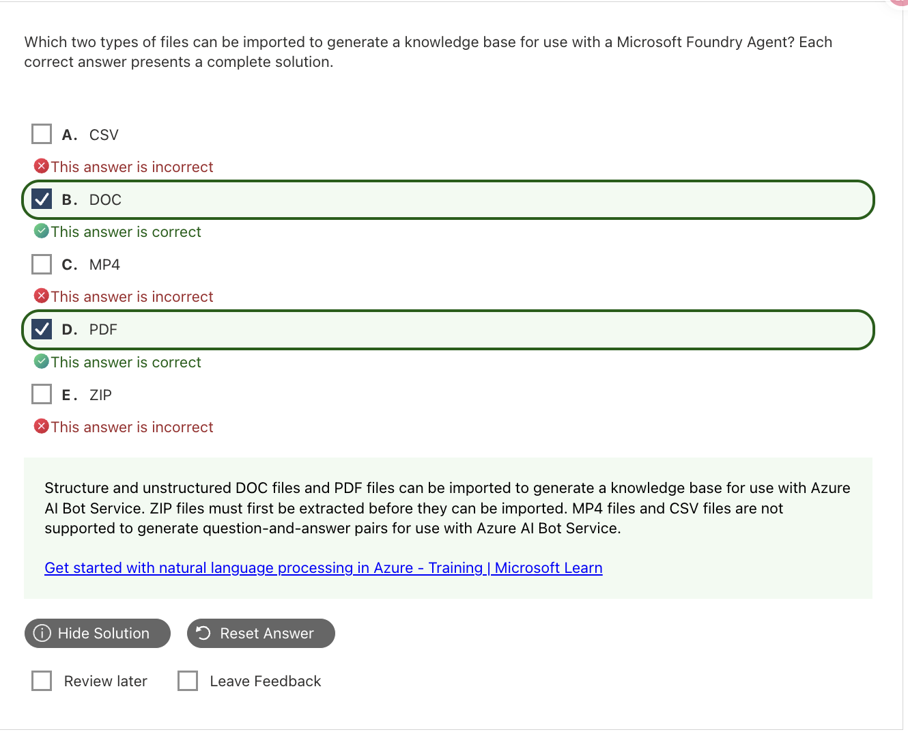
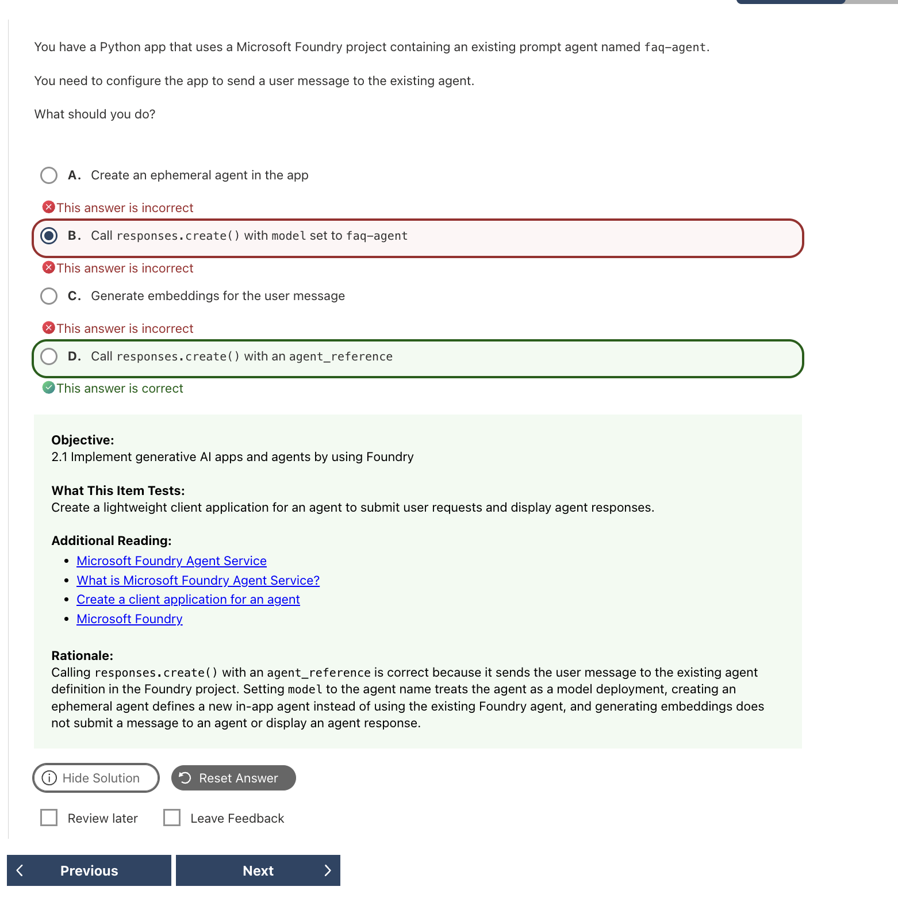
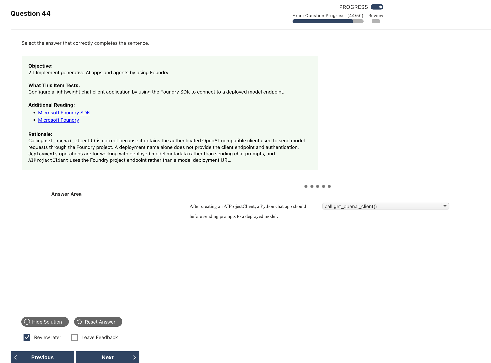

# Microsoft Foundry Mistakes｜Foundry 錯題

---

## Q01 — Knowledge Base 匯入格式的混合年代題

### Answer Summary

| Item | Details |
|---|---|
| Correct Answer | **舊題庫答案：B. DOC、D. PDF**；以現行 Foundry 泛稱而言，題目資訊不足 |
| Tested Concept | 舊式 Q&A knowledge base 的文件格式；題幹與解說產品不一致 |
| Question Keyword | `generate a knowledge base`、`DOC`、`PDF` |
| Related Knowledge | [[../knowledge/03_Microsoft_Foundry#Knowledge tools and file formats]] |
| Mistake Type | Current vs legacy、Service confusion、Terminology |

### Why the Correct Answer Is Correct

截圖的解說其實沿用 Azure AI Bot Service／Question Answering 的知識庫教材，因此其預期答案是 DOC 與 PDF。現行 Microsoft Foundry 有 File Search、Foundry IQ、Azure AI Search 等不同知識來源，各自支援格式不同；不能把這組答案擴張成「所有 Foundry Agent knowledge base 都只支援 DOC/PDF」。

### Option Analysis

| Option | 舊題庫是否正確？ | Reason |
|---|---:|---|
| A. CSV | No | 舊式文件 Q&A 題庫不把它列為此題的匯入格式；現行其他 Foundry knowledge 機制可能處理結構化資料。 |
| B. DOC | Yes | 符合舊題庫的 structured/unstructured DOC 文件匯入語境；現行 File Search 也支援文件類型。 |
| C. MP4 | No | 不是舊題指定的 Q&A 文件來源；影音資訊擷取應看 Content Understanding。 |
| D. PDF | Yes | 符合舊題庫文件匯入語境；也是現行常見檔案搜尋格式。 |
| E. ZIP | No | 壓縮檔本身不是該知識庫的內容格式。 |

### Related Knowledge

參見 [[../knowledge/03_Microsoft_Foundry#File Search vs Code Interpreter vs Azure AI Search]]。

### Current Microsoft Context

- **Current terminology:** Foundry Agent 的知識能力要先辨認 **File Search、Foundry IQ knowledge source、Azure AI Search** 或其他 tool。
- **Legacy / exam-bank terminology:** 題目說 Microsoft Foundry Agent，但解說援引 Azure AI Bot Service／Question Answering 的舊 knowledge base。
- **What to answer if this wording appears on an older question:** 這組固定選項的題庫答案是 DOC + PDF；同時註記題目混用了產品年代。

### Exam Takeaway

> 先辨認 knowledge 機制，再判斷格式；「Foundry knowledge base」不是單一格式規格。

### Official Source

- [File Search tool](https://learn.microsoft.com/en-us/azure/foundry/agents/how-to/tools/file-search)
- [Conversational Question Answering document format guidelines](https://learn.microsoft.com/en-us/azure/ai-services/language-service/question-answering/reference/document-format-guidelines)
- [Conversational Question Answering overview](https://learn.microsoft.com/en-us/azure/ai-services/language-service/question-answering/overview)

---

## Q09 — 呼叫既有 Prompt Agent

### Answer Summary

| Item | Details |
|---|---|
| Correct Answer | **D. Call `responses.create()` with an `agent_reference`** |
| Tested Concept | 以 Responses API 呼叫 project 中既有 agent |
| Question Keyword | `existing prompt agent`、`send a user message` |
| Related Knowledge | [[../knowledge/03_Microsoft_Foundry#Call an existing agent with agent_reference]] |
| Mistake Type | API / SDK syntax、Concept confusion |

### Why the Correct Answer Is Correct

`agent_reference` 明確指向 Foundry project 中既有的 prompt agent。把 agent 名稱塞進 `model` 會把它當成 model deployment；建立 ephemeral agent 則是建立另一個 in-app agent，而非重用既有定義。

### Option Analysis

| Option | Correct? | Reason |
|---|---:|---|
| A. Create an ephemeral agent | No | 會建立新的應用程式內 agent，不是呼叫既有 `faq-agent`。 |
| B. `responses.create(model="faq-agent")` | No | `model` 指模型部署；agent name 不是 model deployment。 |
| C. Generate embeddings | No | Embeddings 支援相似度／檢索，不會把訊息送到 agent。 |
| D. `responses.create()` + `agent_reference` | Yes | 指向並執行既有 agent definition。 |

### Related Knowledge

參見 [[../knowledge/03_Microsoft_Foundry#Call an existing agent with agent_reference]]。

### Current Microsoft Context

- **Current terminology:** **Prompt agent**、`agent_reference` 與 Responses API runtime pattern。
- **Legacy / exam-bank terminology:** agent runtime API 變動快速；應依題目指定的 SDK／API 版本讀參數。
- **What to answer if this wording appears on an older question:** 既有 agent → reference；既有 model deployment → `model`。

### Exam Takeaway

> Agent name 放 `agent_reference`；model deployment name 放 `model`。

### Official Source

- [Foundry Agent Service runtime components](https://learn.microsoft.com/en-us/azure/foundry/agents/concepts/runtime-components)

---

## Q12 — Deployment Option 與 Deployment Type

### Answer Summary

| Item | Details |
|---|---|
| Correct Answer | **題庫答案：D. Standard deployment in Foundry resources** |
| Tested Concept | 部署 option 與 throughput deployment type 的層級差異 |
| Question Keyword | `Azure OpenAI model`、`chat app`、`guardrails`、`deployment option` |
| Related Knowledge | [[../knowledge/03_Microsoft_Foundry#Deployment options vs deployment types]] |
| Mistake Type | Terminology、Current vs legacy、Concept confusion |

### Why the Correct Answer Is Correct

題目明問 deployment **option**，舊題庫把「在 Foundry resource 中建立 standard deployment」視為可套用治理控制的答案。**Provisioned** 描述容量／throughput 類型，不是這題要選的上層 option；不能因此推論 provisioned 不支援 guardrails。

### Option Analysis

| Option | Correct? | Reason |
|---|---:|---|
| A. Instant access | No | 不建立此題要求的受管理模型 deployment。 |
| B. Provisioned deployment type | No | 是 throughput／capacity 類型，與題目所問 option 層級不同。 |
| C. Managed compute deployment | No | 適合需要專用 managed compute 的 open／custom models；不是題目的 Azure OpenAI 選項。 |
| D. Standard deployment in Foundry resources | Yes | 符合此題庫對 Azure OpenAI 模型受治理部署 option 的描述。 |

### Related Knowledge

參見 [[../knowledge/03_Microsoft_Foundry#Deployment options vs deployment types]]。

### Current Microsoft Context

- **Current terminology:** Microsoft 的部署文件目前以 deployment options 與 deployment types 分層說明；現行 portal 文案可能不同於截圖。
- **Legacy / exam-bank terminology:** `Standard deployment in Foundry resources` 是本題使用的 option 文案。
- **What to answer if this wording appears on an older question:** 問 option 就選 D；問可預測 throughput／PTU 才考慮 Provisioned type。

### Exam Takeaway

> Standard／Provisioned 可能出現在不同層級；先看題目問 option 還是 type。

### Official Source

- [Deployment overview for Microsoft Foundry Models](https://learn.microsoft.com/en-us/azure/foundry/concepts/deployments-overview)

---

## Q13 — AIProjectClient 取得 OpenAI Client

### Answer Summary

| Item | Details |
|---|---|
| Correct Answer | **call `get_openai_client()`** |
| Tested Concept | Foundry SDK client layering |
| Question Keyword | `After creating an AIProjectClient`、`before sending prompts` |
| Related Knowledge | [[../knowledge/03_Microsoft_Foundry#AIProjectClient → OpenAI client → Responses API]] |
| Mistake Type | API / SDK syntax |

### Why the Correct Answer Is Correct

`AIProjectClient` 連接 Foundry project；`get_openai_client()` 從 project client 取得已驗證、OpenAI-compatible 的 client，之後才以 Responses API 對 model deployment 傳送 prompt。

### Option Analysis

截圖只顯示下拉選單的已選答案，沒有展開全部選項，因此不臆造逐字選項。

| Choice / direction | Correct? | Reason |
|---|---:|---|
| call `get_openai_client()` | Yes | 取得可呼叫 deployed model 的 OpenAI-compatible client。 |
| 只有 deployment name | No | 名稱本身不提供 client、endpoint 與 authentication。 |
| 使用 deployments management operations 傳 prompt | No | 管理 deployment metadata，不是模型推論 client。 |
| 用 model deployment URL 建立 `AIProjectClient` | No | `AIProjectClient` 使用 project endpoint。 |

### Related Knowledge

參見 [[../knowledge/03_Microsoft_Foundry#AIProjectClient → OpenAI client → Responses API]]。

### Current Microsoft Context

- **Current terminology:** stable `azure-ai-projects` 套件仍提供 `AIProjectClient.get_openai_client()`；套件 stable 不代表其中每項服務能力都是 GA。
- **Legacy / exam-bank terminology:** 舊 preview SDK 的版本號與 import 細節可能不同。
- **What to answer if this wording appears on an older question:** Project client 建立後，要送模型 prompt 時取得 OpenAI client。

### Exam Takeaway

> `AIProjectClient` 管 project；`get_openai_client()` 取得模型呼叫 client。

### Official Source

- [Azure AI Projects Python SDK overview](https://learn.microsoft.com/en-us/python/api/overview/azure/ai-projects-readme?view=azure-python)

---

## Q19 — Unified Model Invocation API

### Answer Summary

| Item | Details |
|---|---|
| Correct Answer | **B. `responses.create()`** |
| Tested Concept | Foundry Responses API 的統一模型呼叫 |
| Question Keyword | `unified model invocation API`、`single prompt` |
| Related Knowledge | [[../knowledge/03_Microsoft_Foundry#Unified model invocation：為何是 responses.create()]] |
| Mistake Type | API / SDK syntax、Terminology |

### Why the Correct Answer Is Correct

題目明示 unified model invocation API，這是 **Responses API** 的定位。`responses.create()` 可傳入 prompt 並取得模型輸出；它的輸入結構是 `input=`，不是 Chat Completions 的 `messages=`。

### Option Analysis

| Option | Correct? | Reason |
|---|---:|---|
| A. `deployments.get()` | No | 讀取 deployment 資訊，不會送 prompt 產生回應。 |
| B. `responses.create()` | Yes | 呼叫 Responses API，送 prompt 並取得模型 output。 |
| C. `models.list()` | No | 列出模型資訊，不進行推論。 |
| D. `chat.completions.create()` | No | 是另一套 Chat Completions API；本題指定 unified model invocation API。 |

### Related Knowledge

參見 [[../knowledge/03_Microsoft_Foundry#Prompt/API shapes：避免把兩套欄位混寫]]。

### Current Microsoft Context

- **Current terminology:** **Responses API** 是 Foundry 的統一模型呼叫介面；使用 `responses.create()`。
- **Legacy / exam-bank terminology:** Chat Completions 仍是可用 API，但不是此題指定的介面。
- **What to answer if this wording appears on an older question:** `unified model invocation` → `responses.create()`；`messages`／`choices` → Chat Completions。

### Exam Takeaway

> 題幹寫 unified model invocation → **Responses API** → `responses.create()`。

### Official Source

- [Use the Azure OpenAI Responses API](https://learn.microsoft.com/en-us/azure/foundry/openai/how-to/responses)
