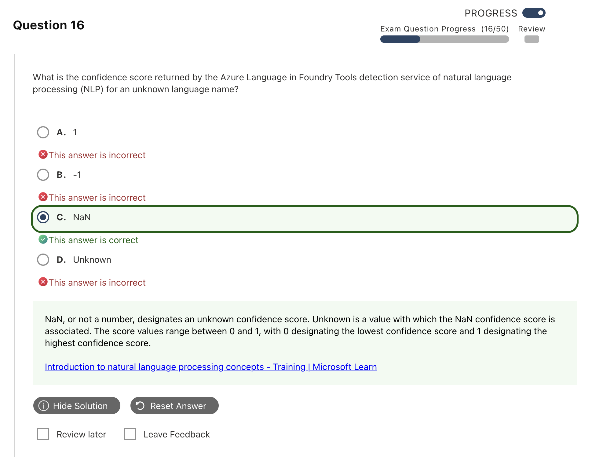

# Text and Language Mistakes｜文字與語言錯題

---

## Q04 — Language Detection 回傳欄位

### Answer Summary

| Item | Details |
|---|---|
| Correct Answer | **B. ISO 6391 Code、C. Language Name、D. Score** |
| Tested Concept | Language Detection 的主要輸出 |
| Question Keyword | `values returned`、`language detection` |
| Related Knowledge | [[../knowledge/04_Text_and_Language#Language detection output]] |
| Mistake Type | Concept confusion、Terminology |

### Why the Correct Answer Is Correct

Language Detection 會回傳偵測到的語言名稱、ISO 639-1 語言代碼與 confidence score。現行 REST 欄位可見 `name`、`iso6391Name`、`confidenceScore`；SDK 命名會依語言採用相應風格。

### Option Analysis

| Option | Correct? | Reason |
|---|---:|---|
| A. Bounding box coordinates | No | 是影像／文件中位置資訊，不是語言偵測結果。 |
| B. ISO 6391 Code | Yes | 回傳主要語言的 ISO 639-1 代碼，例如 `en`。 |
| C. Language Name | Yes | 回傳可讀語言名稱，例如 `English`。 |
| D. Score | Yes | 回傳 `confidenceScore`，範圍為 0 到 1。 |
| E. Wikipedia URL | No | 舊版 Entity Linking 結果可能包含知識庫連結；不是 Language Detection 欄位。 |

### Related Knowledge

參見 [[../knowledge/04_Text_and_Language#Language detection output|Language Detection output]]。

### Current Microsoft Context

- **Current terminology:** `iso6391Name`、`name`、`confidenceScore`；目前 REST 結果還可包含 script 相關資訊。
- **Legacy / exam-bank terminology:** 題目用一般名稱 `ISO 6391 Code`、`Language Name`、`Score`。
- **What to answer if this wording appears on an older question:** 選 ISO code、language name、score；不要選 bounding box 或 Wikipedia URL。

### Exam Takeaway

> Language Detection = 語言名稱 + ISO 639-1 code + confidence score。

### Official Source

- [Language detection overview](https://learn.microsoft.com/en-us/azure/ai-services/language-service/language-detection/overview)
- [Language detection how-to](https://learn.microsoft.com/en-us/azure/ai-services/language-service/language-detection/how-to/call-api)

---

## Q06 — Unknown Language 的 Confidence Score

### Answer Summary

| Item | Details |
|---|---|
| Correct Answer | **現行答案：0.0；題目選項沒有正確答案**。截圖題庫標示 **C. NaN**，屬舊版內容 |
| Tested Concept | 無法判定語言時的輸出 |
| Question Keyword | `unknown language name`、`confidence score` |
| Related Knowledge | [[../knowledge/04_Text_and_Language#Language detection output]] |
| Mistake Type | Current vs legacy、API / SDK syntax |

### Why the Correct Answer Is Correct

現行 Language Detection 文件範例說明：當 analyzer 無法解析輸入時，語言會是 `(Unknown)`，ISO code 為空字串，confidence score 為 **0.0**。因此不能把截圖中的 `NaN` 當作現行 API 規格。

### Option Analysis

| Option | 現行是否正確？ | Reason |
|---|---:|---|
| A. `1` | No | 代表最高信心，與 unknown 相反。 |
| B. `-1` | No | confidence score 的正常範圍為 0 到 1。 |
| C. `NaN` | No | 是題庫的舊版預期答案；現行官方範例使用 `0.0`。 |
| D. `Unknown` | No | `Unknown` 是語言名稱的語意，不是數值 score。 |
| 選項外：`0.0` | Yes | 符合現行 Microsoft Learn。 |

### Related Knowledge

參見 [[../knowledge/04_Text_and_Language#Current vs Legacy|Language Detection Current vs Legacy]]。

### Current Microsoft Context

- **Current terminology / behavior:** `(Unknown)` + 空的 ISO code + `confidenceScore: 0.0`。
- **Legacy / exam-bank terminology:** 截圖把未知 score 設為 `NaN`。
- **What to answer if this wording appears on an older question:** 若考試明確沿用這組舊選項，題庫預期 C；但在本知識庫中必須註記「現行無正確選項」，避免學到錯誤 API 行為。

### Exam Takeaway

> 現行 unknown language confidence = **0.0**；看到 `NaN` 先判斷是否為舊題。

### Official Source

- [Language detection how-to — ambiguous content](https://learn.microsoft.com/en-us/azure/ai-services/language-service/language-detection/how-to/call-api#ambiguous-content)

