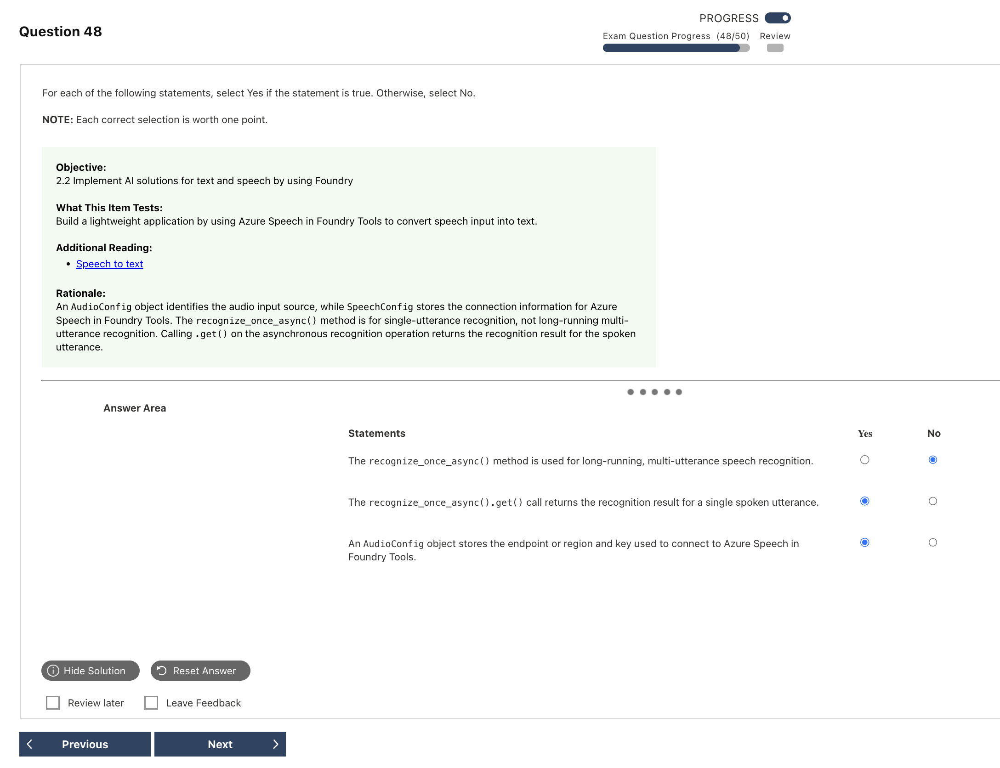

# Speech Mistakes｜語音錯題

---

## Q15 — Multimodal WAV 輸入與雙模態輸出

### Answer Summary

| Item | Details |
|---|---|
| Correct Answer | **C. Base64-encode the WAV file as `input_audio` and request text and audio modalities** |
| Tested Concept | Audio-capable model 的輸入格式與 `modalities` |
| Question Keyword | `recorded WAV`、`both text and WAV audio output` |
| Related Knowledge | [[../knowledge/05_Speech#Audio Chat Completions：WAV → Base64 → input_audio]] |
| Mistake Type | API / SDK syntax、Misread question |

### Why the Correct Answer Is Correct

本機 WAV 的內容必須先 Base64 編碼，放進 `input_audio` 資料結構；要求同時回文字與聲音時，必須請求 `text` 與 `audio` 兩種 modalities，並指定聲音輸出格式。

### Option Analysis

| Option | Correct? | Reason |
|---|---:|---|
| A. 傳 `input_audio`、只要求 text | No | 能得到文字，但不會要求 WAV 音訊輸出。 |
| B. 只傳 WAV 檔名、要求 text + audio | No | 檔名不是音訊內容，服務無法讀取本機檔案。 |
| C. Base64 WAV + `input_audio` + text/audio | Yes | 同時滿足音訊輸入與雙模態輸出。 |
| D. 把 WAV bytes 當 text message | No | 未把資料標示成 audio input。 |

### Related Knowledge

參見 [[../knowledge/05_Speech#Audio modality matrix]]。

### Current Microsoft Context

- **Current terminology:** 此題考 audio-capable Azure OpenAI model 的多模態 API，不是專用 Speech-to-Text SDK。
- **Legacy / exam-bank terminology:** 具體 model 與 API version 會變動，題目核心是 Base64、`input_audio`、`modalities`。
- **What to answer if this wording appears on an older question:** 先看輸入是否真的包含 audio bytes，再看輸出 modalities 是否同時含 text 和 audio。

### Exam Takeaway

> 本機 WAV → Base64 `input_audio`；要聲音回覆 → request `audio` modality。

### Official Source

- [Azure OpenAI audio generation quickstart](https://learn.microsoft.com/en-us/azure/foundry/openai/audio-completions-quickstart)

---

## Q16 — SpeechConfig、AudioConfig 與單次辨識

### Answer Summary

| Item | Details |
|---|---|
| Correct Answer | **No / Yes / No** |
| Tested Concept | Speech SDK 物件責任與 `recognize_once_async()` |
| Question Keyword | `long-running`、`.get()`、`AudioConfig` |
| Related Knowledge | [[../knowledge/05_Speech#SDK objects：服務設定與聲音來源分開]] |
| Mistake Type | API / SDK syntax、Concept confusion |

### Why the Correct Answer Is Correct

`recognize_once_async()` 用於單一 utterance，而非長時間多語句辨識；在 Python 中對回傳的非同步操作呼叫 `.get()` 可取得結果。`AudioConfig` 指定麥克風、檔案等音訊來源；endpoint／region／key 屬於 `SpeechConfig`。

### Option Analysis

| Statement | Correct answer | Reason |
|---|---:|---|
| `recognize_once_async()` 用於 long-running multi-utterance recognition | No | 長時間多語句應使用 continuous recognition。 |
| `recognize_once_async().get()` 回傳單一 spoken utterance 的結果 | Yes | `.get()` 取得非同步單次辨識結果。 |
| `AudioConfig` 保存連線 endpoint 或 region 和 key | No | 那是 `SpeechConfig`；`AudioConfig` 描述音訊來源。截圖選成 Yes，這一列答錯。 |

### Related Knowledge

參見 [[../knowledge/05_Speech#Speech SDK for Python：一次辨識]]。

### Current Microsoft Context

- **Current terminology:** `SpeechConfig` = 服務設定；`AudioConfig` = 音訊 input/output 設定。
- **Legacy / exam-bank terminology:** 本題物件責任仍適用目前 Speech SDK。
- **What to answer if this wording appears on an older question:** Once 是一個 utterance；Continuous 是多個 utterances。

### Exam Takeaway

> `SpeechConfig` 管服務；`AudioConfig` 管聲音；Once 一句、Continuous 多句。

### Official Source

- [Speech-to-text quickstart](https://learn.microsoft.com/en-us/azure/ai-services/speech-service/get-started-speech-to-text)
- [AudioConfig class](https://learn.microsoft.com/en-us/python/api/azure-cognitiveservices-speech/azure.cognitiveservices.speech.audio.audioconfig)

---

## Q17 — 指定 TTS Voice 並從預設喇叭播放

### Answer Summary

| Item | Details |
|---|---|
| Correct Answer | **D. `speech_synthesis_voice_name` and default speaker output** |
| Tested Concept | TTS voice selection 與 audio output destination |
| Question Keyword | `Ava`、`play ... on the default speaker` |
| Related Knowledge | [[../knowledge/05_Speech#Speech SDK：指定 voice 與輸出]] |
| Mistake Type | API / SDK syntax |

### Why the Correct Answer Is Correct

題目指定完整 voice 名稱，因此要設定 `speech_synthesis_voice_name`；要求直接播放，則用 default speaker 的 `AudioOutputConfig`。只設定語言無法保證選到 Ava，file output 會寫入檔案而非播放。

### Option Analysis

| Option | Correct? | Reason |
|---|---:|---|
| A. voice name + file output | No | 選對 voice，但輸出目的地不符。 |
| B. language + default speaker | No | 輸出正確，但只指定 locale，未指定 Ava。 |
| C. language + file output | No | voice 與輸出目的地都不符。 |
| D. voice name + default speaker | Yes | 同時符合指定聲線與直接播放。 |

### Related Knowledge

參見 [[../knowledge/05_Speech#Speech SDK：指定 voice 與輸出]]。

### Current Microsoft Context

- **Current terminology:** `speech_synthesis_voice_name` 選完整 voice；`AudioOutputConfig(use_default_speaker=True)` 直接播放。
- **Legacy / exam-bank terminology:** 題目中的 Ava voice 在查核時仍列於官方 voice 支援清單；部署區域可用性仍應在實作時確認。
- **What to answer if this wording appears on an older question:** 題目指定「誰來說」選 voice name；指定「直接播放」選 default speaker。

### Exam Takeaway

> Language 決定語言；Voice Name 指定聲音；Default Speaker 直接播放。

### Official Source

- [How to synthesize speech from text](https://learn.microsoft.com/en-us/azure/ai-services/speech-service/how-to-speech-synthesis)
- [Language and voice support](https://learn.microsoft.com/en-us/azure/ai-services/speech-service/language-support?tabs=tts)
