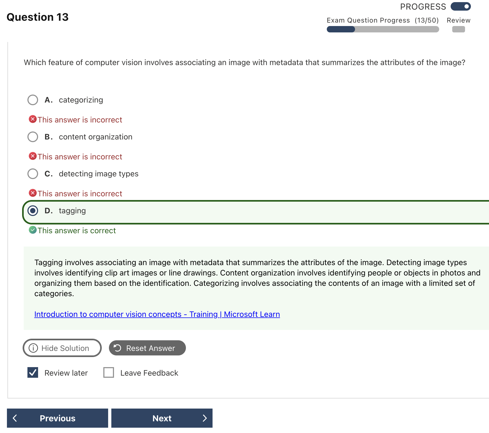

# Computer Vision Mistakes｜電腦視覺錯題

---

## Q03 — Specialized Domain Models

### Answer Summary

| Item | Details |
|---|---|
| Correct Answer | **A. celebrities、C. landmarks** |
| Tested Concept | Image Analysis 3.2 的 domain-specific content |
| Question Keyword | `two specialized domain models`、`categorizing an image` |
| Related Knowledge | [[../knowledge/06_Computer_Vision#Legacy Image Analysis 3.2 capability map]] |
| Mistake Type | Concept confusion、Current vs legacy |

### Why the Correct Answer Is Correct

舊版 Image Analysis 3.2 提供兩個 domain-specific models：`celebrities` 與 `landmarks`。`image types` 是判定 clip art／line drawing；`people_` 與 `people_group` 是 86-category taxonomy 的分類名稱，不是 specialized models。

### Option Analysis

| Option | Correct? | Reason |
|---|---:|---|
| A. celebrities | Yes | 專門辨識名人的 domain model。 |
| B. image types | No | 判斷 clip art 或 line drawing 的功能。 |
| C. landmarks | Yes | 專門辨識地標的 domain model。 |
| D. people_ | No | 舊 taxonomy 的 category／前綴。 |
| E. people_group | No | 舊 taxonomy 中的具體 category。 |

### Related Knowledge

參見 [[../knowledge/06_Computer_Vision#Legacy 86-category taxonomy]]。

### Current Microsoft Context

- **Current terminology:** 現行 AI-901 著重一般 computer vision 與 Foundry 視覺／生成實作。
- **Legacy / exam-bank terminology:** `celebrities`、`landmarks`、86-category taxonomy 屬 Image Analysis 3.2 舊功能；Image Analysis 3.2／4.0 已進入退休期。
- **What to answer if this wording appears on an older question:** specialized domain models 選 celebrities + landmarks。

### Exam Takeaway

> Domain models = celebrities / landmarks；`people_` 是 category，不是 model。

### Official Source

- [Detect domain-specific content](https://learn.microsoft.com/en-us/azure/ai-services/computer-vision/concept-detecting-domain-content)
- [Computer Vision migration options](https://learn.microsoft.com/en-us/azure/ai-services/computer-vision/migration-options)

---

## Q05 — Tagging 是描述性 Metadata

### Answer Summary

| Item | Details |
|---|---|
| Correct Answer | **D. tagging** |
| Tested Concept | Tagging、Categorizing、Image Type 的差異 |
| Question Keyword | `metadata that summarizes the attributes` |
| Related Knowledge | [[../knowledge/06_Computer_Vision#Legacy Image Analysis 3.2 capability map]] |
| Mistake Type | Concept confusion、Terminology |

### Why the Correct Answer Is Correct

**Tagging** 會以多個描述詞和 confidence score 表達圖片中的物件、場景與動作，正是題幹所說的 metadata。Categorizing 對應固定 taxonomy；Image Type 判斷圖片形式。

### Option Analysis

| Option | Correct? | Reason |
|---|---:|---|
| A. categorizing | No | 將圖片對應到固定、有限的舊版 categories。 |
| B. content organization | No | 是利用識別結果整理內容的應用場景，不是此處的影像分析輸出名稱。 |
| C. detecting image types | No | 判斷 clip art、line drawing。 |
| D. tagging | Yes | 回傳描述圖片屬性的 tags／metadata。 |

### Related Knowledge

參見 [[../knowledge/06_Computer_Vision#Tagging vs classification vs detection]]。

### Current Microsoft Context

- **Current terminology:** Tagging 仍是可理解的 vision capability，但這組選項及 taxonomy 來自 legacy Image Analysis 教材。
- **Legacy / exam-bank terminology:** Categorizing、Image Type、86 categories 是舊版功能語境。
- **What to answer if this wording appears on an older question:** metadata／descriptive words → Tagging。

### Exam Takeaway

> Tagging 貼很多描述詞；Categorizing 放進固定分類箱。

### Official Source

- [Image tagging concepts](https://learn.microsoft.com/en-us/azure/ai-services/computer-vision/concept-tagging-images)

---

## Q11 — Responses API 比較兩張圖片

### Answer Summary

| Item | Details |
|---|---|
| Correct Answer | **C. A text instruction and each image URL as an `input_image` content part** |
| Tested Concept | Responses API 的多張視覺輸入 |
| Question Keyword | `two HTTPS image URLs`、`single request`、`text comparison` |
| Related Knowledge | [[../knowledge/06_Computer_Vision#Multimodal Responses API：文字 + 多張圖片]] |
| Mistake Type | API / SDK syntax、Service confusion |

### Why the Correct Answer Is Correct

模型需要收到比較指令，以及兩個各自標為 `input_image` 的視覺內容；每個內容的 `image_url` 放一張 HTTPS 圖片。這樣可在同一個 request 中理解並比較兩張圖。

### Option Analysis

| Option | Correct? | Reason |
|---|---:|---|
| A. 每張 URL 傳到 image-generation endpoint | No | Image generation 用來產生圖片，不是比較既有圖片。 |
| B. 使用 Chat Completions 的 `image_url` content part | No | 題目明示 Responses API，content part 名稱應符合 Responses 格式。 |
| C. text instruction + 每張圖一個 `input_image` | Yes | 同時提供任務與兩張視覺輸入。 |
| D. 把 URL 合併進一個 `input_text` | No | URL 字串不會自動成為視覺輸入。 |

### Related Knowledge

參見 [[../knowledge/06_Computer_Vision#Multimodal Responses API：文字 + 多張圖片]]。

### Current Microsoft Context

- **Current terminology:** Responses API 使用 `input_text` 與 `input_image`；Chat Completions 有不同 content-part schema。
- **Legacy / exam-bank terminology:** 此題目前仍符合 Responses API 的核心格式；實作仍要核對 SDK 與 API 版本。
- **What to answer if this wording appears on an older question:** 先依題目指定 API 選正確 schema，不要混用 Chat Completions 格式。

### Exam Takeaway

> Responses：指令用 `input_text`；每張圖各用一個 `input_image`。

### Official Source

- [Use the Responses API](https://learn.microsoft.com/en-us/azure/foundry/openai/how-to/responses)

