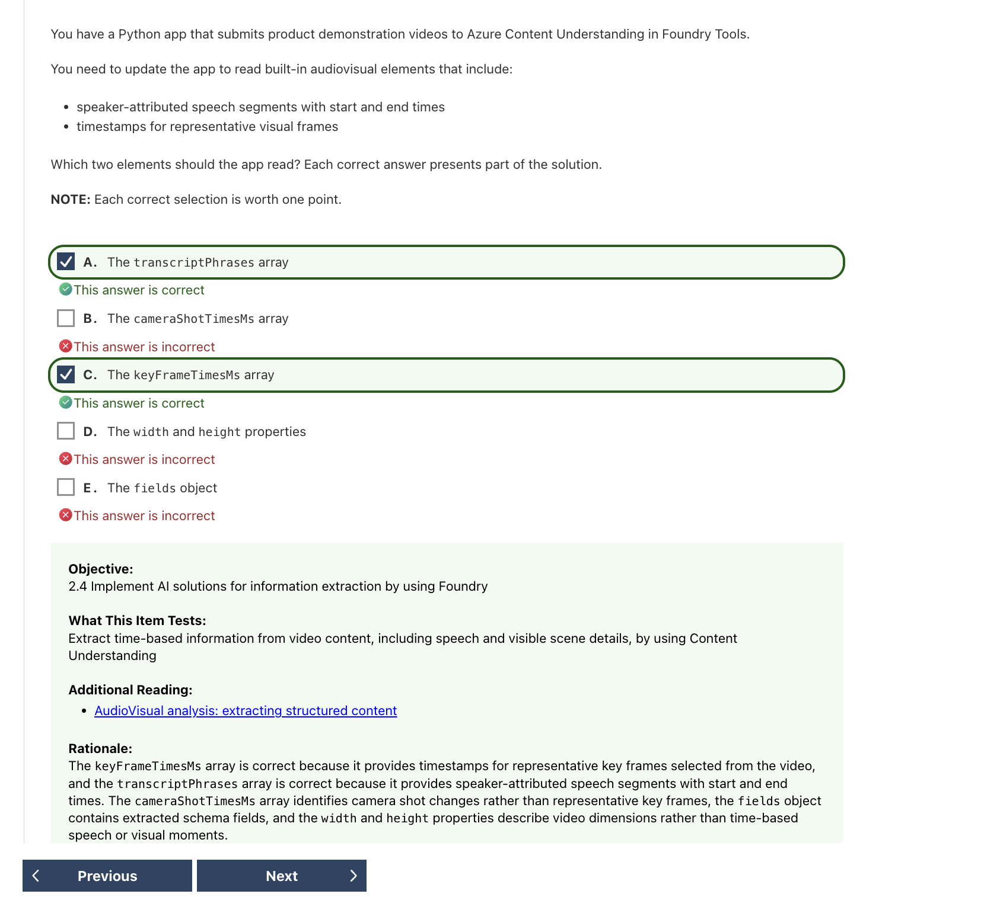
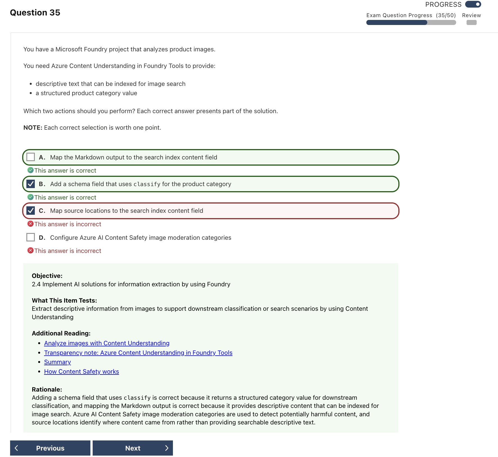

# Content Understanding Mistakes｜內容理解錯題

---

## Q07 — 表單欄位與重複列的 Field Extraction

### Answer Summary

| Item | Details |
|---|---|
| Correct Answer | **D. Field extraction** |
| Tested Concept | 將文件業務欄位轉成 schema-defined structured JSON |
| Question Keyword | `structured JSON`、`fields`、`repeated table rows` |
| Related Knowledge | [[../knowledge/07_Content_Understanding#Documents and forms]] |
| Mistake Type | Concept confusion |

### Why the Correct Answer Is Correct

題目要求具名欄位與重複的 line items，而非只有可閱讀的全文或版面。**Field extraction** 依欄位 schema 回傳結構化值，重複列可表示為 array of objects。

### Option Analysis

| Option | Correct? | Reason |
|---|---:|---|
| A. Markdown output | No | 適合保留可閱讀內容與結構，不等於 schema-defined 業務欄位。 |
| B. Classification | No | 判斷文件類別，不擷取各欄位值。 |
| C. Content extraction | No | 取得文字、版面、表格等一般內容，未必映射至指定 schema。 |
| D. Field extraction | Yes | 回傳指定 fields 與 repeated rows 的 structured JSON。 |

### Related Knowledge

參見 [[../knowledge/07_Content_Understanding#Field schema]]。

### Current Microsoft Context

- **Current terminology:** `fieldSchema` 定義要抽取的 structured fields。
- **Legacy / exam-bank terminology:** 題目把能力簡稱 Field extraction，與現行概念一致。
- **What to answer if this wording appears on an older question:** named fields／line items／structured JSON → Field extraction。

### Exam Takeaway

> 要全文與版面看 Content Extraction；要具名欄位 JSON 看 Field Extraction。

### Official Source

- [Content Understanding analyzer reference](https://learn.microsoft.com/en-us/azure/ai-services/content-understanding/concepts/analyzer-reference)

---

## Q08 — 複雜表單使用 Schema-defined Fields

### Answer Summary

| Item | Details |
|---|---|
| Correct Answer | **schema-defined fields and relationships** |
| Tested Concept | 以 schema 描述抽取目標 |
| Question Keyword | `handwritten`、`visually complex forms`、`structured information` |
| Related Knowledge | [[../knowledge/07_Content_Understanding#Field schema]] |
| Mistake Type | Knowledge gap、Misread question |

### Why the Correct Answer Is Correct

版面與欄位標籤會變動時，應定義欄位名稱、型別、描述與巢狀關係，讓 analyzer 依語意填入結構。固定座標或精確 label matching 對版面變動較脆弱；source normalization 只處理輸入，不定義要抽取什麼。

### Option Analysis

| Option | Correct? | Reason |
|---|---:|---|
| exact label matching | No | 標籤文字變化或手寫時容易失效。 |
| fixed page coordinates | No | 版面位置變動就不可靠。 |
| schema-defined fields and relationships | Yes | 定義目標欄位、型別與結構。 |
| source file normalization | No | 是前處理，不是抽取 contract。截圖選了此項。 |

### Related Knowledge

參見 [[../knowledge/07_Content_Understanding#Nested objects and arrays]]。

### Current Microsoft Context

- **Current terminology:** analyzer 的 `fieldSchema` 與 field definitions。
- **Legacy / exam-bank terminology:** 題目用 `relationships` 描述巢狀物件及重複資料的結構關係。
- **What to answer if this wording appears on an older question:** 視覺複雜／欄位位置改變 + structured information → schema-defined fields。

### Exam Takeaway

> 不背座標；用 schema 定義欄位意義與結構。

### Official Source

- [Analyzer reference](https://learn.microsoft.com/en-us/azure/ai-services/content-understanding/concepts/analyzer-reference)
- [Content Understanding best practices](https://learn.microsoft.com/en-us/azure/ai-services/content-understanding/concepts/best-practices)

---

## Q10 — Video Transcript 與 Key Frame 時間軸

### Answer Summary

| Item | Details |
|---|---|
| Correct Answer | **A. `transcriptPhrases`、C. `keyFrameTimesMs`** |
| Tested Concept | AudioVisual output 的內建時間元素 |
| Question Keyword | `speaker-attributed`、`start and end times`、`representative visual frames` |
| Related Knowledge | [[../knowledge/07_Content_Understanding#Audio and video built-in output]] |
| Mistake Type | API / SDK syntax、Concept confusion |

### Why the Correct Answer Is Correct

`transcriptPhrases` 包含帶 speaker attribution 與起訖時間的語音片段；`keyFrameTimesMs` 是代表性畫面的時間戳。兩者分別回答題目的 speech segments 與 representative frames。

### Option Analysis

| Option | Correct? | Reason |
|---|---:|---|
| A. `transcriptPhrases` | Yes | 語音、speaker 與起訖時間。 |
| B. `cameraShotTimesMs` | No | 表示 camera-shot change 的時間，不等於 key frames。 |
| C. `keyFrameTimesMs` | Yes | 代表性 key frames 的時間戳。 |
| D. `width` / `height` | No | 影片尺寸，不是時間軸資訊。 |
| E. `fields` | No | 自訂 schema 抽取值，不是題目指定的內建元素。 |

### Related Knowledge

參見 [[../knowledge/07_Content_Understanding#Audio and video built-in output]]。

### Current Microsoft Context

- **Current terminology:** JSON／JavaScript 文件使用 camelCase；Python SDK 物件可能呈現 snake_case，例如 `key_frame_times_ms`。
- **Legacy / exam-bank terminology:** 題目雖說 Python app，實際詢問服務回應元素，因此使用 JSON camelCase。
- **What to answer if this wording appears on an older question:** speaker + transcript → `transcriptPhrases`；representative frames → `keyFrameTimesMs`。

### Exam Takeaway

> `transcriptPhrases` 看誰何時說什麼；`keyFrameTimesMs` 找代表畫面時間。

### Official Source

- [AudioVisualContent interface](https://learn.microsoft.com/en-us/javascript/api/@azure/ai-content-understanding/audiovisualcontent?view=azure-node-latest)

---

## Q14 — Call Center 預建 Analyzer

### Answer Summary

| Item | Details |
|---|---|
| Correct Answer | **C. `prebuilt-callCenter`** |
| Tested Concept | 客服通話的預建 post-call analysis |
| Question Keyword | `agent/customer-attributed`、`summary`、`sentiment`、`minimal configuration` |
| Related Knowledge | [[../knowledge/07_Content_Understanding#Audio analyzers]] |
| Mistake Type | Service confusion、Concept confusion |

### Why the Correct Answer Is Correct

`prebuilt-callCenter` 針對客服通話提供角色辨識的逐字稿、摘要與情緒等預設結構，最符合 minimal configuration。通用 audio search 或 custom analyzer 需要額外定義才能產生相同的客服欄位。

### Option Analysis

| Option | Correct? | Reason |
|---|---:|---|
| A. customized `prebuilt-audioSearch` | No | 可以客製，但不符合最少設定。 |
| B. custom audio analyzer | No | 需自行設計 schema 與設定。 |
| C. `prebuilt-callCenter` | Yes | 預建客服角色、摘要與 sentiment 場景。 |
| D. `prebuilt-audioSearch` | No | 偏一般音訊搜尋／檢索，沒有題目要求的客服預設輸出。 |

### Related Knowledge

參見 [[../knowledge/07_Content_Understanding#Audio analyzers]]。

### Current Microsoft Context

- **Current terminology:** `prebuilt-callCenter` 是 Content Understanding analyzer ID，並非獨立 Azure 服務。
- **Legacy / exam-bank terminology:** 此題目前與官方 audio solution 的命名相符；preview／GA API 中可用 analyzer 清單仍須依實作版本核對。
- **What to answer if this wording appears on an older question:** Call center + Agent/Customer + minimal configuration → `prebuilt-callCenter`。

### Exam Takeaway

> 客服通話預建角色、摘要與情緒 → `prebuilt-callCenter`。

### Official Source

- [Content Understanding audio solutions](https://learn.microsoft.com/en-us/azure/ai-services/content-understanding/audio/overview)

---

## Q18 — 圖片 Markdown 與 Structured Category

### Answer Summary

| Item | Details |
|---|---|
| Correct Answer | **A. Map the Markdown output to the search index content field；B. Add a schema field that uses `classify` for the product category** |
| Tested Concept | 以 Content Understanding 處理可搜尋描述與結構化圖片類別 |
| Question Keyword | `descriptive text`、`indexed for image search`、`structured product category` |
| Related Knowledge | [[../knowledge/07_Content_Understanding#圖片索引：Markdown、Fields、Source 各做什麼]] |
| Mistake Type | Concept confusion、Service confusion |

### Why the Correct Answer Is Correct

題目有兩種不同結果：可供搜尋的描述文字，以及固定的產品類別。**Markdown output** 適合 map 到 search index 的內容欄位；在 field schema 中設定 **`classify`** 的欄位，則能得到結構化的 category value。

### Option Analysis

| Option | Correct? | Reason |
|---|---:|---|
| A. Map Markdown output to search index content field | Yes | 將描述性文字作為可搜尋內容。 |
| B. Schema field with `classify` | Yes | 取得符合預定義類別的 structured product category。 |
| C. Map source locations to search index content field | No | source locations 用來追溯結果來源，不是描述性搜尋內容。 |
| D. Configure Content Safety image moderation | No | 審核有害內容，不會產出題目所需的產品描述或分類欄位。 |

### Related Knowledge

參見 [[../knowledge/07_Content_Understanding#圖片索引：Markdown、Fields、Source 各做什麼]]。

### Current Microsoft Context

- **Current terminology:** Markdown output、field schema、`classify` method 與 source locations 都是 Content Understanding 分析結果／設定的不同角色。
- **Legacy / exam-bank terminology:** 題目目前使用的 Foundry Tools 命名與 AI-901 information extraction 範圍相符。
- **What to answer if this wording appears on an older question:** searchable descriptive text → Markdown；fixed category value → schema `classify`；evidence location → source。

### Exam Takeaway

> Markdown 用來搜尋；`classify` 用來取得固定類別；source 用來追溯來源。

### Official Source

- [Content Understanding image overview](https://learn.microsoft.com/en-us/azure/ai-services/content-understanding/image/overview)
- [Content Understanding analyzer reference](https://learn.microsoft.com/en-us/azure/ai-services/content-understanding/concepts/analyzer-reference)
